# 检测链表中的循环

> 原文：<https://www.javatpoint.com/detect-loop-in-a-linked-list>

链表中的循环是当链表没有任何结尾时出现的一种情况。当链表中存在循环时，最后一个指针不会指向在单链表或双链表中观察到的 Null，也不会指向在[循环链表](https://www.javatpoint.com/circular-singly-linked-list)中观察到的链表头。当循环存在时，它指向某个其他节点，也称为链表循环。

**我们通过一个例子来理解这个循环。**

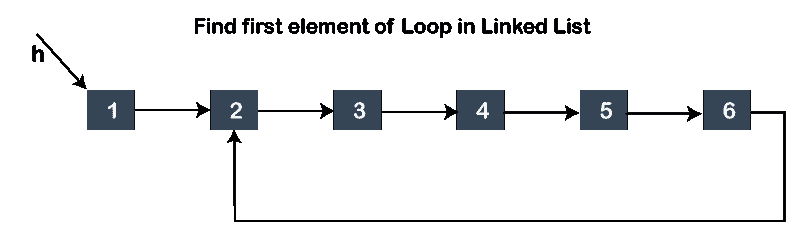

在上图中，我们可以观察到链表中存在循环。这里，问题陈述是我们必须检测节点，这是循环的开始。解决这个问题的办法是:

*   首先，我们检测链表中的循环。
*   检测循环的开始节点。

### 检测循环

首先，我们将检测链表中的一个循环。为了理解这一点，我们将看看检测循环的算法。

**第一步:**首先，我们将初始化两个指针，即 S 作为慢速指针，F 作为快速指针。最初，两个指针都指向链表中的第一个节点。

**第二步:**一次移动‘S’指针一个节点，同时一次移动‘F’指针两个节点。

**步骤 3:** 如果在某一点上，两个指针，即‘S’和‘F’，都指向同一个节点，那么链表中就有一个循环；否则，不存在循环。

**为了更加清晰，让我们可视化上面的算法。**

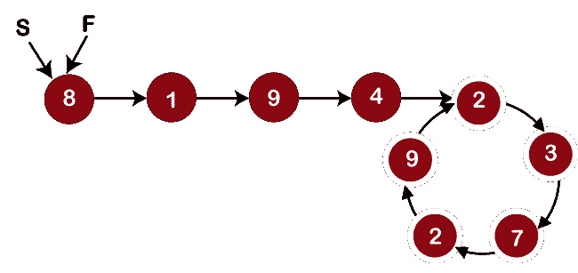

从上图中我们可以观察到，两个指针，即 S 和 F 都指向第一个节点。现在，我们将把“S”指针移动 1，把“F”指针移动 2，直到它们相遇。如果“F”指针到达结束节点，意味着链表中没有循环。

“S”指针移动 1，而“F”指针移动 2，因此“S”指针指向节点 1，“F”指针指向节点 9，如下所示:

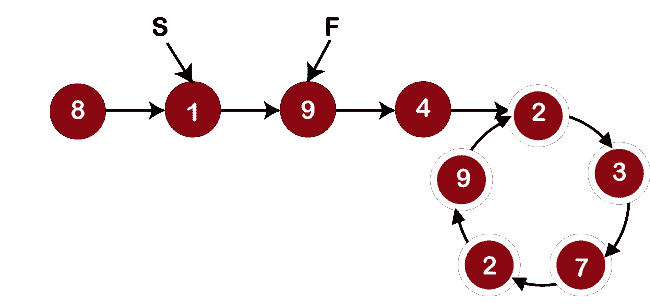

由于两个指针不指向同一个节点，“F”指针没有到达结束节点，因此我们将再次移动两个指针。现在，指针“S”将移动到节点 9，指针“F”将移动到节点 2，如下所示:

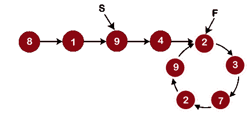

由于两个指针并不指向同一个节点，所以我们将再次递增指针。现在，“S”将指向节点 4，“F”将指向节点 7，如下所示:

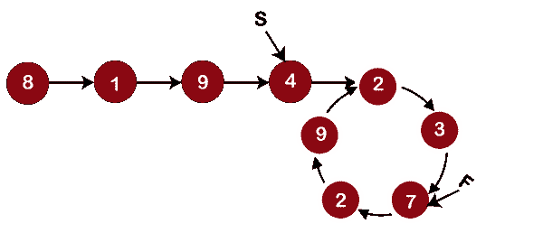

由于两个指针并不指向同一个节点，所以我们将再次递增指针。现在，“S”将指向节点 2，“F”将指向节点 9，如下所示:

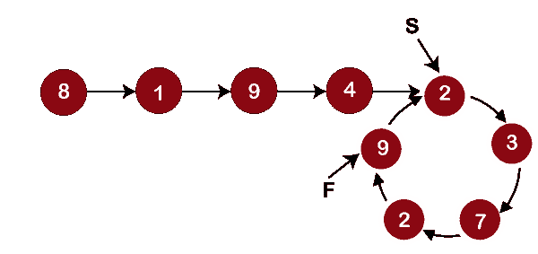

由于两个指针并不指向同一个节点，所以我们将再次递增指针。现在，“S”将指向节点 3，“F”也将指向节点 3，如下所示:

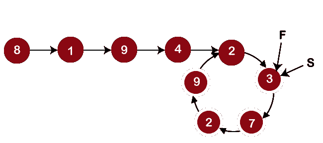

从上图中我们可以观察到，两个指针都指向同一个节点，即 3；因此，循环存在于链表中。

### 检测循环的开始

这里，我们需要检测循环的起源。我们将考虑我们在检测循环时讨论的相同示例。要检测循环的开始，请考虑下面的算法。

**步骤 1:** 将“S”移动到列表的开头，但“F”将保持指向节点 3。

**第二步**:一次向前移动‘S’和‘F’一个节点，直到它们相遇。

第三步:他们相遇的节点是循环的开始。

**为了更加清晰，让我们可视化上面的算法。**

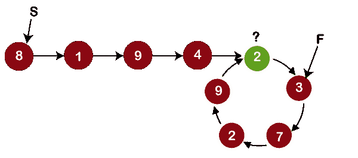

首先，我们将指针“S”和“F”增加一；“s”和“F”将分别指向节点 1 和节点 7，如下所示:

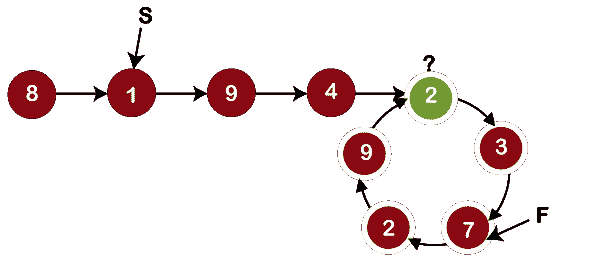

由于两个节点都不满足，因此我们再次将指针增加一个节点，如下所示:

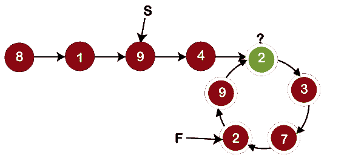

从上图中我们可以看到，“S”指针指向节点 9，“F”指针指向节点 2。同样，我们将两个指针都增加一个节点。现在，“S”将指向节点 4，“F”将指向节点 9，如下所示:

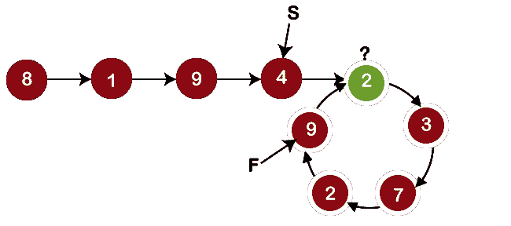

从上图中我们可以观察到，两个指针并不指向同一个节点，所以我们将两个指针都增加一个节点。现在，指针“S”和“F”指向节点 2，如下所示:

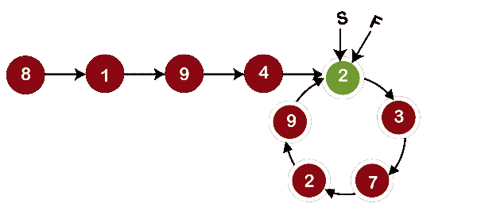

因为两个指针都指向同一个节点，即 2；因此，我们得出结论，循环的起始节点是节点 2。

**为什么这个算法有效？**

考虑表示环路长度的“l ”,它将测量链路中的数量。

**L:回路长度**

从上图中我们可以观察到有五个环节。

将“m”视为循环起点到列表起点的距离。换句话说，“m”可以定义为从开始节点到循环开始的节点的距离。因此，在上图中，m 是 4，因为起始节点是 8，循环开始的节点是 2。

考虑‘k’是‘S’和‘F’在检测循环时第一次相遇时从循环开始的相遇点的距离。在上面的链表中，“k”的值是 1，因为快指针和慢指针第一次相遇的节点是 3，而循环开始的节点是 2。

当‘S’和‘F’第一次相遇时，

假设慢速指针所覆盖的总距离为 **distance_S** ，快速指针所覆盖的总距离为 **distance_F** 。

**距离 _S = m + p*l + k**

其中 S 覆盖的总距离是从列表开始到循环开始的距离、循环中慢速指针覆盖的距离以及从循环开始到两个指针相遇的节点的距离之和。

**距离 _F = m + q*l + k (q > p 因为‘S’的速度大于‘F’的速度)**

我们知道，当‘S’和‘F’第一次相遇时，那么‘F’的遍历速度是‘S’指针的两倍；因此，“F”所覆盖的距离将是“S”所覆盖距离的两倍。数学上，它可以表示为:

**距离 _ F =距离 _S**

上面的等式可以写成:

**m + q*l + k = 2(m + p*l + k)**

求解上述方程，我们会得到:

**m+k = (q-2p)*l，**这意味着 m+k 是 l(循环长度)的整数倍。

**c .**中检测回路的实现

```

int detectloop(struct node *list) 
{
   struct node *S = list, *F=list;
   while(S && F && F->next) 
{
    S=S->next;
  F=F->next->next;
if(F==S)
{
   printf("loop exists");
  return 1;
}
}
return 0;
}

```

在上面的代码中，detectloop()是将在[链表](https://www.javatpoint.com/ds-linked-list)中检测循环的函数的名称。我们已经传递了结构节点类型的列表指针，指向链表中的头节点。在 detectloop()函数中，我们已经声明了两个指针，即结构节点类型的“S”和“F”，并将头节点的引用分配给这些指针。我们定义 while 循环，在该循环中，我们检查“S”、“F”和“F- >下一个是否为空。如果它们不为空，则控件将进入 while 循环。在 while 循环中，“S”指针增加一个节点，“F”指针增加两个节点。如果“F”和“S”相等；意味着循环存在于链表中。

* * *