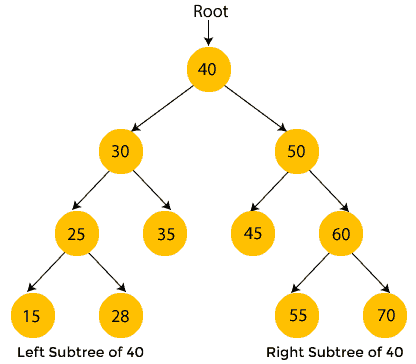
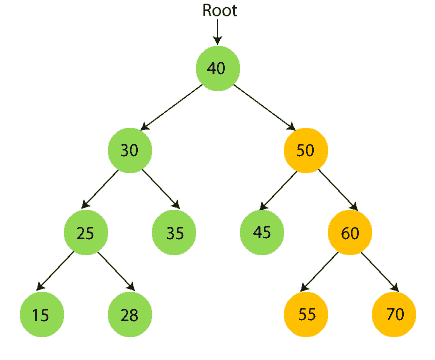
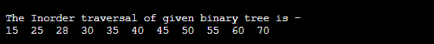
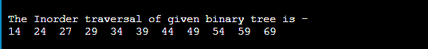
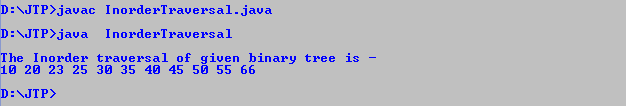

# 有序遍历

> 原文：<https://www.javatpoint.com/inorder-traversal>

在本文中，我们将讨论数据结构中的有序遍历。

如果我们想以升序遍历节点，那么我们使用有序遍历。以下是有序遍历所需的步骤:

*   访问左侧子树中的所有节点
*   访问根节点
*   访问右子树中的所有节点

线性数据结构，如堆栈、数组、队列等。，只有一种方法来遍历数据。但在**树、**等分层数据结构中，有多种方式遍历数据。这里我们将讨论遍历树数据结构的另一种方法，即有序遍历。

有两种方法用于有序遍历:

*   使用递归进行有序遍历
*   使用迭代方法的有序遍历

有序遍历技术遵循**左根右**策略。这里的左根右是指先遍历根节点的左子树，再遍历根节点，然后遍历根节点的右子树。这里，有序名称本身表明根节点位于左右子树之间。

我们将讨论使用递归和迭代技术的有序遍历。让我们首先从使用递归的有序遍历开始。

### 使用递归的有序遍历

```

Step 1: Recursively traverse the left subtree
Step 2: Now, visit the root
Step 3: Traverse the right subtree recursively

```

### 有序遍历的例子

现在，让我们看一个有序遍历的例子。用一个例子更容易理解有序遍历的过程。



黄色的节点还没有被访问。现在，我们将使用有序遍历来遍历上面树的节点。

*   这里，40 是根节点。我们移到左边的子树 40，也就是 30，它也有子树 25，所以我们再移到左边的子树 25，也就是 15。这里，15 没有子树，所以**打印 15** 并向其父节点 25 移动。
    T3】
*   现在，**打印 25** 并移动到 25 的右子树。
    T3】
*   现在，**打印 28** 移动到 25 的根节点即 30。
    T3】
*   所以，30 的左子树被访问。现在，**打印 30** 并移动到 30 的右边孩子。
    T3】
*   现在，**打印 35** 移动到 30 的根节点。
    T3】
*   现在，**打印根节点 40** 并移动到它的右子树。
    T3】
*   现在递归遍历右子树 40，也就是 50。
    50 有子树，所以首先遍历 50 的左边子树，也就是 45。45 没有孩子，所以**打印 45** 并移动到它的根节点。
    
*   现在**打印 50** 并移动到 50 的右子树即 60。
    T3】
*   现在递归遍历右子树 50，也就是 60。60 有子树，所以首先遍历 60 的左子树，即 55。55 没有子节点，所以**打印 55** 并移动到其根节点。
    T3】
*   现在**打印 60** 并移动到 60 的右子树即 70。
    T3】
*   现在**打印 70。**
    

完成有序遍历后，最终输出是-

**{15、25、28、30、35、40、45、50、55、60、70}**

## 有序遍历的复杂性

有序遍历的时间复杂度是**O(n)**，其中‘n’是二叉树的大小。

然而，如果我们不考虑函数调用的堆栈大小，有序遍历的空间复杂度是**O(1)**。否则，有序遍历的空间复杂度是**O(h)**，其中‘h’是树的高度。

## 有序遍历的实现

现在，让我们看看不同编程语言中有序遍历的实现。

**程序:**用 C 语言编写一个实现有序遍历的程序。

```

#include <stdio.h>
#include <stdlib.h>
struct node {
	int element;
	struct node* left;
	struct node* right;
};
/*To create a new node*/
struct node* createNode(int val)
{
	struct node* Node = (struct node*)malloc(sizeof(struct node));
	Node->element = val;
	Node->left = NULL;
	Node->right = NULL;
	return (Node);
}
/*function to traverse the nodes of binary tree in Inorder*/
void traverseInorder(struct node* root)
{
	if (root == NULL)
		return;
	traverseInorder(root->left);
	printf(" %d ", root->element);
	traverseInorder(root->right);
}
int main()
{
	struct node* root = createNode(40);
	root->left = createNode(30);
	root->right = createNode(50);
	root->left->left = createNode(25);
	root->left->right = createNode(35);
	root->left->left->left = createNode(15);
	root->left->left->right = createNode(28);
	root->right->left = createNode(45);
	root->right->right = createNode(60);
	root->right->right->left = createNode(55);
	root->right->right->right = createNode(70);	
	printf("\n The Inorder traversal of given binary tree is -\n");
	traverseInorder(root);
	return 0;
}

```

**输出**



**程序:**编写一个程序，在 C++中实现有序遍历。

```

#include <iostream>
using namespace std;
struct node {
	int element;
	struct node* left;
	struct node* right;
};
/*To create a new node*/
struct node* createNode(int val)
{
	struct node* Node = (struct node*)malloc(sizeof(struct node));
	Node->element = val;
	Node->left = NULL;
	Node->right = NULL;
	return (Node);
}
/*function to traverse the nodes of binary tree in Inorder*/
void traverseInorder(struct node* root)
{
	if (root == NULL)
		return;
	traverseInorder(root->left);
	cout<right);
}
int main()
{
	struct node* root = createNode(39);
	root->left = createNode(29);
	root->right = createNode(49);
	root->left->left = createNode(24);
	root->left->right = createNode(34);
	root->left->left->left = createNode(14);
	root->left->left->right = createNode(27);
	root->right->left = createNode(44);
	root->right->right = createNode(59);
	root->right->right->left = createNode(54);
	root->right->right->right = createNode(69);	
	cout<
```

**输出**



**程序:**用 C#编写一个实现有序遍历的程序。

```

using System;
class Node {
	public int value;
	public Node left, right;
	public Node(int element)
	{
		value = element;
		left = right = null;
	}
}
class BinaryTree {
	Node root;
	BinaryTree() { root = null; }
	void traverseInorder(Node node)
	{
		if (node == null)
			return;
		traverseInorder(node.left);
		Console.Write(node.value + " ");
		traverseInorder(node.right);
	}
	void traverseInorder() { traverseInorder(root); }
	static void Main()
	{
		BinaryTree bt = new BinaryTree();
		bt.root = new Node(36);
		bt.root.left = new Node(26);
		bt.root.right = new Node(46);
		bt.root.left.left = new Node(21);
		bt.root.left.right = new Node(31);
		bt.root.left.left.left = new Node(11);
		bt.root.left.left.right = new Node(24);
		bt.root.right.left = new Node(41);
		bt.root.right.right = new Node(56);
		bt.root.right.right.left = new Node(51);
		bt.root.right.right.right = new Node(66);
		Console.WriteLine("The Inorder traversal of given binary tree is - ");
		bt.traverseInorder();
	}
}

```

**输出**


**程序:**写一个用 Java 实现有序遍历的程序。

```

class Node {
	public int value;
	public Node left, right;
	public Node(int element)
	{
		value = element;
		left = right = null;
	}
}
class InorderTraversal {
	Node root;
	InorderTraversal() { root = null; }
	void traverseInorder(Node node)
	{
		if (node == null)
			return;
		traverseInorder(node.left);
		System.out.print(node.value + " ");
		traverseInorder(node.right);
	}
	void traverseInorder() { traverseInorder(root); }
	public static void main(String args[])
	{
		InorderTraversal pt = new InorderTraversal();
		pt.root = new Node(35);
		pt.root.left = new Node(25);
		pt.root.right = new Node(45);
		pt.root.left.left = new Node(20);
		pt.root.left.right = new Node(30);
		pt.root.left.left.left = new Node(10);
		pt.root.left.left.right = new Node(23);
		pt.root.right.left = new Node(40);
		pt.root.right.right = new Node(55);
		pt.root.right.right.left = new Node(50);
		pt.root.right.right.right = new Node(66);
		System.out.println();
		System.out.println("The Inorder traversal of given 
binary tree is - ");
		pt.traverseInorder();
		System.out.println();
	}
}

```

**输出**



所以，这就是文章的全部内容。希望文章对你有所帮助和启发。

* * *