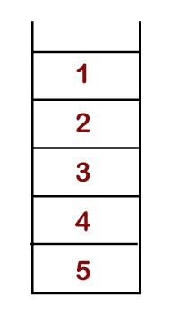
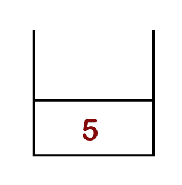
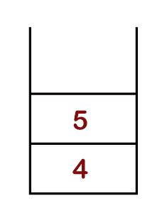
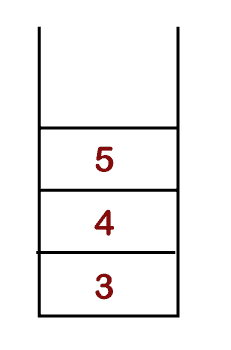
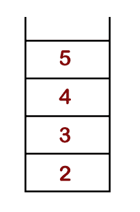
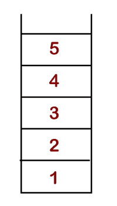
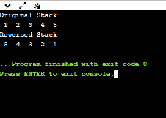

# 使用递归反转堆栈

> 原文：<https://www.javatpoint.com/reverse-a-stack-using-recursion>

在这里，我们将使用递归来反转堆栈。我们不应该使用任何循环结构，比如 for 循环、while 循环、do-while 循环等等。我们应该使用递归方法来反转堆栈。

**例如:**输入:s = [10，20，30，40，50]

产出:[50、40、30、20、10]

说明:当堆栈 s 反转时，输出将是[50，40，30，20，10]。

有多种方法可以使用递归来反转堆栈。反转堆栈最常见的方法是使用辅助堆栈。首先，我们将弹出堆栈中的所有元素，并将它们推入辅助堆栈。一旦所有元素都被推入辅助堆栈，那么它就以相反的顺序包含元素，我们只需打印它们。但是，在这里，我们将不使用辅助堆栈。我们将使用递归方法来反转堆栈，其中递归意味着一次又一次地调用函数本身。

在递归方法中，我们首先从输入堆栈中弹出所有元素，并将所有弹出的项目推入函数调用堆栈，直到堆栈变空。当堆栈变空时，所有项目都将被推入堆栈。让我们通过一个例子来理解这个场景。

**例如:**

**输入栈:** 1，2，3，4，5



**输出:** 5，4，3，2，1

**解决方法:**首先，将输入栈中的所有元素推入函数调用栈

**步骤 1:** 元素 5 被推到堆栈的底部，如下所示:



**步骤 2:** 元素 4 被推到堆栈的底部，如下所示:



**步骤 3:** 元素 3 被推到堆栈底部，如下所示:



**步骤 4:** 元素 2 被推到堆栈底部，如下图所示:



**步骤 5:** 元素 1 被推到堆栈底部，如下所示:



### C 语言中的实现

```

#include <stdio.h>
 #define MAXSIZE 10
#define TRUE 1
#define FALSE 0 
// Defining the structure of stack type
 struct Stack {
    int top;
    int array[MAXSIZE];
} st;

// initialization of top variable
 void initialize() {
 st.top = -1;
}
// checking whether the stack is full or not 
int isFull() {   
    if(st.top >= MAXSIZE-1)
        return TRUE;
    else
        return FALSE;
}
 // checking whether the stack is empty or not
int isEmpty() {
 if(st.top == -1)
     return TRUE;
 else
     return FALSE;
}

// function to push the element into the stack.
void push(int num) {
    if (isFull())
        printf("Stack is Full...\n");
    else {
        st.array[st.top + 1] = num;
        st.top++;
    }
}

// function to pop the element from the stack
int pop() {
    if (isEmpty())
        printf("Stack is Empty...\n");
    else {
     st.top = st.top - 1;
        return st.array[st.top+1];
    }
}

// function to print the elements of stack.
void printStack(){
// condition to check whether the stack is empty or not.
 if(!isEmpty())
{
     int temp = pop();
     printStack();
     printf(" %d ", temp);
     push(temp);
    }
}
// function to insert the element at the bottom of the stack.
void insertAtBottom(int item) {
    if (isEmpty()) {
        push(item);
    } else {
       int top = pop();
        insertAtBottom(item);
        push(top);
    }
}
 // function to reverse the order of the stack.
void reverse() {
    if (!isEmpty()) {
         int top = pop();
        reverse();
        insertAtBottom(top);
    }
}

int getSize(){
 return st.top+1;
}
// Definition of main() method
 int main() {
 initialize(st);    // calling initialize() method
  push(1);     // calling push() method
    push(2);   // calling push() method
    push(3);    // calling push() method
    push(4);    // calling push() method
    push(5);    // calling push() method
    printf("Original Stack\n");
    printStack();
    reverse();
    printf("\nReversed Stack\n");
    printStack();  // calling printStack() method
    return 0;
}

```

**输出**



* * *