# 最佳二叉查找树

> 原文：<https://www.javatpoint.com/optimal-binary-search-tree>

我们知道，在二叉查找树，左子树中的节点比根节点的值小，右子树中的节点比根节点的值大。

我们知道树中每个节点的键值，我们还知道每个节点在搜索方面的频率，这意味着搜索一个节点需要多少时间。频率和键值决定了搜索节点的总成本。在各种应用中，搜索成本是一个非常重要的因素。搜索节点的总成本应该更低。在 BST 中搜索一个节点所需的时间比平衡的二叉查找树多，因为平衡的二叉查找树包含的层次比 BST 少。有一种方法可以降低一个[二叉查找树](https://www.javatpoint.com/binary-search-tree)被称为一个**最优二叉查找树**的成本。

**我们通过一个例子来了解一下。**

如果键是 10、20、30、40、50、60、70

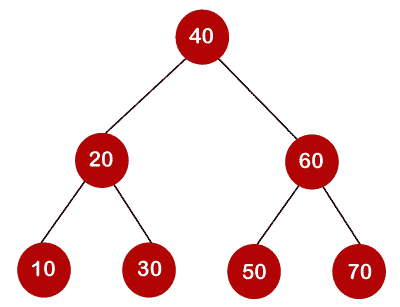

在上面的树中，左边子树上的所有节点都小于根节点的值，右边子树上的所有节点都大于根节点的值。搜索节点所需的最长时间等于树的最小高度，等于 logn。

现在我们将看到有多少二分搜索法树可以由给定数量的键组成。

例如:10、20、30 是键，下面是可以从这些键中辨认出的二分搜索法树。

计算树的数量的公式:

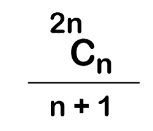

当我们使用上面的公式时，我们发现总共可以创建 5 棵树。

搜索元素所需的成本取决于搜索元素时进行的比较。现在，我们将计算上述二分搜索法树的平均时间成本。

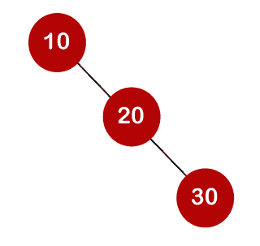

在上面的树中，总共可以进行 3 次比较。平均比较次数如下:

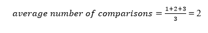
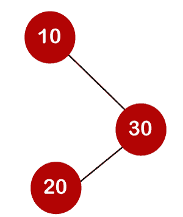

在上面的树中，可以进行的平均比较次数如下:

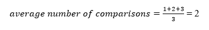
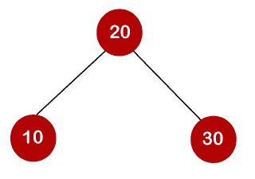

在上面的树中，可以进行的平均比较次数如下:

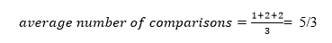
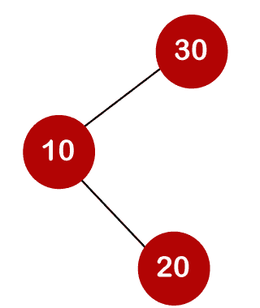

在上面的树中，比较的总数可以是 3。因此，可以进行的平均比较次数为:

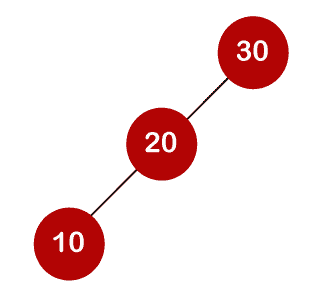

在上面的树中，比较的总数可以是 3。因此，可以进行的平均比较次数为:

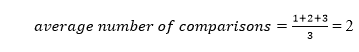

在第三种情况下，比较的次数更少，因为树的高度更低，所以这是一个平衡的二叉查找树。

到目前为止，我们读到了身高平衡的二叉查找树。为了找到最佳二叉查找树，我们将确定搜索关键字的频率。

让我们假设与按键 10、20、30 相关联的频率是 3、2、5。

以上树的频率不同。具有最低频率的树将被认为是最佳二叉查找树。频率为 17 的树是最低的，因此它将被认为是最佳二叉查找树。

### 活动教学法

考虑下表，其中包含了键和频率。

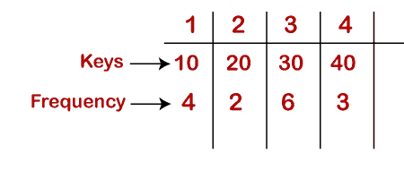
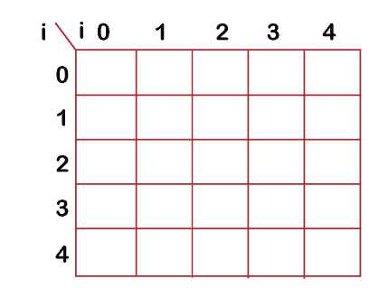

**首先，我们将计算 j-i 等于零的值。**

当 i=0，j=0，则 j-i = 0

当 i = 1，j=1，则 j-i = 0

当 i = 2，j=2，则 j-i = 0

当 i = 3，j=3，那么 j-i = 0

当 i = 4，j=4，则 j-i = 0

因此，c[0，0] = 0，c[1，1] = 0，c[2，2] = 0，c[3，3] = 0，c[4，4] = 0

**现在我们将计算 j-i 等于 1 的值。**

当 j=1 时，i=0，则 j-i = 1

当 j=2 时，i=1，则 j-i = 1

当 j=3，i=2，则 j-i = 1

当 j=4，i=3，则 j-i = 1

现在为了计算成本，我们将只考虑 jth 值。

c[0，1]的成本为 4(键为 10，键 10 对应的成本为 4)。

c[1，2]的成本为 2(键为 20，键 20 对应的成本为 2)。

c[2，3]的成本是 6(键是 30，键 30 对应的成本是 6)

c[3，4]的成本为 3(键为 40，与键 40 对应的成本为 3)

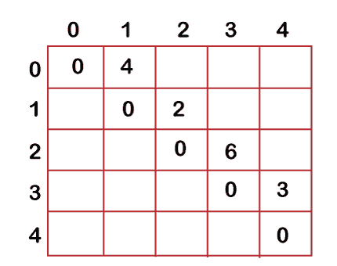

**现在我们将计算 j-i = 2 的值**

当 j=2 时，i=0，则 j-i = 2

当 j=3 时，i=1，然后 j-i = 2

当 j=4，i=2，则 j-i = 2

在这种情况下，我们将考虑两个关键点。

*   当 i=0 和 j=2 时，键 10 和 20。从下面显示的这两个键中可以看出两种可能的树:

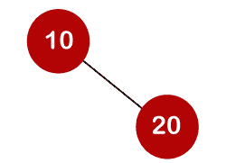

在第一个二叉树中，成本将是:4*1 + 2*2 = 8

在第二棵二叉树中，成本将是:4*2 + 2*1 = 10

最低成本为 8；因此，c[0，2] = 8

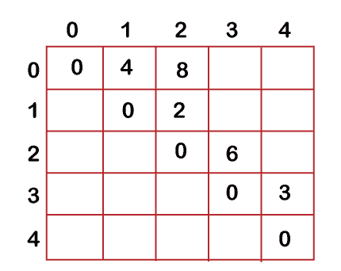

*   当 i=1 和 j=3 时，键 20 和 30。从下面显示的这两个键中可以看出两种可能的树:

在第一个二叉树中，成本将是:1*2 + 2*6 = 14

在第二棵二叉树中，成本将是:1*6 + 2*2 = 10

最低成本为 10；因此，c[1，3] = 10

*   当 i=2 和 j=4 时，我们将考虑 3 和 4 处的键，即 30 和 40。有两种可能的树可以从这两个键中看出，如下所示:

在第一个二叉树中，成本将是:1*6 + 2*3 = 12

在第二棵二叉树中，成本将是:1*3 + 2*6 = 15

最小成本是 12，因此，c[2，4] = 12

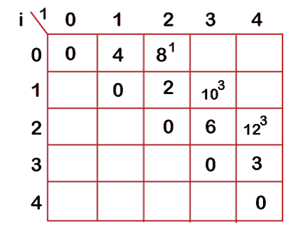

现在我们将计算 j-i = 3 时的值

当 j=3 时，i=0，则 j-i = 3

当 j=4 时，i=1，然后 j-i = 3

*   当 i=0，j=3 时，我们将考虑三个键，即 10，20 和 30。

以下是将 10 视为根节点时可以生成的树。

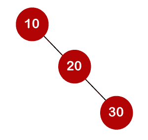

在上图中，10 是根节点，20 是节点 10 的右子节点，30 是节点 20 的右子节点。

成本将是:1*4 + 2*2 + 3*6 = 26

在上面的树中，10 是根节点，30 是节点 10 的右子节点，20 是节点 20 的左子节点。

成本将是:1*4 + 2*6 + 3*2 = 22

如果将 20 视为根节点，则可以创建以下树。

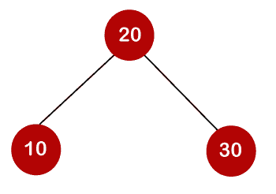

在上图中，20 是根节点，30 是节点 20 的右子节点，10 是节点 20 的左子节点。

成本将是:1*2 + 4*2 + 6*2 = 22

如果将 30 视为根节点，则可以创建以下树。

在上面的树中，30 是根节点，20 是节点 30 的左子节点，10 是节点 20 的左子节点。

成本将是:1*6 + 2*2 + 3*4 = 22

在上面的树中，30 是根节点，10 是节点 30 的左子节点，20 是节点 10 的右子节点。

成本将是:1*6 + 2*4 + 3*2 = 20

因此，最小成本为 20，即 3 rd 根。所以，c[0，3]等于 20。

*   当 i=1 和 j=4 时，我们将考虑键 20、30、40

c[1，4] = min{ c[1，1] + c[2，4]，c[1，2] + c[3，4]，c[1，3] + c[4，4] } + 11

=最小值{0+12，2+3，10+0}+ 11

=最小值{12，5，10} + 11

最小值为 5；因此，c[1，4] = 5+11 = 16

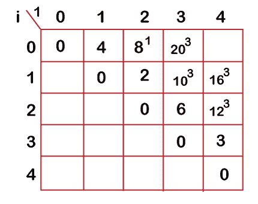

*   **现在我们来计算 j-i = 4 时的数值**

当 j=4 且 i=0 时，则 j-i = 4

在这种情况下，我们将考虑四个键，即 10、20、30 和 40。10、20、30 和 40 的频率分别为 4、2、6 和 3。

w[0，4] = 4 + 2 + 6 + 3 = 15

如果我们考虑 10 作为根节点，那么

C[0，4] = min {c[0，0] + c[1，4]}+ w[0，4]

=最小值{0 + 16} + 15= 31

如果我们考虑 20 作为根节点，那么

C[0，4] = min{c[0，1] + c[2，4]} + w[0，4]

=最低{4 + 12} + 15

= 16 + 15 = 31

如果我们考虑 30 作为根节点，

C[0，4] = min{c[0，2] + c[3，4]} +w[0，4]

=最低{8 + 3} + 15

= 26

如果我们考虑 40 作为根节点，

C[0，4] = min{c[0，3] + c[4，4]} + w[0，4]

=最小值{20 + 0} + 15

= 35

在上述情况下，我们观察到 26 是最小成本；因此，c[0，4]等于 26。

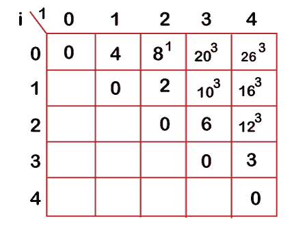

最佳二叉树可以创建为:

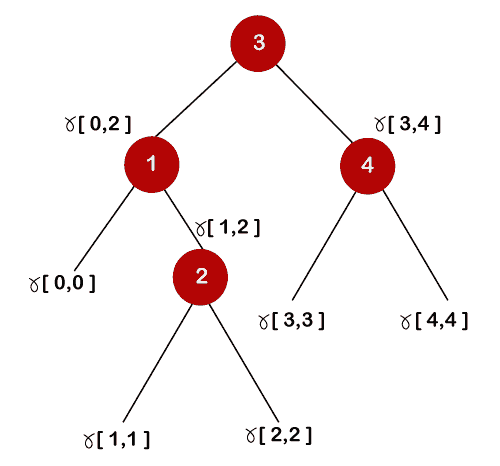
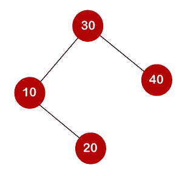

计算最低成本的一般公式是:

C[i，j] = min{c[i，k-1] + c[k，j]} + w(i，j)

* * *