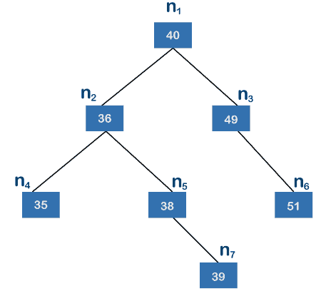
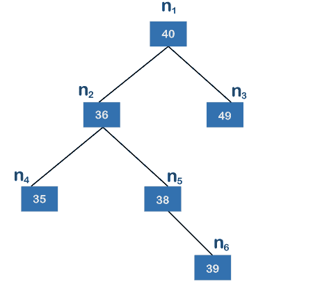
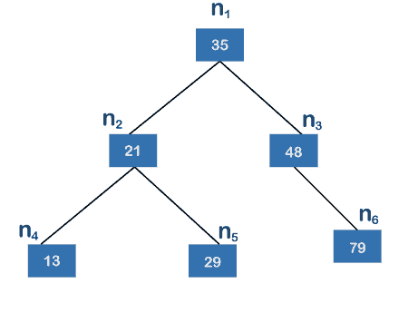
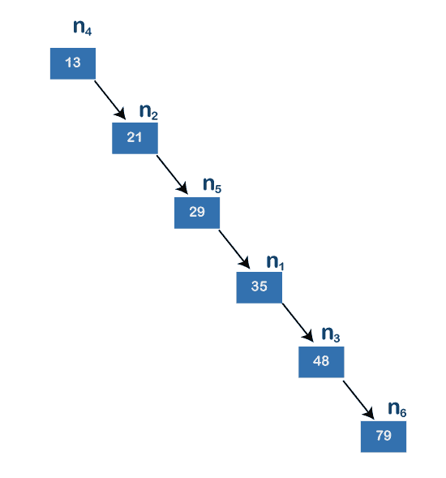

# 平衡的二叉查找树

> 原文：<https://www.javatpoint.com/balanced-binary-search-tree>

平衡二叉树也称为高度平衡树。当左子树和右子树的高度差不超过 m 时，它被定义为二叉树，其中 m 通常等于 1。树的高度是根节点和叶节点之间最长路径上的边数。

上面的树是一棵[二叉查找树](https://www.javatpoint.com/binary-search-tree)。二叉查找树树是一种树，其中左侧的每个节点的值都低于其父节点，右侧的节点的值高于其父节点。在上面的树中，n1 是根节点，n4、n6、n7 是叶节点。n7 节点是离根节点最远的节点。n4 和 n6 包含 2 条边，根节点和 n7 节点之间有 3 条边。因为 n7 离根节点最远；因此，上述树的高度为 3。

现在我们来看看上面的树是否平衡。左边的子树包含节点 n2、n4、n5 和 n7，而右边的子树包含节点 n3 和 n6。左边的子树有两个叶节点，即 n4 和 n7。节点 n2 和 n4 之间只有一条边，节点 n7 和 n2 之间有两条边；因此，节点 n7 离根节点最远。左边子树的高度是 2。右子树只包含一个叶节点，即 n6，只有一条边；因此，右子树的高度为 1。左子树和右子树的高度差为 1。因为我们得到的值是 1，所以我们可以说上面的树是一棵高度平衡的树。应该为像 n2、n3、n4、n5、n6 和 n7 这样的每个节点执行计算高度差的过程。当我们处理每个节点时，那么我们会发现 k 的值不大于 1，所以我们可以说上面的树是一个平衡的[二叉树](https://www.javatpoint.com/binary-tree)。

在上面的树中，n6、n4 和 n3 是叶节点，其中 n6 是离根节点最远的节点。根节点和叶节点之间有三条边；因此，上述树的高度为 3。当我们考虑 n1 作为根节点时，那么左边的子树包含节点 n2、n4、n5 和 n6，而子树包含节点 n3。在左边的子树中，n2 是根节点，n4 和 n6 是叶节点。n4 和 n6 节点中，n6 是离其根节点最远的节点，n6 有两条边；因此，左侧子树的高度为 2。右子树的左右两边确实有子树；因此，右子树的高度为 0。由于左子树的高度是 2，右子树的高度是 0，所以左子树和右子树的高度差是 2。根据定义，左子树和右子树的高度差不得大于 1。在这种情况下，差值为 2，大于 1；因此，上面的二叉树是一个不平衡的二叉查找树。

### 为什么我们需要一个平衡的二叉树？

让我们通过一个例子来理解平衡二叉树的必要性。

上面的树是二叉查找树树，因为所有左边的子树节点都小于它的父节点，所有右边的子树节点都大于它的父节点。假设我们想在上面的树中找到值 79。首先，我们将节点 n1 的值与 79 进行比较；因为 79 的值不等于 35，并且大于 35，所以我们移动到节点 n 3，即 48。由于值 79 不等于 48，而 79 大于 48，所以我们移到 48 的右子代。节点 48 的右子节点的值是 79，等于要搜索的值。搜索元素 79 所需的跳数是 2，搜索任何元素所需的最大跳数是 2。搜索一个元素的平均情况是 0(logn)。

上面的树也是二叉查找树树，因为所有左边的子树节点都小于它的父节点，所有右边的子树节点都大于它的父节点。假设我们想在上面的树中找到值 79。首先，我们将值 79 与节点 n4，即 13 进行比较。因为值 79 大于 13，所以我们移动到节点 13 的右子节点，即 n2 (21)。节点 n2 的值是 21，小于 79，所以我们再次移到节点 21 的右边。节点 21 的右子节点的值是 29。因为值 79 大于 29，所以我们移到节点 29 的右子节点。节点 29 的右子节点的值是 35，小于 79，所以我们移到节点 35 的右子节点，即 48。值 79 大于 48，所以我们移到节点 48 的右子节点。48 的右子节点的值是 79，等于要搜索的值。在这种情况下，搜索一个元素所需的跳数是 5。在这种情况下，最坏的情况是 O(n)。

如果节点数增加，树图 1 中使用的公式比树图 2 中使用的公式更有效。假设上述两个树中可用的节点数都是 100，000。在树形图中搜索任何元素所需的时间是 100，000 秒，而在树形图中搜索一个元素所需的时间是 log(100，000)，等于 16.6 秒。我们可以观察到上面两棵树之间巨大的时间差异。因此，我们得出结论，平衡二叉树比线性树数据结构提供更快的搜索。

* * *