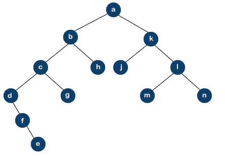

# 二叉树的边界遍历

> 原文：<https://www.javatpoint.com/boundary-traversal-of-binary-tree>

二叉树的边界遍历由左边界、叶子和右边界组成，没有重复的节点，因为节点可能包含重复的值。有两种类型的边界，即左边界和右边界。左边界可以定义为从根到最左边节点的路径，而右边界可以定义为从根到最右边节点的路径。如果根节点不包含任何左右子树，那么根节点本身将被认为是左边界和右边界。

**我们通过一个例子来理解二叉树的边界遍历。**

**考虑下面的树:**



我们必须在上面的[二叉树](https://www.javatpoint.com/binary-tree)中执行边界遍历。首先，我们遍历出现在上述二叉树左边的所有节点，该二叉树位于边界遍历之下。出现在左边的节点是 **a b c d f e** 。右边出现的节点是一个 k l n，我们已经遍历了左右节点，现在我们将遍历叶子节点。在上面的树中，叶节点是 e . h . j . m . n .一些节点在所有的边界上重复；例如，节点“a”同时出现在左边界和右边界，因此我们将从右边界移除“a ”,现在它只出现一次。一些节点也在叶节点中重复。由于节点“e”同时出现在左边界和叶节点中，因此我们将从叶节点中删除“e”。节点“n”同时出现在右边界和叶节点中，因此我们将从叶节点中移除节点“n”。因此，树的最终边界遍历将是:

**a b c d f e k l n g h j**

**假设我们要进行逆时针方向的边界二叉树遍历，那么问题就分解为四个部分:**

1.  第一个根将被打印。
2.  将遍历除叶节点之外的最左边的节点。
3.  叶节点
4.  将遍历除叶节点之外的最右边的节点。

下面给出了查找二叉树最左边节点的源代码:

```

void left_boundary_tree(node *p)
{
    if(p)
   {
         if(p->left)
         {
           print(p->data);
           left_boundary_tree(p->left);
        }
   }
else if(p->right)
{
    print(p->data);
   left_boundary_tree(p->right);
}
}
In the above, the pointer p which is passed to the function is the pointer that points to the root node of the binary tree. If the current node has a left node then the condition p->left would be true. It will print the current node data and the pointer p moves to the left of the current node data. The function left_boundary_tree(p->left); calls itself till wee find the left node.

```

下面给出了查找二叉树中最右边节点的源代码:

```

void right_boundary_tree(node *p)
{
    if(p)
   {
         if(p->right)
         {
           print(p->data);
           right_boundary_tree(p->right);
        }
   }
else if(p->left)
{
    print(p->data);
   right_boundary_tree(p->left);
}
}

```

打印叶节点的源代码。

```

void print_leaf_node(node *p)
{
   if(p)
  {
       print_leaf(p->left);
      if((!p->left) && !(p->right))
      {
           print(p->data);
      }
  print_leaf(p->right);
  }
}

```

**下面是二叉树边界遍历的 C 实现**

```

/* C program for boundary traversal 
of a binary tree */

#include #include <stdlib.h>/* Creation of user-defined structure named as node that has data, pointer to left child
and a pointer to right child */

struct node {
    int data;
    struct node *left, *right;
};

// A function that prints all the leaf nodes of a binary tree
void print_Leaf(struct node* root)
{
    if (root == NULL)
        return;

    print_Leaf(root->left);

    // Condition would be true if the node does not have any left and right child.
    if (!(root->left) && !(root->right))
        printf("%d ", root->data);

    print_Leaf(root->right);
}

// A function that prints all the left boundary nodes, except a leaf node.
// Print the nodes in from the top to the bottom manner
void print_left_boundary(struct node* root)
{
    if (root == NULL)
        return;

    if (root->left) {

        // print the root data before calling the function itself in a top-down manner.

        printf("%d ", root->data);
        print_left_boundary(root->left);
    }
    else if (root->right) {
        printf("%d ", root->data);
        print_left_boundary(root->right);
    }

// if the node is a leaf node then we do not need to do anything otherwise it will create duplicacy..
}

// A function that prints all the left boundary nodes, except a leaf node.
// Print the nodes in from the bottom to the top manner

void print_right_boundary(struct node* root)
{
    if (root == NULL)
        return;

    if (root->right) {
        // First, we will call the right subtree in order to maintain the bottom to top approach.
        print_right_boundary(root->right);
        printf("%d ", root->data);
    }
    else if (root->left) {
        print_right_boundary(root->left);
        printf("%d ", root->data);
    }
// if the node is a leaf node then we do not need to do anything otherwise it will create duplicacy..

}

// A function to do boundary traversal of a given binary tree
void print_boundary_nodes(struct node* root)
{
    if (root == NULL)
        return;

    printf("%d ", root->data);

    // Print the left boundary in top-down manner.
    print_left_boundary(root->left);

    // Print all leaf nodes
    print_Leaf(root->left);
    print_Leaf(root->right);

    // Print the right boundary in bottom-up manner
    print_right_boundary(root->right);
}

// A function used to create a node
struct node* new_Node(int data)
{
    struct node* temp = (struct node*)malloc(sizeof(struct node));

    temp->data = data;
    temp->left = temp->right = NULL;

    return temp;
}

// main() function from where the execution gets started.
int main()
{
    // first we construct a tree by calling the function new_Node()
    struct node* root = new_Node(30);
    root->left = new_Node(18);
    root->left->left = new_Node(14);
    root->left->right = new_Node(21);
    root->left->right->left = new_Node(9);
    root->left->right->right = new_Node(24);
    root->right = new_Node(22);
    root->right->right = new_Node(28);

    print_boundary_nodes(root);

    return 0;
}</stdlib.h> 
```

**输出**


* * *