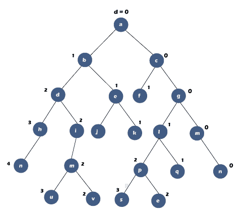
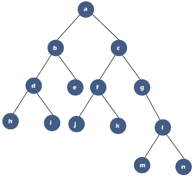
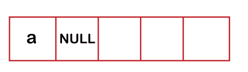
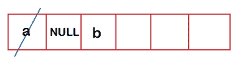
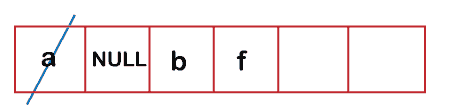
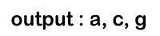
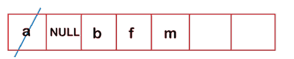

# 二叉树的对角遍历

> 原文：<https://www.javatpoint.com/diagonal-traversal-of-binary-tree>

这里我们将看到如何在二叉树中对角遍历。要打印二叉树中的对角线节点，我们需要计算对角线距离。让我们通过一个例子来理解这一点。

## 考虑下面的树:

在上面的树中，对角线距离用符号“d”表示。标记对角线距离有两个规则:

*   只有当节点有左子节点时,“d”变量才会递增 1。
*   对于每个正确的孩子，“d”与父母的“d”相同(对于正确的孩子，“d”也相同)。


在上面的树中，节点“a”的对角线距离为 0。由于节点“a”有两个子节点，即节点“b”(左子节点)和节点“c”(右子节点)，因此节点“b”的对角线距离增加并变为 1，而节点“c”的对角线距离保持不变并变为 0。节点“b”有一个左子节点，即 d，其对角线距离将变为 2，而节点“e”是右子节点，因此其对角线距离值将保持不变，即 1。节点“c”有一个左子节点，即 f，因此它的对角线距离值递增，“f”的“d”值将变为 1。节点“c”也有正确的子节点，即“g”，其对角线距离值将保持与其父节点相同，即“c”。

一旦计算出所有节点的对角线距离，我们就能找出对角线。对角线距离值相同的节点将被视为对角线。在上面的树中，我们可以观察到节点“a”、“c”和“g”具有相同的对角线距离值，因此“acg”将被视为对角线。节点“b”、“e”和“f”具有相同的对角线距离值，即 1，因此“aef”将被视为对角线。只有一个对角线距离值为 2 的节点。因此，在上面的二叉树中有三条对角线:“acg”、“bef”和“d”。

### 考虑下面的树，以更清楚地理解对角线距离的节点标记。



在上面的[二叉树](https://www.javatpoint.com/binary-tree)中，对角线距离值为 0 的节点为‘a’、‘c’、‘g’、‘m’和‘r’。对角线距离值为 1 的节点是“b”、“e”、“f”、“k”、“l”和“q”。对角线距离值为 2 的节点是“d”、“I”、“j”、“m”、“p”、“v”和“t”。对角线距离值为 3 的节点是“h”、“u”和“s”。只有一个值为 4 的节点是“n”。因此，存在 5 条对角线，即“a c g m r”、“b e f k l q”、“d i j m p v t”、“h u s”和“n”。

用对角线距离值标记节点的简短技巧:

*   首先，将根节点标记为 0。将根节点的右侧系列标记为 0，如下所示:
    简单来说，我们可以说 0 <sup>次</sup>对角线为“a c g m r”。
*   其次，一个 0 <sup>第</sup>对角线上元素的左子元素应该标记为 1，即 0+1 = 1。
*   将右侧系列标记为与我们在第一步中所做的相同。节点“b”的右侧系列，即“e”和“k”将标记为 1。节点“f”没有任何子节点。节点“l”有一个右子节点，即“q”将被标记为 1。:
    因此，第 1 条对角线为“b e k f l q”。
*   现在，第 1 条对角线上元素的所有左子元素都应该标记为 2，即 1+1 = 2。
*   将右侧系列标记为其父系列。节点“d”的右侧系列是“i m v”，因此节点“I”、“m”和“v”标记为 2。节点“p”的右侧系列是“t”..
    因此，第二条<sup>和</sup>对角线应为“d i m v j p t”。
*   现在，我们将对角线距离值为 2 的节点的子节点标记为 2。首先，我们将标记节点的左子节点。节点“d”的左子节点是“h”，因此节点“h”将被标记为 3，即 2+1 = 3。节点“m”的左子节点是“u”，因此节点“u”将被标记为 3，即 2+1 = 3。节点“p”的左子节点是“s”，因此节点“s”将被标记为 3，即 2+1 = 3。
    一旦标注了左侧系列，我们就标注右侧系列。因为没有右子节点系列，所以不会有标记。最后一棵树应该是:
    因此，3 <sup>第</sup>条对角线应该是“h s”。
*   现在我们将对角线距离值为 3 的节点的子节点标记为 3。只有一个节点“h”有左子节点，即“n”。所以，n 将被标记为 4。因此，第 4 条<sup>对角线为“n”。</sup>

## 算法

```

1.	Enqueue(root)
2.	Enqueue(NULL)
While(queue is not empty)
{
   p = dequeue();
   if(p == NULL)
  {
      Enqueue(NULL);
      p = dequeue();
      if(p = = NULL)
      break;
  }
While (p != NULL)
{
   Print(p);
   if(p->left)
   enqueue(p->left);
p = p->right;
}
}

```

### 考虑下面的树来更清楚地理解上面的算法。



这里我们采用队列数据结构来打印对角线元素。

根据上述算法，元素“a”被插入队列，然后空值如下所示:



然后，while 循环将一直执行到队列不为空。

**在第 0 次<sup>迭代</sup>**中，“a”将从队列中出列。现在，“p”指向节点“a”并且不等于 NULL，因此它将打印“a”，如下所示:


a->left 不为 NULL 所以入队(a-> left)//b；队列看起来像:



p = a ->右// c

既然‘p’指向节点‘c’，那么条件 **p！=空变为真，将打印 c.**


**在 1 <sup>st</sup> 迭代**中，‘p’不等于 NULL 它等于 c。

c->left 不等于 NULL//' f '；因此“f”将在如下所示的队列中排队:



p = c-> right // 'g '

既然‘p’指向节点‘T0’g，那么条件 **p！=空**变为真，将打印“g”。



**在 2 <sup>次</sup>迭代**中，【p】不为空；它等于“g”。

g->left 等于 NULL 所以，条件 p->左为假。

p = g->右/“l”

既然‘p’指向节点‘l’，那么条件 **p！=空**变为真，将打印‘l’。


**在 3 <sup>次</sup>迭代中，**的‘p’不为空；它等于“l”。

p-> left 不等于 NULL//' m '；因此“m”将在如下所示的队列中排队:



p = l->右/“n”

既然‘p’指向节点‘n’，那么条件 p！=空变为真，将打印“n”


在第 **4 <sup>次</sup>迭代**中，‘p’不等于空；它等于“n”。

p->left 等于 NULL 所以，条件 p->left 为假。

p =p->右；由于节点“n”没有合适的子节点，因此“p”等于空。

现在条件 p！= NULL 为 false，因此控件从内部循环中出来。控制转移到外部循环，在那里我们将检查队列是否为空。由于队列不是空的，所以控制在循环内移动，元素将从队列中出列，现在“p”指向节点“d”。

在第 **0 <sup>次</sup>迭代**中，

自从 p！=空，因此内部循环的条件变为真。它会打印“b”。


p->left 不等于 Null//“d”，因此条件 p->left 变为真，它将在队列中排队“d”，如下所示:

p = b->右/“e”

在 **1 <sup>st</sup> 迭代**中，条件 **p！=空**为真，因为“p”指向节点“e”。它会打印“e”。


p->left 等于 Null，因此条件 p-> left 变为 false。

p = e-> right//由于节点“e”没有右子节点，因此“p”包含空值。

现在条件 **p！=空**为假，所以控制从内部循环出来。控制转移到外部循环，在那里我们将检查队列是否为空。因为队列不是空的，所以控制在循环内。首先，元素将从队列中出列，现在“p”指向节点“f”。

在第 **0 <sup>次</sup>迭代**中，

自 **p！=空**所以内环的条件变为真。它会打印“f”。


p-> left 不等于 NULL，因此条件 p-> left 变为真。

p = f->右/“k”

在 **1 <sup>st</sup> 迭代**中，条件 **p！=空**为真，因为“p”指向节点“k”。它会打印“k”。


p-> left 等于 NULL，因此条件 p-> left 变为 false。

p = k-> right //由于节点“k”没有右子节点，因此“p”包含空值。

现在条件 **p！=空**为假，所以控制从内部循环出来。控件移动到外部循环，在那里我们将检查队列是否为空。因为队列不是空的，所以控制在循环内。首先，元素将从队列中出列，现在“p”指向节点“m”。

**在第 0 次<sup>迭代中，</sup>**

既然条件‘p！“空”为真，因此控件进入内部循环。它会打印“m”。


p-> left 等于 NULL，因此条件 p-> left 变为 false。

p = m -> right //由于节点“m”没有右子节点，因此“p”包含 NULL 值。

现在条件 **p！=空**为假，所以控制从内部循环出来。控制转移到外部循环，在那里我们将检查队列是否为空。因为队列不是空的，所以控制在循环内。首先，元素将从队列中出列，现在“p”指向节点“d”。

**在第 0 次<sup>迭代中，</sup>**

既然条件 p！= NULL 为真，因此控制进入循环内部。它会打印“d”。


p-> left 不等于 NULL//' h '；因此，条件 p->left 为真，它将在如下所示的队列中排队“h ”:

p = d->右；//I；

**在 1 <sup>st</sup> 迭代中，**

自况 **p！=空**为真，因为“p”指向节点“I”，所以控制进入循环内部。它会打印“我”。


p-> left 等于 NULL，因为节点“I”没有 left 子节点，所以条件 p-> left 变为 false。

p = i->右；//因为节点“I”没有合适的子节点；因此，“p”指向空值。

现在条件 **p！=空**为假，所以控制从内部循环出来。控制转移到外部循环，在那里我们将检查队列是否为空。因为队列不是空的，所以控制在循环内。首先，元素将从队列中出列，现在“p”指向节点“j”。

**在第 0 次<sup>迭代中，</sup>**

自况 **p！=空**为真，因为“p”指向节点“j”，所以控制进入循环内部。它会打印“j”。


p->left 等于 NULL，因为节点“j”没有左子节点。

p = j->右；由于节点“j”没有合适的子节点，因此“p”包含空值。

现在条件 **p！=空**为假，所以控制从内部循环出来。控制转移到外部循环，在那里我们将检查队列是否为空。因为队列不是空的，所以控制进入循环内部。首先，元素将从队列中出列，现在“p”指向节点“h”。

**在 0 <sup>st</sup> 迭代中，**

自况 **p！=空**为真，因为“p”指向节点“h”，所以控制进入循环内部。它会打印“h”。


p->left 等于 NULL，因为节点“h”没有左子节点。

p= h->右；由于节点“h”没有合适的子节点，因此“p”包含空值。

现在条件 **p！=空**为假，所以控制从内部循环出来。控件移动到外部循环，在那里我们将检查队列是否为空。因为队列是空的，所以控制从循环的外部出来。

* * *