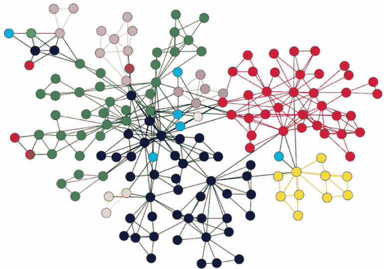
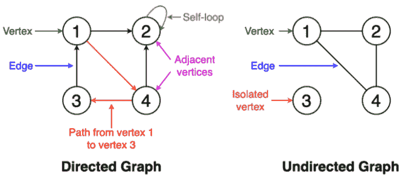
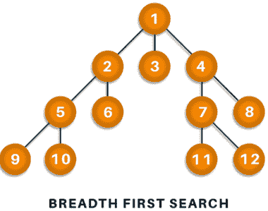
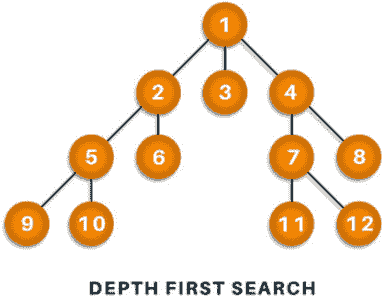
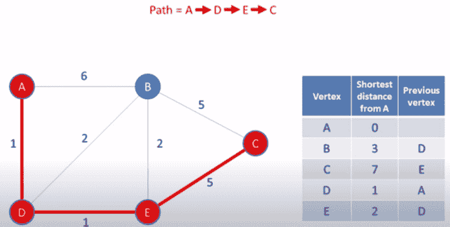
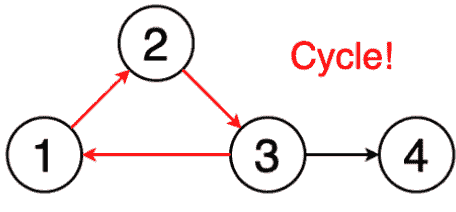
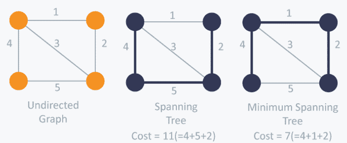
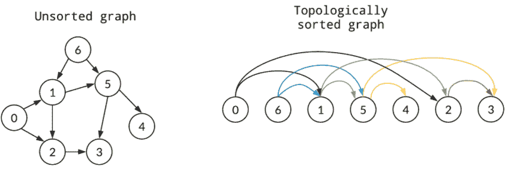
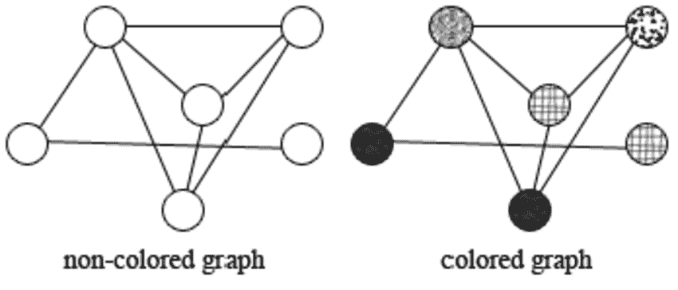
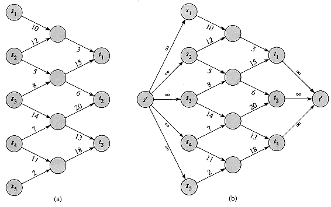

# 图形算法

> 原文：<https://www.javatpoint.com/graph-algorithms>



在本文中，您将学习一些最常用的图形算法的简要说明，用今天的话来说，这些算法有大量的应用。图涵盖了人们在实现它们时所经历的大多数高级数据结构技术，并且知道哪种图算法目前是最有效的是您将在这里学习的。首先，让我们从关于图形的最基本的知识中获得一个清晰的概念。

## 什么是图形？

图是编程中唯一的数据结构，由有限组节点或顶点以及一组连接这些顶点的边组成。此时，相邻的顶点可以称为彼此连接到同一条边的顶点。简单来说，图是共享某种连接或关系的顶点和边的可视化表示。虽然有很多你可能已经熟悉的图形算法，但只有其中一些被使用。原因很简单，因为标准的图形算法是这样设计的，只需几行逻辑编码技术就能解决数百万个问题。在某种程度上，一个完美的算法仅仅是为了获得如此高效的结果而优化的。

## 图的类型

在本文中，您将会看到各种类型的图形算法，但在此之前，让我们先看一些类型的术语，以暗示它们之间的基本差异。

**顺序:**顺序定义图中存在的顶点总数。

**尺寸:**尺寸定义图形中存在的边的数量。

**自环:**是从一个顶点连接到自身的边。

**孤立顶点:**是不与图中任何其他顶点相连的顶点。

**顶点度:**定义为图中一个顶点的入射边数。

**加权图:**具有顶点的值或权重的图。

**未加权图:**没有顶点值或权重的图。

**有向图:**有方向指示器的图。

**无向图:**没有定义方向的图。



现在让我们继续主要讨论，了解不同类型的图形算法。

### 广度优先搜索

遍历或搜索是处理图形时最常用的操作之一。因此，在**广度优先搜索** (BFS)中，你从一个特定的顶点开始，算法试图在进入下一级顶点遍历之前访问给定深度的所有邻居。与树不同，图可能包含循环路径，其中第一个和最后一个顶点总是非常相同。因此，在 BFS，你需要记录你正在访问的所有顶点的轨迹。为了实现这样的顺序，您使用了一种先进先出的队列数据结构。要理解这一点，请参见下图。



**算法**

1.  开始将图中的任何顶点放在队列的后面。
2.  首先，移动前面的队列项并将其添加到被访问节点的列表中。
3.  接下来，创建该列表相邻顶点的节点，并添加尚未访问过的节点。
4.  继续重复第二步和第三步，直到发现队列是空的。

**伪代码**

```

Set all nodes to "not visited";
   q = new Queue();
   q.enqueue(initial node);
   while ( q ? empty ) do
   {
      x = q.dequeue();
      if ( x has not been visited )
      {
         visited[x] = true;         // Visit node x !

         for ( every edge (x, y)  /* we are using all edges ! */ )    
            if ( y has not been visited )   
	       q.enqueue(y);       // Use the edge (x,y) !!!
      }
   }

```

**复杂度:0(V+E)** 其中 V 为顶点，E 为边。

**应用程序**

BFS 算法有多种应用。比如用来确定**最短路径**和**最小生成树。**也用于网络爬虫创建网页索引。它还被用作社交媒体网络上搜索引擎的动力，并有助于在 BitTorrent 中找到对等网络。

### 深度优先搜索

在深度优先搜索(DFS)中，你特别从顶点开始，在回溯之前沿着所有分支探索尽可能多的东西。在 DFS 中，记录访问节点的轨迹是很重要的，为此，您使用堆栈数据结构。



**算法**

1.  首先将图形的一个顶点放在堆栈的顶部。
2.  将栈顶项目添加到访问顶点列表中。
3.  创建顶点的所有相邻节点的列表，然后将这些节点添加到堆栈顶部的未访问节点。
4.  不断重复第 2 步和第 3 步，堆栈就会变空。

**伪代码**

```

 DFS(G,v)   ( v is the vertex where the search starts )
         Stack S := {};   ( start with an empty stack )
         for each vertex u, set visited[u] := false;
         push S, v;
         while (S is not empty) do
            u := pop S;
            if (not visited[u]) then
               visited[u] := true;
               for each unvisited neighbour w of uu
                  push S, w;
            end if
         end while
      END DFS()

```

**应用程序**

当涉及到寻找两个顶点之间的路径和检测循环时，DFS 找到了它的应用。此外，拓扑排序可以很容易地使用 DFS 算法来完成。DFS 也用于单解谜题。

### 迪克斯特拉最短路径算法

Dijkstra 的最短路径算法可以找到从一个顶点到另一个顶点的最短路径。顶点的和应该是这样的，即它们所经过的权重之和应该输出最小值。最短路径算法是一种高度精确的算法，它尽可能基于接收效率的概念。考虑下图。



**算法**

1.  将所有顶点设置为无穷大，不包括源顶点。
2.  将源推送到表单(距离、顶点)中，并将其放入最小优先级队列中。
3.  从优先级中，队列弹出距离源顶点的最小距离。
4.  弹出最小距离顶点后更新距离，并使用(顶点距离+权重
5.  如果您发现访问的顶点被弹出，请不要使用它继续前进。
6.  应用这些步骤，直到发现优先级队列为空。

**伪代码**

```

function dijkstra(G, S)
    for each vertex V in G
        distance[V] 
```

**应用程序**

Dijkstra 的最短路径算法用于寻找从一个地点到另一个地点的旅行距离，就像谷歌地图或苹果地图一样。此外，它在网络中被广泛用于解决最小延迟路径问题和抽象机器，以确定达到特定目标的选择，如数字游戏或赢得比赛的移动。

### 循环检测

循环被定义为图算法中通常考虑第一个和最后一个顶点的路径。例如，如果你从一个顶点开始，沿着一条随机路径行进，你可能会到达你最终开始的确切点。因此，这形成了一个链或循环算法来覆盖遍历中出现的所有节点。因此，周期检测就是基于检测这种周期。请看下图。



**伪代码**

```

Brent's Cycle Algorithm Example
def brent(f, x0):
    # main phase: search successive powers of two
    power = lam = 1
    tortoise = x0
    hare = f(x0)  # f(x0) is the element/node next to x0.
    while tortoise != hare:
        if power == lam:  # time to start a new power of two?
            tortoise = hare
            power *= 2
            lam = 0
        hare = f(hare)
        lam += 1
    # Find the position of the first repetition of length ?
    tortoise = hare = x0
    for i in range(lam):
    # range(lam) produces a list with the values 0, 1, ... , lam-1
        hare = f(hare)
    # The distance between the hare and tortoise is now ?.
    # Next, the hare and tortoise move at same speed until they agree
    mu = 0
    while tortoise != hare:
        tortoise = f(tortoise)
        hare = f(hare)
        mu += 1
    return lam, mu

```

**应用程序**

循环算法用于基于消息的分布式系统和大规模集群处理系统。它还主要用于检测并发系统和各种加密应用程序中的死锁，其中密钥用于管理具有加密值的消息。

### 最小生成树

最小生成被定义为没有圈的图的边的子集，并且与所有的顶点都很好地连接，使得最小和通过边权重得到。它仅取决于生成树的成本和顶点覆盖的最小跨度或最小距离。根据边权重和各种其他因素，可以有许多最小生成树。



**伪代码**

```

Prim's Algorithm Example
ReachSet = {0};     
   UnReachSet = {1, 2, ..., N-1};
   SpanningTree = {};
   while ( UnReachSet ? empty )
   {
      Find edge e = (x, y) such that:
         1\. x ? ReachSet
	 2\. y ? UnReachSet
	 3\. e has smallest cost
      SpanningTree = SpanningTree ? {e};
      ReachSet   = ReachSet ? {y};
      UnReachSet = UnReachSet - {y};
   }

```

**应用程序**

最小生成树在网络设计中得到了应用，并被广泛用于数据结构中的**旅行推销员**问题。也可用于寻找最小成本加权完美匹配和多终端最小割问题。MST 在图像和手写识别以及聚类分析领域也有应用。

### 拓扑排序

图的拓扑排序遵循对顶点进行线性排序的算法，使得每个具有顶点排序的有向图确保顶点在它之前。用户可以通过查看下面给出的示例图像来更准确地理解它。



在上面的示例中，您可以可视化未排序图和拓扑排序图的顺序。拓扑排序图确保对路径中的顶点进行排序。

**伪代码**

```

topological_sort(N, adj[N][N])
        T = []
        visited = []
        in_degree = []
        for i = 0 to N
                in_degree[i] = visited[i] = 0
        for i = 0 to N
                for j = 0 to N
                        if adj[i][j] is TRUE
                                in_degree[j] = in_degree[j] + 1
        for i = 0 to N
                if in_degree[i] is 0
                        enqueue(Queue, i)
                        visited[i] = TRUE
        while Queue is not Empty
                vertex = get_front(Queue)
                dequeue(Queue)
                T.append(vertex)
                for j = 0 to N
                        if adj[vertex][j] is TRUE and visited[j] is FALSE
                                in_degree[j] = in_degree[j] - 1
                                if in_degree[j] is 0
                                        enqueue(Queue, j)
                                        visited[j] = TRUE
        return T

```

**应用**

拓扑排序涵盖了卡恩和 DFS 算法的应用空间。在现实应用中，拓扑排序用于调度指令和数据序列化。它还被广泛用于确定要编译的任务，并用于解决链接器中的依赖关系。

### 图形着色

图着色算法遵循在特定条件下为图中存在的元素分配颜色的方法。条件基于技术或算法。因此，顶点着色是一种常用的着色技术。首先，在这种方法中，您尝试使用 k 颜色给顶点着色，确保两个相邻的顶点不应该具有相同的颜色。其他方法包括面部着色和边缘着色。这两种方法还应确保没有边缘或表面的颜色不一致。图的着色是通过知道色数来决定的，色数也是所需的较小的颜色数。请看下图，了解它是如何工作的。



**伪代码**

```

#include #include <list>using namespace std; 
// A class that represents an undirected graph
class Graph
{
    int V;    // No. of vertices
    list <int>*adj;    // A dynamic array of adjacency lists
public:
    // Constructor and destructor
    Graph(int V)   { this->V = V; adj = new list<int>[V]; }
    ~Graph()       { delete [] adj; }
    // function to add an edge to graph
    void addEdge(int v, int w);
    // Prints greedy coloring of the vertices
    void greedyColoring();
};
void Graph::addEdge(int v, int w)
{
    adj[v].push_back(w);
    adj[w].push_back(v);  // Note: the graph is undirected
}
// Assigns colors (starting from 0) to all vertices and prints
// the assignment of colors
void Graph::greedyColoring()
{
    int result[V]; 
    // Assign the first color to first vertex
    result[0]  = 0; 
    // Initialize remaining V-1 vertices as unassigned
    for (int u = 1; u < V; u++)
        result[u] = -1;  // no color is assigned to u
    // A temporary array to store the available colors. True
    // value of available[cr] would mean that the color cr is
    // assigned to one of its adjacent vertices
    bool available[V];
    for (int cr = 0; cr < V; cr++)
        available[cr] = false; 
    // Assign colors to remaining V-1 vertices
    for (int u = 1; u < V; u++)
    {
        // Process all adjacent vertices and flag their colors
        // as unavailable
        list<int>::iterator i;
        for (i = adj[u].begin(); i != adj[u].end(); ++i)
            if (result[*i] != -1)
                available[result[*i]] = true; 
        // Find the first available color
        int cr;
        for (cr = 0; cr < V; cr++)
            if (available[cr] == false)
                break; 
        result[u] = cr; // Assign the found color
        // Reset the values back to false for the next iteration
        for (i = adj[u].begin(); i != adj[u].end(); ++i)
            if (result[*i] != -1)
                available[result[*i]] = false;
    }
    // print the result
    for (int u = 0; u < V; u++)
        cout << "Vertex " << u << " --->  Color "
             << result[u] << endl;
}
// Driver program to test above function
int main()
{
    Graph g1(5);
    g1.addEdge(0, 1);
    g1.addEdge(0, 2);
    g1.addEdge(1, 2);
    g1.addEdge(1, 3);
    g1.addEdge(2, 3);
    g1.addEdge(3, 4);
    cout << "Coloring of graph 1 \n";
    g1.greedyColoring(); 
    Graph g2(5);
    g2.addEdge(0, 1);
    g2.addEdge(0, 2);
    g2.addEdge(1, 2);
    g2.addEdge(1, 4);
    g2.addEdge(2, 4);
    g2.addEdge(4, 3);
    cout << "\nColoring of graph 2 \n";
    g2.greedyColoring();
    return 0;
}</int></int></int></list> 
```

**应用**

图着色在数据结构和解决现实问题中有着广泛的应用。例如，它用于时间表调度和为移动设备分配无线电频率。它也用于 Sudoko 和检查给定的图是否是二部图。图形着色也可以用于地理地图，以不同的颜色标记国家和州。

### 最大流量

最大流算法通常被视为一种解决问题的算法，其中图被建模为网络流基础设施。因此，最大流量是通过找到具有**最大流量的流动路径来确定的。**最大流量是通过增加路径来确定的，路径是源节点基于流量的总流出量等于宿节点中的流量。下图也是如此。

```

function: DinicMaxFlow(Graph G,Node S,Node T):
    Initialize flow in all edges to 0, F = 0
    Construct level graph
    while (there exists an augmenting path in level graph):
        find blocking flow f in level graph
        F = F + f
        Update level graph
    return F

```

**应用程序**

像你一样，最大流问题涵盖了流行算法的应用，如福特-富尔克森算法、埃德蒙兹-卡普算法和迪尼奇算法，就像你在上面给出的伪代码中看到的那样。在现实生活中，它可以应用于航班调度和前景与背景的图像分割。它也用于像篮球这样的游戏，在这种游戏中，分数被设置为具有当前分区领导者的最大估计值。

### 相称的

图中的匹配算法或技术被定义为完全没有公共顶点的边。如果最大数量的边可能与尽可能多的顶点匹配，则匹配可以称为最大匹配。它遵循确定完全匹配的特定方法，如下图所示。



**应用程序**

匹配用于像霍普克罗夫特-卡普算法和布鲁姆算法这样的算法中。它还可以使用匈牙利算法来解决问题，该算法涵盖了匹配的概念。在现实生活的例子中，匹配可以用于资源分配和旅行优化以及一些问题，如稳定婚姻和顶点覆盖问题。

## 结论

在本文中，您遇到了大量的图着色算法和技术，它们在现实生活的所有实例中都有日常应用。您学习了如何根据情况实现它们，因此伪代码帮助您战略性地、高效地处理信息。图形算法被认为是该领域的一个重要方面，不仅局限于使用数据结构解决问题，而且也适用于谷歌地图和苹果地图等一般任务。然而，初学者可能会发现很难实现 Graph 算法，因为它们性质复杂。因此，强烈建议通读这篇文章，因为它从头开始涵盖了所有内容。

* * *