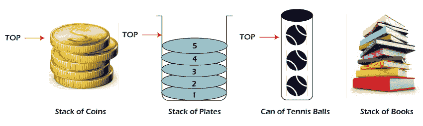
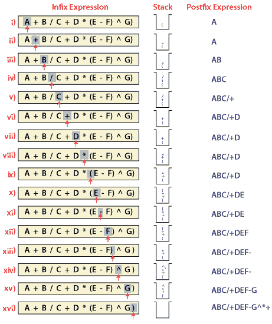
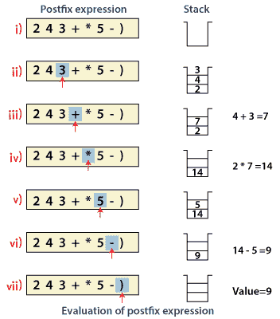
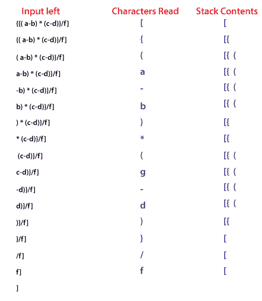
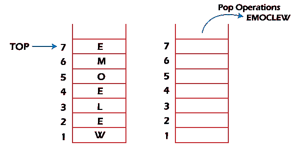
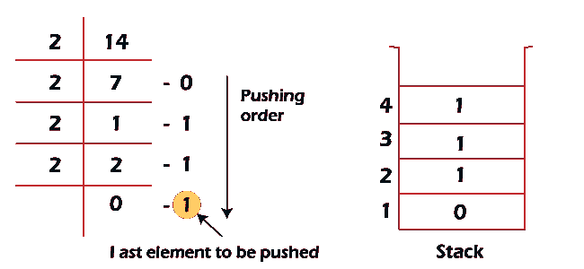
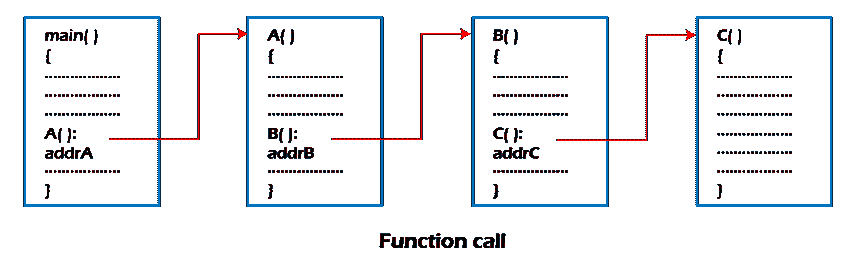
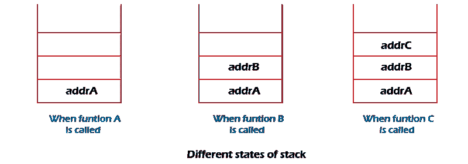

# 栈在数据结构中的应用；

> 原文：<https://www.javatpoint.com/applications-of-stack-in-data-structure>

在本文中，我们将了解堆栈在数据结构中的应用。

## 你说的 Stack 是什么意思？

堆栈是现代计算机中广泛使用的线性数据结构，其中元素的插入和删除只能发生在一端，即堆栈的顶部。它用在所有必须在最后存储和检索数据的应用程序中。

堆栈数据结构的日常类比是桌子上的一堆书、一堆盘子、乒乓球、一堆无货、文本编辑器中的撤销或重做机制等。

### 以下是堆栈在数据结构中的各种应用:

*   算术表达式的求值
*   追踪
*   分隔符检查
*   反转数据
*   处理函数调用

## 1.算术表达式的求值

栈是一种非常有效的[数据结构](https://www.javatpoint.com/data-structure-tutorial)，用于评估编程语言中的算术表达式。算术表达式由操作数和运算符组成。

除了操作数和运算符之外，算术表达式还可以包括括号，如“左括号”和“右括号”。

**例:A + (B - C)**

要评估表达式，需要了解算术表达式的标准优先规则。五种基本算术运算符的优先规则是:

| 经营者 | 结合性 | 优先 |
| 求幂 | 从右向左 | 最高，其次是*乘法和/除法 |
| *乘法，/除法 | 从左到右 | 最高，其次是+加减 |
| +加法，-减法 | 从左到右 | 最低的 |

### 算术表达式的计算需要两个步骤:

*   首先，将给定的表达式转换成特殊的符号。
*   用这个新符号计算表达式。

### 算术表达式的符号

有三种表示算术表达式的符号:

*   中辍法
*   前缀表示法
*   Postfix 符号

**微小的符号**

中缀符号是编写表达式的一种方便方式，其中每个运算符都放在操作数之间。中缀表达式可以加圆括号，也可以不加圆括号，这取决于问题的要求。

**例:** A + B，(C - D)等。

所有这些表达式都是中缀符号，因为运算符位于操作数之间。

前缀符号

前缀表示法将运算符放在操作数之前。这种符号是由波兰数学家引入的，因此通常被称为波兰符号。

**例:**+A B- CD 等。

所有这些表达式都采用前缀表示法，因为运算符位于操作数之前。

**邮政修正符号**

后缀表示法将运算符放在操作数之后。这种符号正好是波兰语符号的反义词，也被称为波兰语反义词。

**例:** AB +、CD+等。

所有这些表达式都采用后缀表示法，因为运算符在操作数之后。

**算术表达式到各种符号的转换:**

| 中辍法 | 前缀表示法 | Postfix 符号 |
| 甲*乙 | *甲乙 | AB* |
| (甲+乙)/丙 | /+ ABC | AB+C/ |
| (甲*乙)+(丁-丙) | +*AB - DC | AB*DC-+ |

**我们举一个把中缀表达式转换成后缀表达式的例子。**

在上面的例子中，后缀表达式的唯一变化是运算符放在操作数之前，而不是操作数之间。

**评估后缀表达式:**

堆栈是计算后缀表达式的理想数据结构，因为顶部元素总是最近的操作数。堆栈上的下一个元素是要操作的第二个最新操作数。

在计算后缀表达式之前，必须检查以下条件。如果任何一个条件失败，后缀表达式无效。

*   当运算符遇到扫描过程时，堆栈必须包含一对操作数或先前计算的中间结果。
*   当表达式被完全求值后，堆栈必须恰好包含一个值。

**示例:**

现在让我们考虑下面的中缀表达式 2 * (4+3) - 5。

它的等价后缀表达式是 2 4 3 + * 5。

下面的步骤说明了如何计算这个后缀表达式。

## 2.追踪

回溯是 Stack 的另一个应用。这是一种用于求解优化问题的递归算法。

## 3.分隔符检查

堆栈的常见应用是分隔符检查，即语法分析，包括从语法上分析源程序。这也称为括号检查。当编译器把用 C、C++等编程语言编写的源程序翻译成机器语言时，会把程序解析成多个独立的部分，如变量名、关键字等。从左向右扫描。翻译时遇到的主要问题是分隔符不匹配。我们使用不同类型的分隔符，包括括号检查(，)，大括号{，}和方括号[，]，以及常见的分隔符/*和*/。每个开始分隔符必须与结束分隔符匹配，即每个开始括号后面都应该跟一个匹配的结束括号。此外，分隔符可以嵌套。源程序中后面出现的开始分隔符应该在前面出现的分隔符之前关闭。

| 有效分隔符 | 无效分隔符 |
| 而(i > 0) | 而(我> |
| /*数据结构*/ | /*数据结构 |
| { ( a + b) - c } | { ( a + b) - c |

为了执行分隔符检查，编译器使用堆栈。当编译器翻译一个源程序时，它一次读取一个字符，如果找到一个开始分隔符，它就把它放在堆栈上。当找到结束分隔符时，它会从堆栈顶部弹出开始分隔符，并将其与结束分隔符匹配。

**匹配时，可能会出现以下情况。**

*   如果分隔符属于同一类型，则匹配被认为是成功的，并且该过程继续。
*   如果分隔符不是同一类型，则报告语法错误。

当程序结束，堆栈为空时，源程序的处理停止。

**示例:**为了解释这个概念，我们来考虑以下表达式。

**[{a -b) * (c -d)}/f]**

## 4.反转数据:

要反转给定的数据集，我们需要对数据重新排序，以便交换第一个和最后一个元素，交换第二个和第二个最后一个元素，以此类推所有其他元素。

**示例:**假设我们有一个字符串“欢迎”，那么在反转时它将是“表情提示”。

**有不同的倒车应用:**

*   反转弦
*   将十进制转换为二进制

### 反转字符串

堆栈可用于反转字符串的字符。这可以通过简单地将每个字符一个接一个地推到堆栈上来实现，稍后可以一个接一个地从堆栈中弹出。由于堆栈的**后进先出**属性，堆栈的第一个字符在堆栈的底部，字符串的最后一个字符在堆栈的顶部，在堆栈中执行弹出操作后，堆栈以相反的顺序返回字符串。

### 将十进制转换为二进制:

虽然十进制数字在大多数商业应用中使用，但是一些科学和技术应用需要二进制、八进制或十六进制的数字。堆栈可用于将数字从十进制转换为二进制/八进制/十六进制形式。为了将任何十进制数转换成二进制数，我们重复地将十进制数除以二，并将每次除法的余数推到堆栈上，直到该数减少到 0。然后我们弹出整个堆栈，得到的结果是给定十进制数的二进制等价物。

**示例:将 14 位十进制数转换为二进制数:**

在上面的例子中，14 除以 2，我们得到 7 作为商，1 作为提醒，它被推送到堆栈上。再次将 7 除以 2，我们得到 3 作为商，1 作为提醒，这再次被推到堆栈上。这个过程一直持续到给定的数字没有减少到 0。当我们完全弹出堆栈时，我们得到等价的二进制数 **1110。**

## 5.处理函数调用:

堆栈在连续调用多个函数的程序中起着重要的作用。假设我们有一个包含 A、B、c 三个函数的程序，函数 A 调用函数 B，函数 B 调用函数 c。

当我们调用包含对函数 B 的调用的函数 A 时，那么它的处理将不会完成，直到函数 B 完成它的执行并返回。对于函数 B 和 C 也是如此。所以我们观察到函数 A 只有在函数 B 完成之后才会完成，函数 B 只有在函数 C 完成之后才会完成。因此，功能 A 首先启动，最后完成。总之，上面的函数活动与后进先出行为相匹配，可以使用堆栈轻松处理。

考虑 addrA、addrB、addrC 分别是在完成函数 A、B 和 C 后返回控制的语句的地址。

上图显示返回地址在堆栈中出现的顺序与调用函数的顺序相反。每个函数完成后，执行弹出操作，并在从堆栈中删除的地址继续执行。因此，连续调用几个函数的程序可以由堆栈数据结构进行最佳处理。控件在正确的位置返回到每个函数，这与调用序列的顺序相反。
