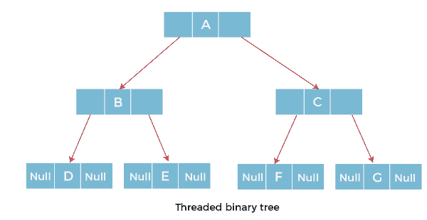
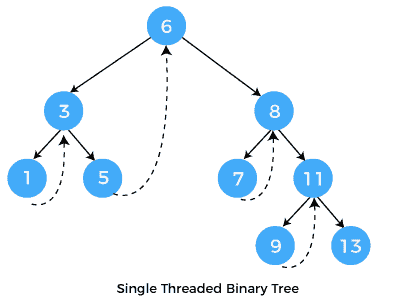
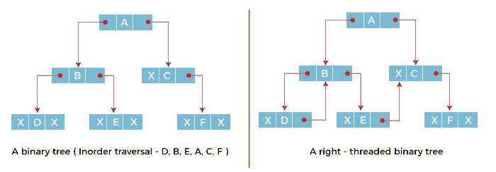
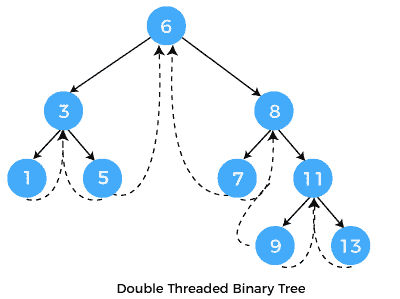
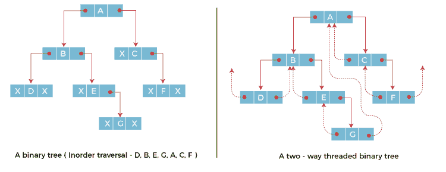
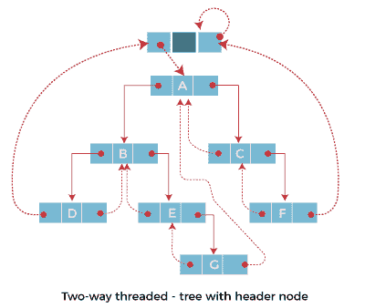
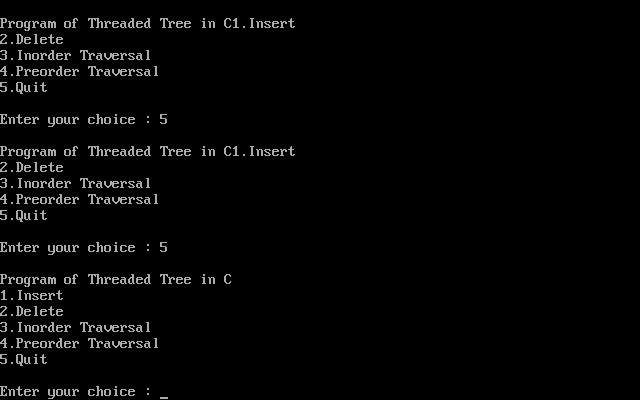
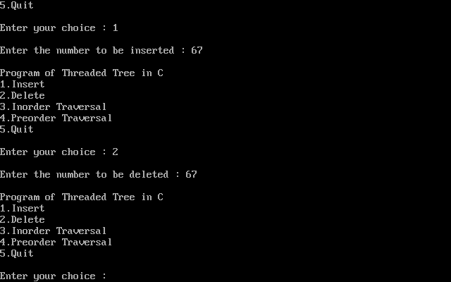
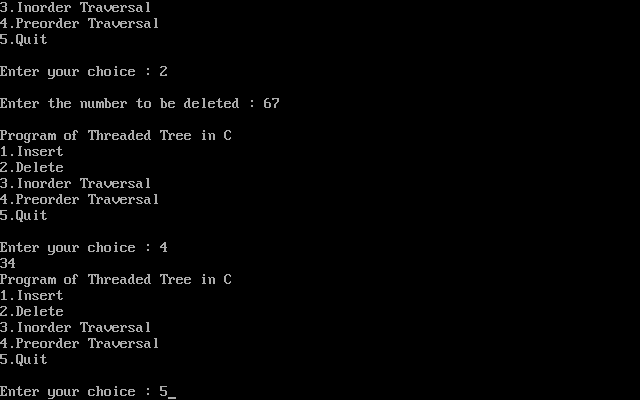

# 线程二叉树

> 原文：<https://www.javatpoint.com/threaded-binary-tree>

在本文中，我们将详细了解线程二叉树。

**线程二叉树是什么意思？**

在二叉树的链接表示中，超过一半的链接字段包含空值，这导致存储空间的浪费。如果二叉树由 **n** 个节点组成，那么 **n+1** 个链接字段包含空值。因此，为了有效地管理空间，Perlis 和 Thornton 设计了一种方法，将空链接替换为称为线程的特殊链接。这种带线程的二叉树被称为**线程二叉树**。线程二叉树中的每个节点要么包含指向其子节点的链接，要么包含指向树中其他节点的线程。



### 线程二叉树的类型

有两种类型的线程二叉树:

*   单向线程二叉树
*   双向线程二叉树

**单向线程二叉树:**



在单向线程二叉树中，线程将出现在节点的右或左链接字段中。如果它出现在一个节点的右链接字段中，那么它将指向执行顺序遍历时出现的下一个节点。这样的树称为**右线程二叉树**。如果线程出现在一个节点的左字段，那么它将指向前一个节点。这样的树被称为**左线程二叉树。**左线程二叉树的使用频率较低，因为它们没有右线程二叉树的最后优势。在单向线程二叉树中，最后一个节点的右链接字段和第一个节点的左链接字段包含一个空值。为了区分线程和普通链接，它们用虚线表示。



上图显示了此二叉树的有序遍历产生 D、B、E、A、C、f。当此树表示为右线程二叉树时，包含空值的叶节点 D 的右链接字段被指向节点 D 的有序后继节点 B 的线程替换。同样，包含右链接字段中的值的其他节点也将包含空值。

**双向线程二叉树:**



在双向线程二叉树中，包含空值的节点的右链接字段被指向后续节点的线程替换，包含空值的节点的左字段被指向前置节点的线程替换。



上图显示了此二叉树的有序遍历产生 D、B、E、G、A、C、f。如果我们考虑双向线程二叉树，其左字段包含空值的节点 E 被指向其有序前身即节点 B 的线程替换。类似地，对于其右和左链接字段包含空值的节点 G，被线程替换，使得右链接字段指向其有序后继，左链接字段指向其有序前身。同样，链接字段中包含空值的其他节点也用线程填充。



在上图的双向线程二叉树中，我们注意到第一个节点不可能有左线程，最后一个节点不可能有右线程。这是因为他们分别没有更好的前任和继任者。这是由不指向任何地方的线程指示的。所以为了保持线程的一致性，我们维护了一个特殊的节点叫做**头节点**。头节点不包含任何数据部分，其左链接字段指向根节点，其右链接字段指向自身。如果这个头节点包含在双向线程二叉树中，那么这个节点将成为第一个节点的前序节点和最后一个节点的后序节点。现在，第一个节点的左链接字段和最后一个节点的右链接字段的线程将指向头节点。

## 线程二叉树的有序遍历算法；

```

ALgorithm Inorder(I)
{
  ThreadedTreeNode *Header;
  Header=I;
  while(1)
  {
    I=fnFindInorder_Successor(H);
    if(I==Header)
     return;
    else
     print(I->info);
   }
}  
In the above algorithm, we have discussed the Inorder traversal of Threaded binary trees. 
Pseudocode of Threaded Tree in C:
#include #include <stdlib.h>typedef enum {false,true} boolean;
struct node *in_succ(struct node *p);
struct node *in_pred(struct node *p);
struct node *insert(struct node *root, int ikey);
struct node *del(struct node *root, int dkey);
struct node *case_a(struct node *root, struct node *par,struct node *ptr);
struct node *case_b(struct node *root,struct node *par,struct node *ptr);
struct node *case_c(struct node *root, struct node *par,struct node *ptr);
void inorder( struct node *root);
void preorder( struct node *root);

struct node
{
        struct node *left;
        boolean lthread;
        int info;
        boolean rthread;
        struct node *right;
};
int main( )
{
clrscr();
	int choice,num;
        struct node *root=NULL;
        while(1)
        {
	       printf("\Program of Threaded Tree in C\n");
                printf("1.Insert\n");
                printf("2.Delete\n");
                printf("3.Inorder Traversal\n");
                printf("4.Preorder Traversal\n");
                printf("5.Quit\n");
                printf("\nEnter your choice : ");
                scanf("%d",&choice);
                switch(choice)
                {
                 case 1:
                        printf("\nEnter the number to be inserted : ");
                        scanf("%d",&num);
                        root = insert(root,num);
                        break;
                 case 2:
                        printf("\nEnter the number to be deleted : ");
                        scanf("%d",&num);
                        root = del(root,num);
                        break;
                 case 3:
                        inorder(root);
                        break;
                 case 4:
                        preorder(root);
                        break;
                 case 5:
                         exit(1);

                 default:
                        printf("\nWrong choice\n");
		}
	}
        return 0;
}
struct node *insert(struct node *root, int ikey)
{
	struct node *tmp,*par,*ptr;
	int found=0;
	ptr = root;
	par = NULL;
	while( ptr!=NULL )
	{
		if( ikey == ptr->info)
		{
			found =1;
			break;
		}
		par = ptr;
		if(ikey < ptr->info)
		{
			if(ptr->lthread == false)
				ptr = ptr->left;
			else
				break;
		}
		else
		{
			if(ptr->rthread == false)
				ptr = ptr->right;
			else
				break;
		}
	}
	if(found)
		printf("\nDuplicate key");
	else
	{
		tmp=(struct node *)malloc(sizeof(struct node));
		tmp->info=ikey;
		tmp->lthread = true;
		tmp->rthread = true;
		if(par==NULL)
		{
			root=tmp;
			tmp->left=NULL;
			tmp->right=NULL;
		}
		else if( ikey < par->info )
		{
			tmp->left=par->left;
			tmp->right=par;
			par->lthread=false;
			par->left=tmp;
		}
		else
		{
			tmp->left=par;
			tmp->right=par->right;
			par->rthread=false;
			par->right=tmp;
		}
	}
	return root;
}

struct node *del(struct node *root, int dkey)
{
	struct node *par,*ptr;
	int found=0;
	ptr = root;
	par = NULL;
	while( ptr!=NULL)
	{
		if( dkey == ptr->info)
		{
			found =1;
			break;
		}
		par = ptr;
		if(dkey < ptr->info)
		{
			if(ptr->lthread == false)
				ptr = ptr->left;
			else
				break;
		}
		else
		{
			if(ptr->rthread == false)
				ptr = ptr->right;
			else
				break;
		}
	}
	if(found==0)
		printf("\ndkey not present in tree");
	else if(ptr->lthread==false && ptr->rthread==false)/*2 children*/
		root = case_c(root,par,ptr);
	else if(ptr->lthread==false )
	root = case_b(root, par,ptr);
	else if(ptr->rthread==false)
	root = case_b(root, par,ptr);
	else
		root = case_a(root,par,ptr);
	return root;
}

struct node *case_a(struct node *root, struct node *par,struct node *ptr )
{
	if(par==NULL)
		root=NULL;
	else if(ptr==par->left)
	{
		par->lthread=true;
		par->left=ptr->left;
	}
	else
	{
		par->rthread=true;
		par->right=ptr->right;
	}
	free(ptr);
	return root;
}
struct node *case_b(struct node *root,struct node *par,struct node *ptr)
{
	struct node *child,*s,*p;
	if(ptr->lthread==false)
		child=ptr->left;
	else
		child=ptr->right;
        if(par==NULL )   
                root=child;
        else if( ptr==par->left) 
                par->left=child;
        else                     
                par->right=child;
        s=in_succ(ptr);
        p=in_pred(ptr);
        if(ptr->lthread==false) 
                        p->right=s;
        else
        {
		if(ptr->rthread==false) 
                        s->left=p;
        }
        free(ptr);
        return root;
} 
struct node *case_c(struct node *root, struct node *par,struct node *ptr)
{
        struct node *succ,*parsucc;
        parsucc = ptr;
        succ = ptr->right;
        while(succ->left!=NULL)
        {
                parsucc = succ;
                succ = succ->left;
        }
        ptr->info = succ->info;
        if(succ->lthread==true && succ->rthread==true)
                root = case_a(root, parsucc,succ);
        else
                root = case_b(root, parsucc,succ);
        return root;
}
struct node *in_succ(struct node *ptr)
{
        if(ptr->rthread==true)
                return ptr->right;
        else
        {
                ptr=ptr->right;
                while(ptr->lthread==false)
                        ptr=ptr->left;
                return ptr;
        }
} 
struct node *in_pred(struct node *ptr)
{
        if(ptr->lthread==true)
                return ptr->left;
        else
        {
                ptr=ptr->left;
                while(ptr->rthread==false)
                        ptr=ptr->right;
                return ptr;
        }
}
void inorder( struct node *root)
{
        struct node *ptr;
        if(root == NULL )
        {
                printf("Tree is empty");
                return;
        }
        ptr=root;
        while(ptr->lthread==false)
                ptr=ptr->left;
        while( ptr!=NULL )
        {
                printf("%d ",ptr->info);
                ptr=in_succ(ptr);
        }
}
void preorder(struct node *root )
{
        struct node *ptr;
        if(root==NULL)
        {
                printf("Tree is empty");
                return;
        }
        ptr=root;
        while(ptr!=NULL)
        {
                printf("%d ",ptr->info);
                if(ptr->lthread==false)
                        ptr=ptr->left;
                else if(ptr->rthread==false)
                        ptr=ptr->right;
                else
                {
                        while(ptr!=NULL && ptr->rthread==true)
                                ptr=ptr->right;
                        if(ptr!=NULL)
                                ptr=ptr->right;
                }
        }
}</stdlib.h> 
```

**说明:**

在上面的例子中，我们为各种操作创建了一个线程二叉树。

**输出:**





**线程二叉树的优势:**

*   在线程二叉树中，线性和快速遍历树中的节点，因此不需要堆栈。如果使用堆栈，那么它会消耗大量内存和时间。
*   它更通用，因为人们可以通过简单地跟踪线程和链接来有效地确定任何节点的后继节点和前驱节点。它的行为几乎像一个循环链表。

**线程二叉树的缺点:**

*   当实现时，线程二叉树需要维护每个节点的额外信息，以指示每个节点的链接字段是指向普通节点，还是指向该节点的后继和前任。
*   由于线程和普通链接都需要维护，因此插入和删除线程二叉树更加耗时。

* * *