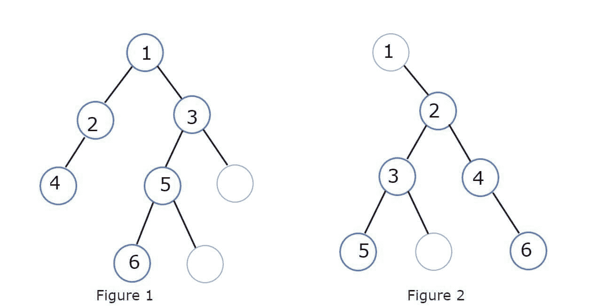

# 二叉树的直径

> 原文：<https://www.javatpoint.com/diameter-of-binary-tree>

二叉树的直径可以定义为连接二叉树中任意两个节点的最长路径之间的边数。二叉树的直径也称为二叉树的宽度。路径表示二叉树的直径，可以通过也可以不通过二叉树的根。该路径包括两个叶节点，其中的直径正在计算。

代表二叉树直径的两个节点之间的最长路径有两种可能:

1.  **通过根节点:**它会经过二叉树的根节点也算根节点。
2.  **不通过根节点:**在这种情况下，选择的路径不会通过二叉树的根节点，也不会计算路径中的根节点。



在上面的图 1 中，最长的路径在叶节点 4 和叶节点 6 之间，将穿过根节点 1。图 1 所示的二叉树的直径是 6，从叶节点 4 开始到叶节点 6，即节点 4 -节点 2 -节点 1 -节点 3 -节点 5 -节点 6 也覆盖根节点。

而在图 2 所示的二叉树中，获得二叉树直径的最长路径是从叶节点 5 开始到叶节点 6，但不包括根节点 1。除根节点 1 之外，该二叉树的直径为 5，路径节点 5 -节点 3 -节点 2 -节点 4 -节点 6。

## 求二叉树直径的方法

求二叉树的直径是数据结构中非常常见的问题，解决这个问题的方法有很多。所以，现在我们有了一个如何找到二叉树直径的想法，现在让我们看看找到这个问题陈述的解决方案的不同方法或途径。

解决这个问题有两种不同的方式**递归方式**和**迭代方式**。两种方式都有不同的方法和不同的时空复杂度。

### 1.递归方式

这样，使用递归函数借助于该递归函数来找到两个子树的高度，然后借助于两个子树的高度来计算整个二进制的直径。由于递归函数的重复递归调用，递归方法的时间和空间复杂度较高。

现在，让我们编写一个 Java 代码，借助递归找到二叉树的直径。

**代码:**

```

// A Java Program to create a  Binary tree and then find the diameter of the Binary tree

// A class named Node is written that will act as the single node of the Binary tree

class Node
{
    // the Node class has Three class variables, one of Integer type and the rest two of Node class type having names data left and right, respectively 

    // the data variable is of Integer type and will be used to store the value that particular node is storing in the Binary tree
    int data;

    // the left and right variables are of a Node type and will be used to store the left sub child and right sub child of the Binary tree, respectively
    Node left = null, right = null;

// A parameterised constructor is also written that will be used to assign the value to the data variable for storing that value in the node of the Binary tree 
    Node(int data) {
        this.data = data;
    }
}//end of Node Class

// A class named BinaryTree is written to find the diameter of the Binary tree and print the result
class BinaryTree
{
    // Function to find the diameter of the binary tree. Note that the
    // function returns the height of the subtree rooted at a given node,
    // and the diameter is updated within the function as it is passed by
    // reference using the `AtomicInteger` class.
    // The getDiameter Function is the recursive function that will be called repeatedly to find the heights of both the left subtree and right subtree and
    // and then those heights will be used to calculate the diameter of the Binary tree

public static int getDiameter(Node root, AtomicInteger diameter)
    {
        // base case: tree is empty
        if (root == null) {
            return 0;
        }

        // get heights of left and right subtrees
        int left_height = getDiameter(root.left, diameter);
        int right_height = getDiameter(root.right, diameter);

        // calculate diameter "through" the current node
        int max_diameter = left_height + right_height + 1;

        // update maximum diameter (note that diameter "excluding" the current
        // node in the subtree rooted at the current node is already updated
        // since we are doing postorder traversal)
        diameter.set(Math.max(diameter.get(), max_diameter));

        // it is important to return the height of the subtree rooted at the
        // current node
        return Math.max(left_height, right_height) + 1;
    }

    there is one more definition of the getDiameter function with only one parameter that will be called from the main function that
    will return the actual diameter of the Binary tree    
    public static int getDiameter(Node root)
    {
        AtomicInteger diameter = new AtomicInteger(0);
        getDiameter(root, diameter);

        return diameter.get();
    }

    //main function is written to create a Binary tree and call the getDiameter() function to get the diameter of the Binary tree
    public static void main(String[] args)
    {
       // An Object of the Node class named root is created that will represent the root node of the Binary tree whose diameter is going to be calculated 
        Node root = new Node(500);

        //After the creation of the root node the childs to the root nodes are attached  
        root.left = new Node(895);
        root.right = new Node(123);
        root.left.right = new Node(412);
        root.right.left = new Node(345);
        root.right.right = new Node(236);
        root.right.left.left = new Node(247);
        root.right.left.right = new Node(448);

        // Once all the nodes are added in the Binary tree, the getDiameter() function is called to get the diameter of the Binary tree and the root node of the Binary tree is passed as a parameter to the getDiameter() function
        int diameter = getDiameter(root);
        System.out.print("The diameter of the binary tree is " + diameter);
    }
}

```

**输出:**上述代码的输出为:

```
The diameter of the binary tree is 6

```

在上面的代码中，我们使用了一个名为 **getDiameter()** 的递归函数，该函数将被重复调用以找到二叉树的左子树和右子树的高度，然后这些高度将被用来计算二叉树的直径。由于递归函数的重复递归调用，与迭代方式相比，时间复杂度和空间复杂度太高。

求二叉树直径的时间复杂度为: **O(n^2)**

求二叉树直径的空间复杂度为: **O(log n)**

### 2.迭代方式

不是使用递归函数，而是以深度优先搜索的方式遍历二叉树，以找到二叉树的直径。当我们以深度优先的方式迭代二叉树时，它将帮助我们找到二叉树的最深或最远的叶节点，从该叶节点计算到另一个节点的路径以获得树的直径。这种方法的时间和空间复杂度都比较低。

这里，迭代方式的空间复杂度小于递归方式的寻找树的直径，因为没有重复的递归调用会增加这些复杂度。

现在让我们为寻找二叉树直径的迭代方法编写一个代码。

**代码:**

```

// A Java program to create a binary tree and find the diameter of that binary tree using DFS(iterative way). 

// The ArrayList class is imported from the java.util package
import java.util.ArrayList; 
// The Arrays class is imported from the java.util package
import java.util.Arrays;
// The List class is imported from the java.util package 
import java.util.List; 

// A class named BinaryTree is created to create a binary tree and find the diameter of that binary tree
public class BinaryTree { 
// Used to track farthest or the deepest leaf node of the binary tree. 
    static int x; 
    static int maxCount; 
    // A static Object of the List class is created to store the nodes of the binary tree whose diameter is to be calculated
    static List nodes[]; 

    // A static Function named findDepth is created to find the deepest element of the binary tree, which is passed as a parameter to this Function

    // The findDepth() Function has four parameters two of Integer type named node and count and one is a boolean array named visited to mark the visited nodes and a List of Integer types named nodes representing the nodes of the binary tree
    static void findDepth(int node, int count,boolean visited[],List <integer>nodes[]) {

        // If that particular node is visited it is marked as true in the boolean array named visted for the particular element
        visited[node] = true; 
        // The count variable is incremented by one value 
        count++; 

        // The depth of that particular node is found with the help of this findDepth() Function, and the deepest value is put into the maxCount variable

        List <integer>l = nodes[node]; 
        for(Integer i: l) 
        { 
            if(!visited[i]){ 
                if (count >= maxCount) { 
                    maxCount = count; 
                    x = i; 
                } 
                findDepth(i, count, visited, nodes); 
            } 
        } 
    } 

    // A static Function named dfs is written to traverse the Binary Tree and then subsequently find the deepest element of that particular Binary Tree  

    // The dfs() Function has three parameters two of Integer type named node and n, and the third one is a List of Integer types named nodes representing the nodes of the binary tree
    static void dfs(int node, int n, List<integer>nodes[]) { 

        // A boolean array named visted is created to keep track of all the nodes of the binary tree that are visited
        boolean[] visited = new boolean[n + 1]; 
        int count = 0; 

        // Initially, all the fields of the visited array is marked as false, representing that no node is visited at the beginning of the program
        Arrays.fill(visited, false); 

        // Then the deepest element of the binary tree is calculated that will be used to find the diameter of the binary tree 
        findDepth(node, count + 1, visited, nodes); 

    } 

    // A static Function named diameter is written to find the diameter of the binary tree 

    // The diameter() Function has two parameters one is a List of Integer types named nodes representing the nodes of the binary tree,, and the other is Integer named n
    static int diameter(List <integer>nodes[], int n) 
    { 

        // the maxCount variable is initialised with the minimum value of the Integers
        maxCount = Integer.MIN_VALUE; 

        // Firstly, the deepest nodes that are present in the binary tree are found, and once the deepest nodes are found
        // Those will be used to find the diameter of the binary tree 
        dfs(1, n, nodes); 

        dfs(x, n, nodes); 

        return maxCount; 
    } 

    //The main Function is written to call the diameter() Function to get the diameter of the binary tree
    public static void main(String args[]) 
    { 
        int n = 5; 

        /* Constructed tree is 
             1 
            / \ 
            2    3 
           / \ 
          4   5 */

        // elements are added to the nodes of the binary tree
        nodes = new List[n + 1]; 
        for(int i = 0; i < n+1 ; i++) 
            nodes[i] = new ArrayList<integer>();  

        /*create undirected edges */
        nodes[1].add(2); 
        nodes[2].add(1); 
        nodes[1].add(3); 
        nodes[3].add(1); 
        nodes[2].add(4); 
        nodes[4].add(2); 
        nodes[2].add(5); 
        nodes[5].add(2); 

        /* maxCount will have diameter of tree */
        int diametr = diameter(nodes,n);
        System.out.println("The Diameter of the given tree is " + diametr); 
    } // end of the main class
}// end of the Binary tree class</integer></integer></integer></integer></integer> 
```

**输出:**上述代码的输出为:

```
The diameter of the given tree is 4

```

在上面的代码中，我们使用迭代的方式计算了二叉树的直径。迭代方法中有重复的递归调用。在这种方法中，空间和时间复杂度远低于递归方法。

求二叉树直径迭代方式的时间复杂度为 **O(n)** 。

求二叉树直径迭代方式的空间复杂度为 **O(n)** 。

* * *