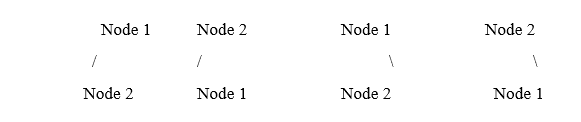
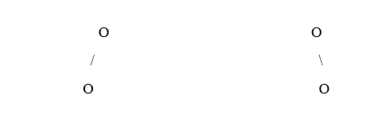
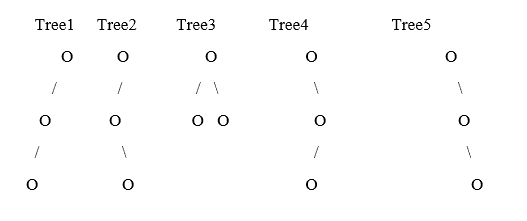

# 二叉树的计数

> 原文：<https://www.javatpoint.com/enumeration-of-binary-trees>

二叉树的枚举可以定义为从给定数量的节点或二叉树创建的不同二叉树的数量。根据二叉树节点的标记，这些不同的二叉树可以是不同的。根据二叉树中节点的标记，二叉树有两种类型:

1.  **标记二叉树**:二叉树中的所有节点都用标记二叉树中适当的标签进行标记。这意味着标记二叉树中的所有节点都是以特定的顺序排列的。
2.  **未标记二叉树**:在未标记二叉树中，节点没有被赋予特定的标签。二叉树中节点的顺序或顺序是不相关的，因为没有特定的参数来清楚地识别二叉树的各个节点。

这两种不同的类型有不同类型的二叉树枚举。

### 标记二叉树的计数

标记二叉树的计数可以被定义为由给定的标记二叉树或一组标记节点形成的不同的未标记二叉树的数量。

标记二叉树的枚举和未标记二叉树的枚举之间的主要区别在于，对于给定数量的节点，在未标记的树中创建了新树的唯一结构，但是在标记的树中，将有两个不同的树具有相同数量的节点，因为树中的定位节点可以不同于所有节点并且不相同。

让我们借助一个例子来理解未标记二叉树的枚举。

假设我们有一组节点，其中有三个节点，分别名为节点 1、节点 2 和节点 3。

对于第一轮，让我们考虑 N=1，其中 N 表示创建一个不同的二叉树的节点数，其中树中有一个节点。这棵树会是这样的，

Node 1

现在让我们考虑 N=2，这意味着我们有节点 1 和节点 2 来形成二叉树。所以有了两个节点，我们可以创建四个不同的二叉树。

对于 N=2，形成了两个不同的二叉树。这两棵树看起来像，



在上面的树中，根据树中节点的位置，我们有四棵树。有两株 ***向左倾斜的*** 树和两株 ***向右倾斜的*** 树。

*   在第一棵***-左偏*** 树中，节点 1 是根节点，节点 2 是左子节点。在第二个左倾斜树中，节点二作为左倾斜二叉树的根节点，节点一作为左子节点。
*   同时，两个 ***右偏的*** 二叉树有相同数量的节点，只是改变了这些节点在树中的位置。在第一棵向右倾斜的二叉树中，节点 1 充当二叉树的根节点，节点 2 充当树的子节点。而在第二棵向右倾斜的二叉树中，节点二作为二叉树的根节点，节点一作为树的子节点。

因此，对于两个标记的节点，创建了四个不同的树。类似地，对于三个标记的节点，可以创建三十个不同的二叉树。

因此，为了计算三个节点的枚举，

对于 N=1，不同标记树的数量=1

对于 N=2，不同标记树的数量= 4

对于 N=3，不同标记树的数量= 30

下面是所有这些不同二叉树的数目除以节点数目的总和公式。

```

Number of distinct unlabelled trees = N!( (2N)! / ((N+1)! * N!))

```

其中 N 是节点数。

让我们计算一下 N=3，

```

Number of distinct unlabelled trees = 3! ((2*3)! / ((3+1)! * 3!))
					  =  3! (6! / 4! * 3!)
					  = 6 * (720 / 144)
 					  = 6 * 5
					  = 30

```

因此，对于三个带标签的节点，我们可以创建三十个不同的树。

### C++代码

让我们编写一个 C++代码来查找从给定的一组标记节点创建的不同标记二叉树的数量。

```

// A C++ code to find the number of distinct labelled binary trees that can be created from a given set of labelled nodes.

// The iostream library is included to use the functionalities like cout and cin provided by the stream objects of the ostream and istream classes, respectively.
#include 
using namespace std;

// A fucntion named fact with one integer parameter is written to calculate the factorial of the integer that is passed as a parameter to this fact fucntion
 int fact(int n){
   if(n == 1)
      return 1;

   // Factorial of the integer is returned
   return n * fact(n - 1);
}

// A function named distinctCount with one integer parameter is written
// The distinctCount() function is used to find the number of distinct labelled binary trees that can be created from a given set of labelled nodes

// The number of distinct labelled bianry trees that are possible to create from the N number of nodes is returned as the value of this fucntion
int distinctCount(int N){
   return ( (fact(N))*( fact(2*N) / ( fact(N+1)*fact(N)) ) );
}

//The main fucntion is written to call the distinctCount() fucntion to find the number of distinct labelled binary trees that can be created from a given set of labelled nodes
int main(){

   // An integer variable named N is created that represents the number of nodes for which we have to calculate the number of distinct labelled binary trees
   int N = 3;

   // An integer variable named N is created that represents the number of distinct labelled binary trees
   // The distinctCount() function is called to find the number of distinct labelled binary trees that can be created from a given set of labelled nodes
   int count = distinctCount(N);

   cout<
```

**输出:**

上面代码的输出是

```
The number of Distinct labelled Binary Tree is 30

```

### Java 代码

让我们编写一个 Java 代码来查找从一组给定的标记节点创建的不同标记二叉树的数量。

```

// A Java code to find the number of distinct labelled binary trees that can be created from a given set of labelled nodes.

// A class named DistinctTreeCount is created to calculate the number of distinct labelled binary trees that can be created from a given set of labelled nodes.
// The DistinctTreeCount class has a distinctCountLabeledTree() fucntion to find the number of distinct labelled binary trees that can be created from a given set of labelled nodes.
class DistinctTreeCount{

	// A fucntion named fact with one integer parameter is written to calculate the factorial of the integer that is passed as a parameter to this fact function
	public static int fact(int num){

		if(num == 1)
      		return 1;

	   // Factorial of the integer is returned
	   return n * fact(num - 1);
	}//end of fact fucntion

	// A function named distinctCount with one integer parameter is written
	// The distinctCountLabeledTree() function is used to find the number of distinct labelled binary trees that can be created from a given set of labelled nodes

	// The number of distinct labelled binary trees that are possible to create from the N number of nodes is returned as the value of this fucntion
	public static int distinctCountLabeledTree(int N){

		// An integer variable is defined to store the number of distinct labelled binary trees that can be created using the formula mentioned in the next line.
		int treeCount = fact(N) * ( fact(2*N) / ( fact(N+1)*fact(N)) )  ;

		// after the calculation of the distinct number of labelled binary trees the value stored in the treeCount vaiable is returned as a return value of the distinctCountLabeledTree() fucntion
		return treeCount;
	}//end of the distinctCountLabeledTree function

	// A main fucntion is written to call the distinctCount() fucntion to find the number of distinct labelled binary trees that can be created from a given set of labelled nodes
	public static void main(String ... nk){

		// An integer variable named N is created that represents the number of nodes for which we have to calculate the number of distinct labelled binary trees

```

### 无标记二叉树的计数

未标记二叉树的计数可以被定义为由给定的未标记二叉树或一组未标记节点形成的不同的未标记二叉树的数量。

让我们借助一个例子来理解未标记二叉树的枚举。

假设我们有一组节点，其中有三个节点。

对于第一轮，考虑 N=1，其中 N 代表节点的数量，这样我们可以创建一个不同的二叉树，其中一个节点在树上。这棵树会是这样的，

O

现在考虑 N=2，这意味着我们有两个节点来形成二叉树。所以有了两个节点，我们可以创建两个不同的二叉树。

对于 N=2，形成了两个不同的二叉树，这两个树看起来像，



在其中一棵树中，根节点只有左边的子节点，而在另一棵树中，根节点只有右边的一个子节点。

现在考虑 N=3。有三个节点可用于创建不同的二叉树。N=3 时，可以创建五个不同的未标记二叉树。这五种不同的未标记二叉树是:



如上所示，创建了这五个不同的未标记树。

*   在未标记的二叉树 1 中，根节点只有一个左子节点，只有一个左子节点。未标记的二叉树中显示的树也被称为左偏斜二叉树。
*   在未标记的二叉树 2 中，根有一个左子节点，该左子节点有一个右子节点。
*   在未标记的二叉树 3 中，根节点有一个右子节点和一个左子节点。它是一棵二叉树。
*   在未标记的二叉树 4 中，根有一个右子节点和一个左子节点。
*   在未标记的二叉树 5 中，根节点只有一个右子节点，而右子节点只有一个。未标记的二叉树 5 中所示的树也被称为右树。偏斜二叉树。

因此，为了计算三个节点的枚举，

对于 N=1，不同的未标记树的数量=1

对于 N=2，不同的未标记树的数量=2

对于 N=3，不同的未标记树的数量= 5

下面是所有这些不同二叉树的数目除以节点数目的总和公式。

```

Number of distinct unlabelled trees = (2N)! / ((N+1)! * N!)

```

其中 N 是节点数。

让我们计算一下 N=3，

```

Number of distinct unlabelled trees = (2*3)! / ((3+1)! * 3!)
					  =  6! / 4! * 3!
					  = 720 / 144
 					  = 5

```

因此，有了三个节点，就可以创建五个不同的无标签二叉树。

### C++代码

让我们编写一个 C++代码来查找从一组给定的未标记节点创建的不同的未标记二叉树的数量。

```

// A C++ code to find the number of distinct unlabelled binary trees that can be created from a given set of unlabeled nodes.

// The iostream library is included to use the functionalities like cout and cin provided by the stream objects of the ostream and istream classes, respectively.
#include 
using namespace std;

// A fucntion named fact with one integer paramter is written to calculate the factorial of the integer that is passed as a paramter to this fact fucntion
int fact(int n){
   if(n == 1)
      return 1;

   // Factorial of the integer is returned
   return n * fact(n - 1);
}

// A function named distinctCount with one integer parameter is written
// The distinctCountLabeledTree() function is used to find the number of distinct unlabelled binary trees that can be created from a given set of unlabelled nodes

// The number of distinct unlabelled bianry trees that are possible to create from the N number of nodes is returned as the value of this fucntion
int distinctCountLabeledTree(int N){
   return ( (fact(N))*( fact(2*N) / ( fact(N+1)*fact(N)) ) ) ;
}

//The main fucntion is written to call the distinctCount() fucntion to find the number of distinct unlabelled binary trees that can be created from a given set of labelled nodes
int main(){

   // An integer variable named N is created that represents the number of nodes for which we have to calculate the number of distinct unlabelled binary trees
   int N = 7;

   // An integer variable named N is created that represents the number of distinct labelled binary trees
   // The distinctCountLabeledTree() function is called to find the number of distinct unlabelled binary trees that can be created from a given set of labelled nodes
   int count = distinctCountLabeledTree(N);

   cout<
```

**输出:**上述 C++代码的输出为

```
The number of distinct unlabeled binary trees is 5

```

### Java 代码

让我们编写一个 Java 代码来查找从一组给定的未标记节点创建的不同的未标记二叉树的数量。

```

// A Java code to find the number of distinct unlabelled binary trees that can be created from a given set of labelled nodes.

// A class named DistinctTreeCount is created to calculate the number of distinct unlabelled binary trees that can be created from a given set of unlabeled nodes.
// The DistinctTreeCount class has a getDisticntTreeCount() fucntion to find the number of distinct unlabelled binary trees that can be created from a given set of unlabeled nodes.
class DistinctTreeCount{

	// A fucntion named fact with one integer parameter is written to calculate the factorial of the integer that is passed as a parameter to this fact function
	public static int fact(int num){

		if(num == 1)
      		return 1;

	   // Factorial of the integer is returned
	   return n * fact(num - 1);
	}//end of fact fucntion

// A function named distinctCount with one integer parameter is written
	// The distinctCountLabeledTree() function is used to find the number of distinct unlabelled binary trees that can be created from a given set of unlabelled nodes

	// The number of distinct unlabelled binary trees that are possible to create from the N number of nodes is returned as the value of this fucntion
	public static int distinctCountLabeledTree(int N){

		// An integer variable is defined to store the number of distinct unlabelled binary trees that can be created using the formula mentioned in the next line.
		int treeCount = ( fact(2*N) / ( fact(N+1)*fact(N)) )  ;

		// after the calculation of the distinct number of unlabelled binary trees the value stored in the treeCount vaiable is returned as a return value of the distinctCountLabeledTree() fucntion
		return treeCount;
	}//end of the distinctCountLabeledTree function

	// A main fucntion is written to call the distinctCount() fucntion to find the number of distinct unlabelled binary trees that can be created from a given set of labelled nodes
	public static void main(String ... nk){

		// An integer variable named N is created that represents the number of nodes for which we have to calculate the number of distinct unlabelled binary trees
		int N=3;

		// An Object of the DistinctTreeCount class named obj is created to call the distinctCount() fucntion to find the number of distinct unlabelled binary trees that can be created from a given set of labelled nodes
		DistinctTreeCount obj =  new DistinctTreeCount();

		// An integer varialbe named N is created that is representing the number of distinct labelled binary trees
		// The distinctCount() function is called to to find the number of distinct unlabelled binary trees that can be created from a given set of labelled nodes
		int count = obj.distinctCountLabeledTree(N);

		//After successfully calculating the number of distinct unlabelled binary trees, the result is printed on the console.
		System.out.print("The number of Distinct unlabeled Binary Tree is :");
		System.out.print(count);
		System.out.print("\n");

	}//end of the main function

}// end of the DistinctTreeCount class

```

**输出:**上述 java 代码的输出为

```
The number of distinct unlabeled binary trees is 5

```

* * *