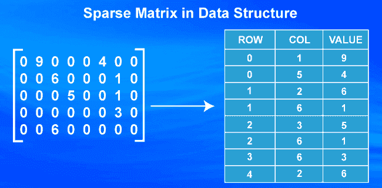
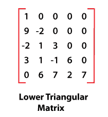
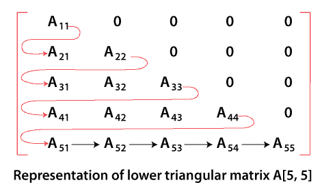
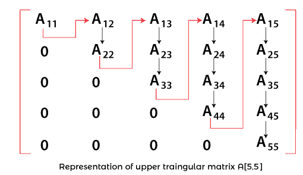
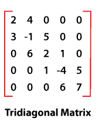
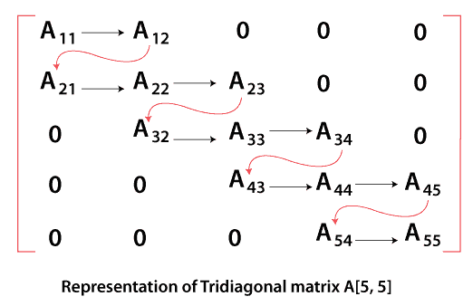
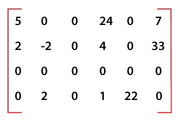
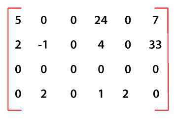
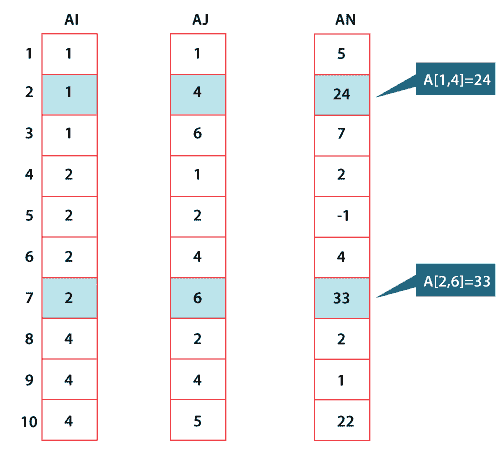
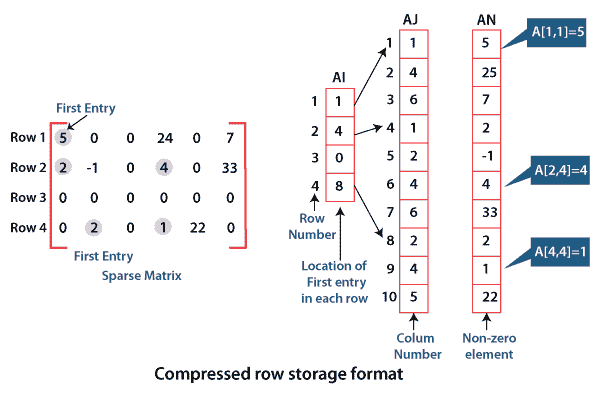

# 稀疏矩阵的类型？

> 原文：<https://www.javatpoint.com/types-of-sparse-matrices>

在本文中，我们将详细了解稀疏矩阵及其类型。

### 稀疏矩阵是什么意思？

工程、科学、计算和经济等现实应用中的各种数值问题都使用巨大的矩阵。这些矩阵通常包含许多零元素，这种具有高比例零条目的矩阵被称为稀疏矩阵。



它被称为稀疏的，因为它具有相对较低的非零元素密度。如果我们将稀疏矩阵存储为二维数组，那么会浪费大量空间来存储所有那些显式的 0。此外，在对存储为二维数组的稀疏矩阵执行诸如加法、减法和乘法等操作时，许多操作是对零值元素执行的，这导致时间上的大量浪费。因此，更好的策略是显式存储非零元素，这大大减少了执行各种操作所需的存储空间和计算。

## 稀疏矩阵的类型

稀疏矩阵有不同的变体，这取决于矩阵稀疏性的性质。基于这些属性，稀疏矩阵可以

*   正则稀疏矩阵
*   不规则稀疏矩阵/非规则稀疏矩阵

### 正则稀疏矩阵

规则稀疏矩阵 **x** 是具有明确稀疏模式的正方形矩阵，即非零元素出现在明确模式中。各种类型的正则稀疏矩阵有:

*   下三角正则稀疏矩阵
*   上三角正则稀疏矩阵
*   三对角正则稀疏矩阵

### 下三角正则稀疏矩阵

下正则稀疏矩阵是主对角线以上的所有元素都为零值的矩阵。下面的矩阵是下三角正则稀疏矩阵。



**存储下三角正则稀疏矩阵**

在下三角正则稀疏矩阵中，非零元素被逐行存储在一维数组中。



**例如:**上图所示的 5 乘 5 的下三角正则稀疏矩阵存储在一维数组 B 中是:

B = { A <sub>11</sub> ，A <sub>21</sub> ，A <sub>22</sub> ，A <sub>31</sub> ，A <sub>32</sub> ，A <sub>33</sub> ，A <sub>41</sub> ，A <sub>42</sub> ，A <sub>43</sub> ，A <sub>44</sub> ，A <sub>51</sub> ，

这里 B [1] = A <sub>11</sub> ，B [2] = A <sub>21</sub> ，B [3] = A <sub>22</sub> ，……………………………B【14】= A<sub>54，</sub>B【15】= A<sub>55</sub>

为了计算非零元素的总数，我们需要知道每行中非零元素的数量，然后将它们相加。由于第 I 行中非零元素的数量使得 **n** 行的下三角正则稀疏矩阵中非零元素的总数为:

**1+2+………………+I+…………………..+ (n-1) + n = n (n+1)/2**

### 上三角正则稀疏矩阵

上三角正则稀疏矩阵是主对角线以下的所有元素都为零的矩阵。跟随矩阵是上三角正则稀疏矩阵。


**存储上三角正则稀疏矩阵**

在上三角正则稀疏矩阵中，非零元素被逐列存储在一维数组中。



**例如**5 乘 5 的下三角正则稀疏矩阵，如上图所示，存储在一维数组 B 中的是:

B = { A <sub>11</sub> ，A <sub>21</sub> ，A <sub>22</sub> ，A <sub>31</sub> ，A <sub>32</sub> ，A <sub>33</sub> ，A <sub>41</sub> ，A <sub>42</sub> ，A <sub>43</sub> ，A <sub>44</sub> ，A <sub>51</sub> ，

这里 B [1] = A <sub>11</sub> 、B [2] = A <sub>21</sub> 、B [3] = A <sub>22</sub> 、B [4] = A <sub>31、</sub> B [5] = A <sub>32</sub> 【b[10]= a<sub>【44】、</sub>【b[11]= a<sub>【51】、</sub>【b[12]= a<sub>【52】</sub><sub>、</sub>【b[13]= a<sub>【53】】</sub>

为了计算非零元素的总数，我们需要知道每行中非零元素的数量，然后将它们相加。因为，第 I 行中非零元素的数量使得 **n** 行的下三角正则稀疏矩阵中非零元素的总数为:

**1+2+………………+I+…………………..+ (n-1) + n = n (n+1)/2**

**上三角正则稀疏矩阵**

上三角正则稀疏矩阵是主对角线以下的所有元素都为零的矩阵。下面的矩阵是上三角正则稀疏矩阵。

**存储上三角正则稀疏矩阵**

在上三角正则稀疏矩阵中，非零元素被逐列存储在一维数组中。

**例如**5 乘 5 的下三角正则稀疏矩阵，如上图所示，存储在一维数组 B 中的是:

C = { A <sub>11</sub> ，A <sub>12</sub> ，A <sub>22</sub> ，A <sub>13</sub> ，A <sub>23</sub> ，A <sub>33</sub> ，A <sub>14</sub> ，A <sub>24</sub> ，A <sub>34</sub> ，A <sub>44</sub> ，A <sub>15</sub> ，

在这里 C [1] = A <sub>11</sub> 、C [2] = A <sub>12</sub> 、C [3] = A <sub>22</sub> 、C [4] = A <sub>13、</sub> C [5] = A <sub>23</sub> c[10]= a<sub>【44】、</sub>【c[11]= a<sub>【15】、</sub>【c[12]= a<sub><sub>、</sub>【c[13]= a<sub>、【C14]= a】</sub></sub>

为了计算非零元素的总数，我们需要知道每列中非零元素的数量，然后将它们相加。由于第 I 列的非零元素个数为 **i** ，因此 **n** 列的上三角正则稀疏矩阵的非零元素总数为:

**1+2+………………+I+…………………..+ (n-1) + n = n (n+1)/2**

### 三对角正则稀疏矩阵

三对角正则稀疏矩阵，其中所有非零元素位于三条对角线中的一条上，主对角线在上面和下面。



**存储三对角正则稀疏矩阵**

在三对角正则稀疏矩阵中，所有非零元素被逐行存储在一维数组中。



**例如，**5 乘 5 的三对角正则稀疏矩阵，如上图所示，存储在一维数组 D 中的是:

D = { A <sub>11</sub> ，A <sub>12</sub> ，A <sub>21</sub> ，A <sub>22</sub> ，A <sub>23</sub> ，A <sub>32</sub> ，A <sub>33</sub> ，A <sub>34</sub> ，A <sub>43</sub> ，A <sub>44</sub> ，A <sub>45</sub> ，

在此处 D [1] = A <sub>11</sub> 、D [2] = A <sub>12</sub> 、D [3] = A <sub>21</sub> 、D [4] = A <sub>22、</sub> D [5] = A <sub>23、</sub> D [11] = A <sub>45，</sub> D [12] = A <sub>54，</sub> D [13] = A <sub>55</sub>

为了计算非零元素的总数，我们需要知道沿着对角线、对角线上方和对角线下方的非零元素的数量。正方形矩阵中沿对角线的元素个数为**‘n’**，对角线以上为 **(n-1)** 。所以 n 平方矩阵中非零元素的总数是:

```

      n              +        (n-1)            +         (n-1)
Along the diagonal        Above the diagonal        Below the diagonal

```

因此，n-squre 矩阵的元素总数= 3n-2

在我们的例子中，n = 5，所以元素总数= 3 * 5 - 2 = 13

### 不规则稀疏矩阵

不规则稀疏矩阵是表现为非零元素出现的不规则或非结构化模式的矩阵。下面的矩阵是一个不规则稀疏矩阵。



在上图中，有几种常见的存储稀疏矩阵的存储方案。这些方案大多将矩阵的所有非零元素存储到一维数组中。

### 不规则稀疏矩阵的存储方案；

在该方案中，我们将矩阵的所有非零元素存储到一维数组中，并使用几个辅助数组来指定非零元素在稀疏矩阵中的位置。在用于存储不规则稀疏矩阵的几种可用存储方案中，最常见的存储方案是:

*   索引法存储
*   按压缩行格式存储

**用索引法存储不规则稀疏矩阵**

通过索引方法使用存储，我们可以通过构建三个一维数组 an、AI 和 AJ 来存储不规则稀疏矩阵 A，每个数组都具有等于非零元素总数的元素。

*   数组 AN 包含逐行连续存储的非零元素。
*   AI 包含矩阵 A 中非零元素 A[I，J]对应的行号。
*   AJ 包含矩阵 A 中非零元素 A[I，J]对应的列数。

**让我们考虑一个 4 乘 6 的稀疏矩阵 A，如下所示:**



在这个稀疏矩阵的 24 个元素中，只有 10 个元素是非零的。这些非零元素是:

```

A [1,1] = 5
A [1,4] = 24
A [1,6] = 7
A [2,1] = 2
A [2,2] = -1
A [2,4] = 4
A [2,6] = 33
A [4,2] = 2
A [4,4] = 1
A [4,5] = 22

```



**图:三个一维阵列 AI、AJ、AN 的表示**

使用按索引存储的方法存储它。我们构造了三维数组 AN、SI、AJ，每个数组有 10 个元素(即非零元素的总数)，如上图所示。

数组 AN 包含连续存储的 10 个非零元素。每个非零元素对应的行号和列号分别存储在数组 AI 和 AJ 中。

### 使用压缩行存储格式存储不规则稀疏矩阵

用于表示不规则稀疏矩阵的另一种空间高效且最广泛使用的方案是压缩行存储。在这个方案中，我们采用三个一维阵列 AN、AI 和 AJ。一维数组 AN 包含以行方式从矩阵中获取的非零元素的所有值。构造下一个长度等于 AN 长度的一维数组 AJ，它包含 AN 中相应元素的原始列位置。构造一个长度等于几行的一维数组 AI，它存储一个数组中非零元素的第一个条目的位置。

**例如:**

AI [2] = 4 表示第 2 行的第一个非零元素存储在 AN[4]中，即 2。

为了通过压缩行存储格式来存储，我们构造了三个一维数组 AN、AI 和 AJ，如下图所示:



数组 AN 包含以逐行方式连续存储的 10 个非零元素。相应的列号存储在一维数组 AJ 中。一维数组 AI 包含指向数组 AJ 和 AN 中每行的第一个非零元素的指针元素。

* * *