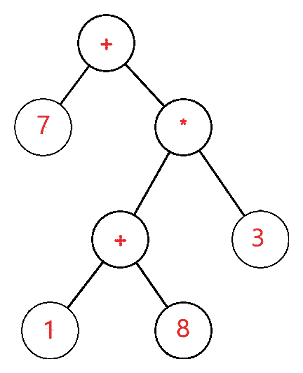

# 数据结构中的表达式树

> 原文：<https://www.javatpoint.com/expression-tree-in-data-structure>

表达式树是用于表示各种表达式的树。树形数据结构用于表示表达式语句。在这个树中，内部节点总是表示操作符。

*   叶节点总是表示操作数。
*   操作总是在这些操作数上执行。
*   位于树深处的操作员总是处于最高优先级。
*   与位于深度的操作符相比，在树的深度不多的操作符总是处于最低优先级。
*   操作数将始终出现在树的某个深度；因此，它被认为是所有运营商中的最高优先级。
*   简而言之，我们可以将其总结为，与位于树顶部的其他运算符相比，位于树深度的值具有最高优先级。
*   这些表达式树的主要用途是用来**评估、分析**、**修改**各种表达式。
*   它还用于找出表达式中每个运算符的关联性。
*   例如，+运算符是左关联运算符，/是右关联运算符。
*   通过使用表达式树，这种关联性的困境已经被清除。
*   这些表达式树是通过使用上下文无关的语法形成的。
*   我们在每个语法产品前面关联了上下文无关语法中的一个规则。
*   这些规则也被称为语义规则，通过使用这些语义规则，我们可以很容易地构建表达式树。
*   它是编译器设计的主要部分之一，属于语义分析阶段。
*   在这个语义分析中，我们将使用语法导向的翻译，并且以输出的形式，我们将产生带注释的解析树。
*   带注释的解析树只不过是与类型属性和每个生产规则相关联的简单解析。
*   使用表达式树的主要目的是生成复杂的表达式，并且可以很容易地使用这些表达式树进行计算。
*   它是不可变的，一旦我们创建了一个表达式树，我们就不能改变它或进一步修改它。
*   为了进行更多的修改，需要整体构建新的表达式树。
*   它还用于解决后缀、前缀和中缀表达式求值。

表达式树在以数据的形式表示**语言级**代码方面起着非常重要的作用，数据主要存储在树状结构中。它也用于**λ**表达式的记忆表示。使用树形数据结构，我们可以更加透明和明确地表达 lambda 表达式。首先创建它是为了将代码段转换为数据段，以便可以轻松地计算表达式。

表达式树是二叉树，其中每个外部或叶节点对应于操作数，每个内部或父节点对应于运算符，因此例如 7 + ((1+8)*3)的表达式树将是:



**让我们成为表达式树**

如果 S 不为空，那么

如果 s 值是一个操作数，那么

返回 s 值

x =求解(左侧)

y =求解(右侧)

返回计算(x，y，s 值)

在上面的例子中，表达式树使用了上下文无关的语法。

我们在这个语法中有一些与一些产生式规则相关联的产生式，主要称为**语义规则**。我们可以使用这些语义规则从相应的产生规则中定义结果产生。这里我们使用了 value 参数，它将计算结果并将其返回到语法的开始符号。S.left 将计算节点的左子节点，同样，可以使用 S.right 参数计算节点的右子节点。

## 表达式树的使用

1.  使用表达式树的主要目的是生成复杂的表达式，并且可以很容易地使用这些表达式树进行计算。
2.  它还用于找出表达式中每个运算符的关联性。
3.  它还用于解决后缀、前缀和中缀表达式求值。

## 表达式树的实现

为了实现表达式树并编写它的程序，我们需要使用堆栈数据结构。

因为我们知道堆栈是基于后进先出后进先出原则的，所以最近推入堆栈的数据元素在任何需要的时候都会弹出。对于它的实现，使用了堆栈的两个主要操作，push 和 pop。使用 push 操作，我们将数据元素推入堆栈，通过使用 pop 操作，我们将从堆栈中移除数据元素。

### 表达式树实现中堆栈的主要功能:

首先，我们将对给定的表达式进行从左到右的扫描，然后逐一检查识别出的字符，

1.  如果扫描的字符是一个操作数，我们将应用推送操作并将其推入堆栈。
2.  如果被扫描的字符是一个运算符，我们将对其应用 pop 操作，从堆栈中移除这两个值，使它们成为它的子节点，然后我们将当前父节点推回到堆栈中。

## C 语言中表达式树的实现

```

// C program for expression tree implementation
#include #include <stdlib.h>/* The below structure node is defined as a node of a binary tree consists 
of left child and the right child, along with the pointer next which points to the next node */
struct node 
{
	char info ;
	struct node* l ;
	struct node* r ;
	struct node* nxt ;
};
struct node *head=NULL;
/* Helper function that allocates a new node with the
given data and NULL left and right pointers. */
struct node* newnode(char data)
{
	struct node* node = (struct node*) malloc ( sizeof ( struct node ) ) ;
	node->info = data ;
	node->l = NULL ;
	node->r = NULL ;
	node->nxt = NULL ;
	return ( node ) ;
}
void Inorder(struct node* node)
{
	if ( node == NULL)
		return ;
	else
	{
	/* first recur on left child */
	Inorder ( node->l ) ;

	/* then print the data of node */
	printf ( "%c " , node->info ) ;

	/* now recur on right child */
	Inorder ( node->r ) ;
	}
}

void push ( struct node* x )
{
	if ( head == NULL )
	head = x ;
	else
	{
		( x )->nxt = head ;
		head = x ;
	}
	// struct node* temp ;
	// while ( temp != NULL )
	// {
	//	 printf ( " %c " , temp->info ) ;
	//	 temp = temp->nxt ;
	// }
}
struct node* pop()
{
	// Poping out the top most [pointed with head] element
	struct node* n = head ;
	head = head->nxt ;
	return n ;
}
int main()
{
	char t[] = { 'X' , 'Y' , 'Z' , '*' , '+' , 'W' , '/' } ;
	int n = sizeof(t) / sizeof(t[0]) ;
	int i ;
	struct node *p , *q , *s ;
	for ( i = 0 ; i < n ; i++ ) 
	{
		// if read character is operator then popping two
		// other elements from stack and making a binary
		// tree
		if ( t[i] == '+' || t[i] == '-' || t[i] == '*' || t[i] == '/' || t[i] == '^' )
		{
			s = newnode ( t [ i ] ) ;
			p = pop() ;
			q = pop() ;
			s->l = q ;
			s->r = p;
			push(s);
		}
		else {
			s = newnode ( t [ i ] ) ; 
			push ( s ) ;
		}
	}
	printf ( " The Inorder Traversal of Expression Tree: " ) ;
	Inorder ( s ) ;
	return 0 ;
}</stdlib.h> 
```

**上述程序的输出为:**

```
X + Y * Z / W

```

## C++编程语言中表达式树的实现

```

// C++ program for expression tree
#include using namespace std ;
/* The below class node is defined as a node of a binary tree consists 
of left child and the right child, along with the pointer next which points to the next node */

class node 
{
public:
	char info ;
	node* l ;
	node* r ;
	node* nxt = NULL ;
	node ( char c )
	{
		this->info = c ;
		l = NULL ;
		r = NULL ;
	}
	node()
	{
		l = NULL ;
		r = NULL ;
	}
	friend class Stack ;
	friend class tree ;
} ;
class Stack 
{
	node* head = NULL ;

public:
	void push ( node* ) ;
	node* pop() ;
	friend class tree ;
} ;
class tree 
{
public:
	void inorder ( node* x )
	{
		// cout<l ) ;
			cout << x->info << " " ;
			inorder ( x->r ) ;
		}
	}
} ;

void Stack::push( node* x )
{
	if ( head == NULL ) 
	{
		head = x ;
	}
	// We are inserting here nodes at the top of the stack [following LIFO principle]
	else 
	{
		x->nxt = head ;
		head = x ;
	}
}
node* Stack::pop()
{
	// Poping out the top most [ pointed with head ] element
	node* p = head ;
	head = head->nxt ;
	return p ;
}
int main()
{
	string str = "XYZ*+W/" ;
	// If you wish take input from user:
	//cout << "Insert Postorder Expression: " << endl;
	//cin >> s;
	Stack s ;
	tree t ;
	node *p, *q, *re;
	int n = str.length() ;
	for ( int i = 0 ; i < n ; i++ ) 
	{

		if ( str[ i ] == '+' || str[ i ] == '-' || str[ i ] == '*' || str[ i ] == '/' || str[ i ] == '^') 
		{
			re = new node( str[i] ) ;
			p = s.pop() ;
			q = s.pop() ;
			re->l = q ;
			re->r = p ;
			s.push(re) ;
		}
		else 
		{
			re = new node( str[ i ] ) ;
			s.push(re) ;
		}
	}
	cout << " The Inorder Traversal of Expression Tree: " ;
	t.inorder(re) ;
	return 0 ;
} 
```

**上述程序的输出为:**

```
X + Y * Z / W

```

## 表达式树在 Java 编程语言中的实现

```

// Java program for expression tree
import java.util.* ;
/* The below class node is defined as a node of a binary tree consists 
of left child and the right child, along with the pointer next which points to the next node */

class Node
{
    char info ;
    Node l , r ;
    public Node(char data)
	{
        this.info = data ;
        l = null ;
		r = null ;
    }
}

public class Main 
{
    public static boolean isOperator ( char ch )
	{
        if ( ch == '+' || ch == '-' || ch == '*' || ch == '/' || ch == '^' ) 
		{
            return true ;
        }
        return false ;
    }
    public static Node Tree ( String postfix )
	{
        Stack st = new Stack<node>();
        Node t1,t2,temp ;

        for ( int i = 0 ; i < postfix.length(); i++ ) 
		{
            if ( !isOperator( postfix.charAt(i) ) )
			{
                temp = new Node( postfix.charAt(i) ) ;
                st.push( temp ) ;
            }
            else
			{
                temp = new Node ( postfix.charAt(i) ) ;

                t1 = st.pop() ;
                t2 = st.pop() ;

                temp.l = t2 ;
                temp.r = t1 ;

                st.push(temp) ;
            }

        }
        temp = st.pop() ;
        return temp ;
    }
    public static void inorder( Node parent ){
        if ( parent == null ) return ;  

        inorder ( parent.l ) ;
        System.out.print ( parent.info ) ;
        inorder ( parent.r ) ;
    }
    public static void main( String[] args ) 
	{
        String postfix = "XYZ*+W/" ;

        Node r = Tree( postfix ) ;
        inorder ( r ) ;
    }
}</node> 
```

**上述程序的输出为:**

```
X + Y * Z / W

```

* * *