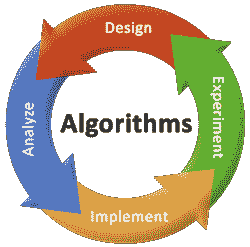

# DAA 教程

> 原文：<https://www.javatpoint.com/daa-tutorial>

我们的 DAA 教程是为初学者和专业人士设计的。

我们的 DAA 教程包括算法、渐近分析、算法控制结构、递归、主方法、递归树方法、简单排序算法、冒泡排序、选择排序、插入排序、分治、二分搜索法、合并排序、计数排序、下界理论等所有主题。

## 什么是算法？

为了解决一个特定的问题或一类问题，指定要执行的操作序列的有限指令集称为算法。

## 为什么要学习算法？

随着处理器速度的提高，性能经常被认为不如其他软件质量特征(例如安全性、可扩展性、可重用性等)重要。).然而，大问题规模在计算科学领域是常见的，这使得性能成为一个非常重要的因素。这是因为更长的计算时间，仅举几个例子，意味着更慢的结果，更少的研究和更高的计算成本(如果从外部购买 CPU 小时数)。因此，对算法的研究为我们提供了一种语言，将性能表示为问题大小的函数。

* * *

## DAA 教程索引

* * *

**DAA 教程**

*   [DAA 教程](daa-tutorial)
*   [DAA 算法](daa-algorithm)
*   [算法需求](daa-need-of-algorithm)
*   [算法复杂度](daa-complexity-of-algorithm)
*   [算法设计技术](daa-algorithm-design-techniques)

**渐近分析**

*   [渐近分析](daa-asymptotic-analysis-of-algorithms)
*   [分析算法控制结构](daa-analyzing-algorithm-control-structure)

**复发**

*   [递归关系](daa-recurrence-relation)
*   [递归树法](daa-recursion-tree-method)
*   [掌握方法](daa-master-method)

**排序分析**

*   [气泡排序](daa-bubble-sort)
*   [选择排序](daa-selection-sort)
*   [插入输出](daa-insertion-sort)

**分而治之**

*   [简介](divide-and-conquer-introduction)
*   [最大-最小问题](daa-max-min-problem)
*   [二分搜索法](daa-binary-search)
*   [合并排序](daa-merge-sort)
*   [河内塔](daa-tower-of-hanoi)

**排序**

*   [二进制堆](daa-binary-heap-sort)
*   [快速排序](daa-quick-sort)
*   [稳定分拣](daa-stable-sorting)

**下限理论**

*   [下限理论](daa-lower-bound-theory)

**线性时间排序**

*   [线性时间](daa-linear-time-sorting)
*   [计数排序](daa-counting-sort)
*   [桶排序](daa-bucket-sort)
*   [基数排序](daa-radix-sort)

**散列**

*   [散列](daa-hashing)
*   [散列表](daa-hash-tables)
*   [哈希方法](daa-hashing-method)
*   [开放寻址技术](daa-open-addressing-techniques)
*   [哈希函数](daa-hash-function)

**二分搜索法树**

*   [二分搜索法树](daa-binary-search-trees)

**红黑树**

*   [红黑树](daa-red-black-tree)

**动态编程**

*   [动态编程](dynamic-programming)
*   [分而治之&征服法 vs 动态规划](divide-and-conquer-method-vs-dynamic-programming)
*   [斐波那契数列](fibonacci-sequence)
*   [矩阵链乘法](matrix-chain-multiplication)
*   [矩阵链乘法示例](matrix-chain-multiplication-example)
*   [矩阵链乘法算法](matrix-chain-multiplication-algorithm)
*   [最长公共序列](longest-common-sequence)
*   [最长公共序列算法](longest-common-sequence-algorithm)
*   [0/1 背包问题](0-1-knapsack-problem)

**贪婪算法**

*   [简介](greedy-algorithms)
*   [活动选择问题](activity-selection-problem)
*   [分数背包问题](fractional-knapsack-problem)
*   [霍夫曼码](huffman-coding)
*   [霍夫曼码的算法](huffman-coding-algorithm)
*   [活动或任务调度问题](activity-or-task-scheduling-problem)
*   [出差销售人员问题](travelling-sales-person-problem)
*   [动态规划 vs 贪婪方法](dynamic-programming-vs-greedy-method)

**回溯**

*   [回溯介绍](backtracking-introduction)
*   [递归迷宫算法](recursive-maze-algorithm)
*   [哈密顿回路问题](hamiltonian-circuit-problems)
*   [子集和问题](subset-sum-problems)
*   [N 皇后问题](n-queens-problems)

MST

*   [MST 简介](minimum-spanning-tree-introduction)
*   [MST 应用程序](applications-of-minimum-spanning-tree)
*   [克鲁斯卡尔算法](kruskals-minimum-spanning-tree-algorithm)
*   [普里姆算法](prims-minimum-spanning-tree-algorithm)

**最短路径**

*   [简介](single-source-shortest-paths)
*   [负权重边缘](negative-weight-edges)
*   [表示最短路径](representing-shortest-path)
*   [放松](relaxation)
*   [迪克斯特拉算法](dijkstras-algorithm)
*   [贝尔曼-福特算法](bellman-ford-algorithm)
*   [有向无环图中的单源最短路径](single-source-shortest-path-in-a-directed-acyclic-graphs)

**全对最短路径**

*   [简介](all-pairs-shortest-paths)
*   [弗洛伊德-沃肖尔算法](floyd-warshall-algorithm)
*   [约翰逊算法](johnsons-algorithm)

**最大流量**

*   [流量网络和流量](daa-flow-networks-and-flows)
*   [网络流量问题](daa-network-flow-problems)
*   [福特富尔克森算法](daa-ford-fulkerson-algorithm)
*   [最大二分匹配](daa-maximum-bipartite-matching)

**分类网络**

*   [对比网络](daa-comparison-network)
*   [双离子分选网络](daa-bitonic-sorting-network)
*   [合并网络](daa-merging-network)

**复杂性理论**

*   [复杂度等级](daa-complexity-classes)
*   [多项式时间验证](daa-polynomial-time-verification)
*   [NP-完全性](daa-np-completeness)
*   [电路可满足性](daa-circuit-satisfiability)
*   [3-CNF 可满足性](daa-3-cnf-satisfiability)
*   [派系问题](daa-clique-problem)
*   [顶点覆盖问题](daa-vertex-cover-problem)
*   [子集和问题](daa-subset-sum-problem)

**近似算法**

*   [简介](daa-approximate-algorithms)
*   [顶点覆盖](daa-approximation-algorithm-vertex-cover)
*   [旅行推销员问题](daa-traveling-salesman-problem)

**字符串匹配**

*   [简介](daa-string-matching-introduction)
*   [朴素字符串匹配算法](daa-naive-string-matching-algorithm)
*   [拉宾-卡普算法](daa-rabin-karp-algorithm)
*   [有限自动机字符串匹配](daa-string-matching-with-finite-automata)
*   [克努特-莫里斯-普拉特算法](daa-knuth-morris-pratt-algorithm)
*   [博耶-摩尔算法](daa-boyer-moore-algorithm)

* * *

## 先决条件

在学习 DAA 教程之前，你必须具备数据结构、编程和数学的基础知识。

## 观众

我们的 DAA 教程旨在帮助初学者和专业人士。

## 问题

我们保证您在本 DAA 教程中不会发现任何问题。但是如果有任何错误，请在联系表格中发布问题。

* * *