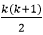

# 算法的复杂性

> 原文：<https://www.javatpoint.com/daa-complexity-of-algorithm>

术语“算法复杂性”衡量算法需要多少步骤来解决给定的问题。它将算法执行的操作计数的顺序作为输入数据大小的函数进行评估。

为了评估复杂性，总是考虑操作计数的顺序(近似值)，而不是计算精确的步骤。

O(f)符号表示算法的复杂性，也称为渐近符号或“**大 O** ”符号。这里，f 对应于大小与输入数据大小相同的函数。渐近计算 O(f)的复杂性决定了诸如[中央处理器](https://www.javatpoint.com/cpu-full-form)时间、内存等资源的顺序。被表达为输入数据大小的函数的算法所消耗。

复杂度可以是常数、对数、线性、n*log(n)、二次、三次、指数等任何形式。它只不过是常数、对数、线性等的阶次，完成特定算法所遇到的步数。为了使其更加精确，我们通常将算法的复杂性称为“运行时间”。

## 算法的典型复杂性

*   **不变的复杂性:**
    它强加了 **O(1)** 的复杂性。它要经历一系列的步骤，比如 1、5、10 等等。用于解决给定的问题。操作计数与输入数据大小无关。
*   **对数复杂度:**
    它强加了 **O(log(N))** 的复杂度。它按照日志(N)步骤的顺序执行。对 N 个元素进行运算，往往取对数基数为 2。
    对于 N = 1，000，000，复杂度为 O(log(N))的算法将经历 20 步(具有恒定精度)。这里，对数基数对于操作计数顺序不具有必要的结果，因此通常被省略。
*   **线性复杂度:**
    *   它强加了一个复杂性 **O(N)** 。它包含与在 N 个元素上实现操作的元素总数相同的步骤数。
        例如，如果存在 500 个元素，那么大约需要 500 步。基本上，在线性复杂度中，元素的数量线性地依赖于步骤的数量。例如，N 个元素的步数可以是 N/2 或 3*N
    *   它还强加了一个运行时间 **O(n*log(n))** 。它在 N 个元素上执行 N*log(N)的顺序来解决给定的问题。
        对于给定的 1000 个元素，线性复杂度将执行 10，000 个步骤来解决给定的问题。
*   **二次复杂度:**它强加了 **O(n <sup>2</sup> )** 的复杂度。对于 N 个输入数据大小，它经历 N 个元素的 N <sup>2</sup> 计数操作的顺序来解决给定的问题。
    如果 N = 100，就能忍受 1 万步。换句话说，每当运算顺序趋向于与输入数据大小成二次关系时，就会导致二次复杂性。例如，对于 N 个元素，发现步骤的顺序为 3*N <sup>2</sup> /2。
*   **立方复杂度:**它强加了 **O(n <sup>3</sup> )** 的复杂度。对于 N 个输入数据大小，它对 N 个元素执行 N <sup>3</sup> 步的顺序来解决给定的问题。
    比如存在 100 个元素，就要执行 100 万步。
*   **指数复杂度:**它强加了**O(2<sup>N</sup>)O(N！)、O(n <sup>k</sup> )、…** 。对于 N 个元素，它将执行依赖于输入数据大小的操作计数顺序。
    例如，如果 N = 10，那么指数函数 2 <sup>N</sup> 将得到 1024。同样，如果 N = 20，将得到 1048 576，如果 N = 100，将得到一个 30 位数的数字。指数函数 N！生长得更快；例如，如果 N = 5，将得到 120。同样，如果 N = 10，将得到 3，628，800，依此类推。

由于常数对运算次数没有显著影响，所以最好忽略它们。因此，为了认为一个算法是线性的和同样有效的，它必须在相同数量的元素上分别进行 N、N/2 或 3*N 次运算来解决特定的问题。

## 如何近似算法花费的时间？

所以，要找出答案，我们首先要了解我们现有算法的类型。有两种类型的算法:

1.  **迭代算法:**在迭代方法中，函数重复运行，直到满足条件或失败。它涉及循环构造。
2.  **递归算法:**在递归方法中，函数调用自己，直到满足条件。它整合了分支结构。

然而，值得注意的是，任何用迭代编写的程序都可以写成递归。同样，递归程序可以转换为迭代，使这两种算法彼此等效。

但是为了分析迭代程序，我们必须计算循环将要执行的次数，而在递归程序中，我们使用递归方程，即我们根据 F(n/2)编写 F(n)的函数。

假设程序既不是迭代的，也不是递归的。在这种情况下，可以得出结论，运行时间不依赖于输入数据大小，即无论输入大小是多少，运行时间都将是一个恒定值。因此，对于这样的程序，复杂度将是 **O(1)** 。

### 对于迭代程序

考虑以下用简单英语编写的程序，它们不对应任何语法。

**示例 1:**

在第一个例子中，我们有一个整数 I 和一个从 I 等于 1 到 n 的 for 循环。现在问题来了，这个名字被打印了多少次？

```

A()
{
int i;
for (i=1 to n)
printf("Edward");
}

```

既然 I 等于 1 等于 n，那么上面的程序将打印 Edward，n 次。因此，复杂度将是 **O(n)** 。

**示例 2:**

```

A()
{
int i, j:
for (i=1 to n)
for (j=1 to n)
printf("Edward");
}

```

在这种情况下，首先，外环将运行 n 次，使得对于每次，内环也将运行 n 次。因此，时间复杂度将是 **O(n <sup>2</sup> )** 。

**示例 3:**

```

A()
{
i = 1; S = 1;
while (S<=n)
{
i++;
S = S + i;
printf("Edward");
}
}

```

从上面的例子可以看出，我们有两个变量；I，S，然后我们有 while S<=n，这意味着 S 将从 1 开始，只要 S 值达到 S 变得大于 n 的点，整个循环就会停止。

这里 I 以 1 为单位递增，S 将按 I 的值递增，即 I 的增量是线性的。然而，S 的增量取决于 I。

最初；

i=1，S=1

1 <sup>st</sup> 迭代后；

i=2，S=3

2 <sup>次</sup>迭代后；

i=3，S=6

3 <sup>次</sup>迭代后；

i=4，S = 10……以此类推。

既然我们不知道 n 的值，那么让我们假设它是 k。现在，如果我们注意到 S 的值在上面的情况下是增加的；对于 i=1，S = 1；i=2，S = 3；i=3，S = 6；i=4，S = 10…

因此，它只不过是前 n 个自然数之和的级数，即当我到达 k 时，S 的值将是 k(k+1)/2。

为了停止循环，必须大于 n，当我们解这个方程时，我们会得到 ** > n** 。因此，可以得出结论，在这种情况下，我们得到了 **O(√  n  )** 的复杂度。

### 对于递归程序

考虑以下递归程序。

**示例 1:**

```

A(n)
{
if (n>1)
return (A(n-1))
} 

```

解决方案；

这里我们将看到解决上述问题的简单反向替换方法。

**T(n) = 1 + T(n-1)** …Eqn。(1)

**步骤 1:** 在方程中 n 的位置替换 n-1。(1)

T(n-1) = 1 + T(n-2)-我...。嗯，嗯。(2)

**步骤 2:** 在方程中 n 的位置替换 n-2。(1)

t(n-2)= 1+t(n-3)…eq。(3)

**步骤 3:** 代入方程。(2)在方程中。(1)

T(n)= 1+1+T(n-2)= 2+T(n-2)…方程。(4)

**第 4 步:**代入方程。(3)在方程中。(4)

T(n) = 2 + 1 + T(n-3) = 3 + T(n-3) = …...= k + T(n-k) …Eqn。(5)

根据方程。(1)，即 T(n) = 1 + T(n-1)，算法将一直运行到 n>1。基本上，n 会从一个非常大的数字开始，然后逐渐减少。所以，当 T(n) = 1 时，算法最终停止，这样的终止条件称为锚定条件、基础条件或停止条件。

因此，对于 k = n-1，T(n)将变为。

**步骤 5:** 在方程中代入 k = n-1。(5)

T(n)=(n-1)+T(n-(n-1))=(n-1)+T(1)= n-1+1

因此，T(n) = n 或 **O(n)。**

* * *