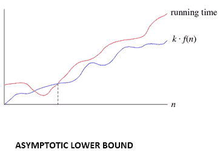
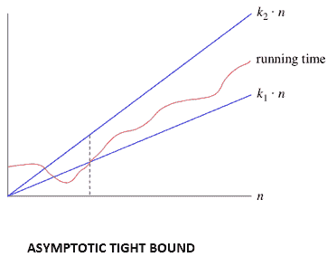

# 算法的渐近分析(函数的增长)

> 原文：<https://www.javatpoint.com/daa-asymptotic-analysis-of-algorithms>

算法的资源通常表示为关于输入的函数。通常，这个功能工作起来既麻烦又复杂。为了有效地研究函数增长，我们将函数简化为重要的部分。

```
  Let f (n) = an2+bn+c

```

在这个函数中，当 n 变得足够大时，n <sup>2</sup> 项占主导地位。

支配项是我们感兴趣的减少函数，在这；我们忽略所有的常数和系数，看关于 n 的最高阶项。

### 渐近表示法:

单词**渐近**意味着任意接近一个值或曲线(即，当采取某种限制时)。

### 渐近分析

这是一种表现限制行为的技术。这种方法在科学上有广泛的应用。它可以用来分析算法对一些大数据集的性能。

1.在计算机科学中的算法分析中，考虑算法在应用于非常大的输入数据集时的性能

最简单的例子是一个函数*ф(n)= n<sup>2</sup>+3n*，当 n 非常大时，与*n<sup>2</sup>T7】相比，术语 3n 变得微不足道。函数“*ф(n)*据说是**渐近等价于**到*n<sup>2</sup>T15】为 *n → ∞* ，这里象征性地写成*ф(n)~ n<sup>2</sup>T21】。***

**渐近符号**用于为算法编写最快和最慢的可能运行时间。这些也被分别称为“最佳情况”和“最坏情况”。

“在渐近符号中，我们导出了与输入大小有关的复杂性。(用 n 表示的例子)”

“这些符号很重要，因为在不增加运行算法成本的情况下，我们可以估计算法的复杂性。”

## 渐近符号为什么重要？

1.它们给出了算法效率的简单特征。

2.它们允许比较各种算法的性能。

## 渐近符号:

渐近表示法是一种忽略常数因子和小输入大小的函数比较方法。有三种符号用于计算算法的运行时间复杂度:

**1。Big-oh 表示法:** Big-oh 是表示算法运行时间上限的形式化方法。它是最长时间的量度。函数 **f (n) = O (g (n))** 【读作“n 的 f 是大的-n 的 g 的 oh”】当且仅当存在正常数 c 并且这样

```

 f (n) ⩽ k.g (n)f(n)⩽k.g(n) for n>n0n>n0 in all case 

```

因此，函数 g (n)是函数 f (n)的上限，因为 g (n)比 f (n)增长得快


### 例如:

```

 1\. 3n+2=O(n) as 3n+2≤4n for all n≥2
 2\. 3n+3=O(n) as 3n+3≤4n for all n≥3

```

因此， **f(n)** 的复杂度可以表示为 O (g (n))

**2。ω()符号:**函数 f(n)=ω(g(n))[读作“n 的 f 是 n 的 g 的ω”]当且仅当存在正常数 c 和 n 时 <sub>0</sub> 这样

```
F (n) ≥ k* g (n) for all n, n≥ n0

```



### 例如:

```
  f (n) =8n2+2n-3≥8n2-3
        =7n2+(n2-3)≥7n2 (g(n))
Thus, k1=7

```

因此， **f (n)** 的复杂度可以表示为ω(g(n))

**3。θ(θ):**函数 f (n) = θ (g (n))【读作“f 是 n 的 g 的θ”】当且仅当存在正常数 k <sub>1</sub> ，k <sub>2</sub> 和 k <sub>0</sub> 这样

```
  k1 * g (n) ≤ f(n)≤ k2 g(n)for all n, n≥ n0

```



### 例如:

```
3n+2= θ (n) as 3n+2≥3n and 3n+2≤ 4n, for n
    k1=3,k2=4, and n0=2

```

因此，f (n)的复杂度可以表示为θ (g(n))。

Theta 符号比大-oh 和 Omega 符号都更精确。如果 g (n)既是上界又是下界，则函数 f (n) = θ (g (n))。

* * *