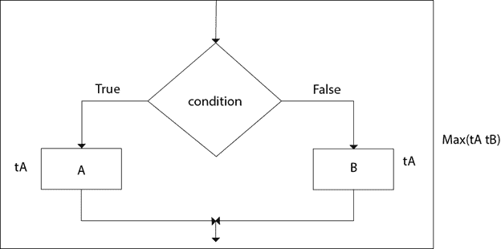
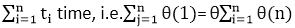
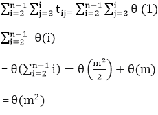

# 算法控制结构分析

> 原文：<https://www.javatpoint.com/daa-analyzing-algorithm-control-structure>

要分析编程代码或算法，我们必须注意到每条指令都会影响算法的整体性能，因此，必须单独分析每条指令来分析整体性能。然而，有一些算法控制结构存在于每个编程代码中，并且具有特定的渐近分析。

一些算法控制结构是:

1.  定序
2.  如果-那么-否则
3.  for 循环
4.  While 循环

* * *

### 1.排序:

假设我们的算法由 A 和 B 两部分组成，A 需要时间 t <sub>A</sub> ，B 需要时间 t <sub>B</sub> 进行计算。总计算“t <sub>A</sub> + t <sub>B</sub> 是根据顺序规则。根据最大值规则，该计算时间为(最大值(t <sub>A</sub> ，t <sub>B</sub> )。

**示例:**

```
Suppose tA =O (n) and tB = θ (n2). 
Then, the  total computation time can be calculated as

Computation Time = tA + tB
 = (max (tA,tB)
 = (max (O (n), θ (n2)) = θ (n2)

```

### 2.如果-那么-否则:



总时间的计算是根据条件规则——“如果-那么-否则”根据最大值规则，该计算时间为最大值(t <sub>A</sub> ，t <sub>B</sub> )。

**示例:**

```
Suppose tA = O (n2) and tB = θ (n2)
Calculate the total computation time for the following:

Total Computation = (max (tA,tB))
                  = max (O (n2), θ (n2) = θ (n2)

```

### 3.对于循环:

for 循环的一般格式是:

```
  For (initialization; condition; updation)
{
		Statement(s);
}

```

## for 循环的复杂性:

外循环执行 N 次。每次外循环执行，内循环执行 M 次。因此，**内部**循环中的语句总共执行 N * M 次。因此，两个循环的总复杂度为 0(N2)

考虑以下循环:

```
for i ← 1 to n    
 {
		 P (i)
 }

```

如果(P <sub>I</sub> )的计算时间 t <sub>i</sub> 是“I”的函数，则循环的总计算时间不是通过乘法而是通过求和给出的，即

```
For i ← 1 to n    
 {
		    P (i)
 }

```

取

如果算法由嵌套的“for”循环组成，则总计算时间为

```
For i ← 1 to n
 {
      For j ←  1 to n       
    {
      P (ij)
    }
 }  

```

**示例:**

考虑以下“for”循环，计算以下循环的总计算时间:

```
For i ← 2 to n-1
	{
		For j ← 3 to i
	     {
                       Sum ← Sum+A [i] [j]
                 }
            }

```

**解决方案:**

总计算时间为:



### 4.While 循环:

分析循环的简单技术是确定所涉及的变量的函数，该变量的值每次都会减少。其次，为了终止循环，值必须是正整数。通过跟踪函数值减少多少次，可以获得循环的重复次数。分析“while”循环的另一种方法是将它们视为递归算法。

## 算法:

```
1\. [Initialize] Set k: =1, LOC: =1 and MAX: = DATA [1]
2\. Repeat steps 3 and 4 while K≤N
3\.  if MAX<DATA [k],then:
	Set LOC: = K and MAX: = DATA [k]
4\. Set k: = k+1
   [End of step 2 loop]
5\. Write: LOC, MAX
6\. EXIT

```

**示例:**

计算 n 整数数组中最大元素的算法数组 Max 的运行时间为 O (n)。

**解决方案:**

```
   array Max (A, n)
1\. Current max ← A [0]
2\. For i ←  1 to n-1
3\. do if current max < A [i]
4\. then  current max ← A [i]
5\. return current max.

```

该算法执行的基元运算 t (n)的个数至少为。

```
2 + 1 + n +4 (n-1) + 1=5n
2 + 1 + n + 6 (n-1) + 1=7n-2

```

最佳情况 T(n) =5n 发生在 A [0]是最大元素的时候。当元素按递增顺序排序时，出现最差情况 T(n) = 7n-2。

因此，我们可以应用 c=7 和 n <sub>0</sub> =1 的大-Oh 定义，并得出其运行时间为 O (n)。

* * *