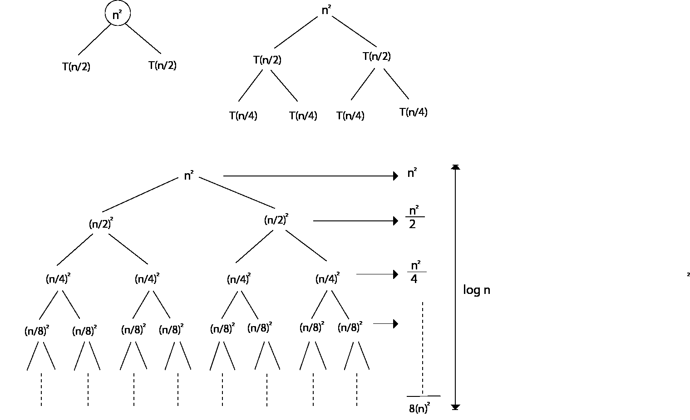
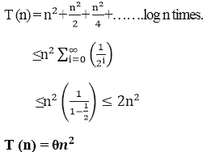
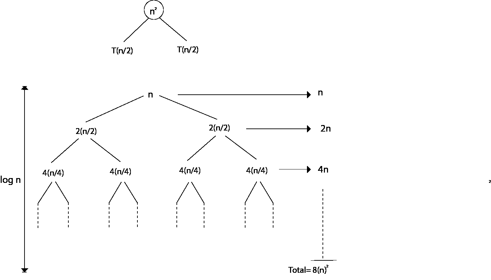
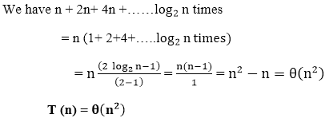
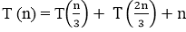
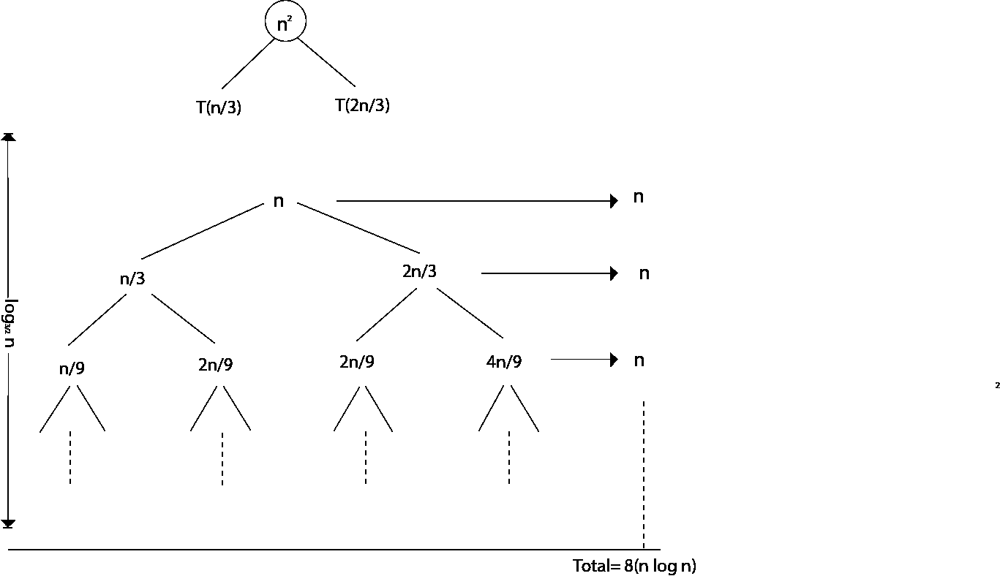
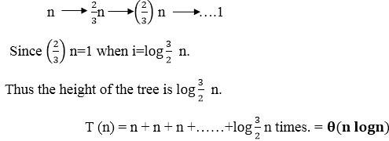

# 递归树方法

> 原文：<https://www.javatpoint.com/daa-recursion-tree-method>

1.递归树方法是迭代方法的图形表示，它是树的形式，在每一层节点都被展开。

2.一般来说，我们认为递归中的第二项是根。

3.当使用分治算法时，它非常有用。

4.有时候很难做出好的猜测。在递归树中，每个根和子代表单个子问题的成本。

5.我们对树的每个层次内的成本求和，以获得一组预层次成本，然后对所有预层次成本求和，以确定递归的所有层次的总成本。

6.递归树最适合用来产生好的猜测，这可以通过替换方法来验证。

**例 1**

```
 Consider T (n) = 2T + n2

```

我们必须用递归树方法得到渐近界。

**解:**上述递归的递归树为




**例 2:** 考虑以下重现

```
 T (n) = 4T +n 

```

用递归树方法求渐近界。

**解:**上述递归的递归树




**例 3:** 考虑以下重现



用递归树方法求渐近界。

**解:**给定的递归具有以下递归树



当我们将递归树各层的值相加时，我们得到每一层的 n 值。从根到叶的最长路径是



* * *