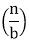
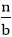
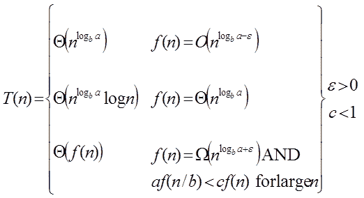
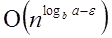
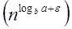
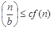

# 主方法

> 原文：<https://www.javatpoint.com/daa-master-method>

主方法用于解决以下类型的循环

T(n)= a T+f(n)a≥1，b≥1 为常数& f(n)为函数可解释为

设 T (n)在非负整数上由递推定义。

```
 T (n) = a T+ f (n)

```

在分析递归算法的函数中，常数和函数具有以下意义:

*   n 是问题的大小。
*   a 是递归中子问题的数量。
*   n/b 是每个子问题的大小。(这里假设所有子问题的大小基本相同。)
*   f (n)是递归调用之外所做工作的总和，包括划分问题的总和和合并子问题解的总和。
*   不可能总是按照要求绑定函数，所以我们做了三个例子，告诉我们可以对函数应用什么样的绑定。

## 主定理:

在这三种情况下，有可能完成渐近紧界:



**情况 1:** 如果 f (n) = 为某个常数ε > 0，那么如下:

```
T (n) = Θ 

```

**示例:**

```
T (n) = 8 T  apply master theorem on it.

```

**解决方案:**

```
Compare T (n) = 8 T  with 
 T (n) = a T 
 a = 8, b=2, f (n) = 1000 n2, logba = log28 = 3
 Put all the values in: f (n) = 
     1000 n2 = O (n3-ε ) 
     If we choose ε=1, we get: 1000 n2 = O (n3-1) = O (n2)

```

由于这个方程成立，主定理的第一种情况适用于给定的递推关系，从而得出结论:

```
T (n) = Θ 
   Therefore: T (n) = Θ (n3) 

```

**情况 2:** 如果为真，对于某常数 k ≥ 0:

```
F (n) = Θ  then it follows that: T (n) = Θ 

```

**示例:**

```
T (n) = 2 , solve the recurrence by using the master method.
As compare the given problem with T (n) = a T a = 2, b=2, k=0, f (n) = 10n, logba = log22 =1 
Put all the values in f (n) =Θ , we will get 
	10n = Θ (n1) = Θ (n) which is true.
Therefore: T (n) = Θ 
      = Θ (n log n)

```

**情况 3:** 如果对于某些常量ε > 0 为真 f(n)=ω并且对于某些常量 c < 1 为大 n 值也为真:a f ，则:

```

T (n) = Θ((f (n)) 

```

**例:**求解递推关系:

```
T (n) = 2 

```

**解决方案:**

```
Compare the given problem with T (n) = a T 
a= 2, b =2, f (n) = n2, logba = log22 =1 
Put all the values in f (n) = Ω  ..... (Eq. 1)
If we insert all the value in (Eq.1), we will get 
  n2 = Ω(n1+ε) put ε =1, then the equality will hold.
  n2 = Ω(n1+1) = Ω(n2)
Now we will also check the second condition:
  2 
If we will choose c =1/2, it is true:
    ∀ n ≥1 
So it follows: T (n) = Θ ((f (n))
    T (n) = Θ(n2)

```

* * *