# DAA 泡沫分类

> 原文：<https://www.javatpoint.com/daa-bubble-sort>

冒泡排序，也称为交换排序，是一种简单的排序算法。它的工作原理是重复遍历要排序的列表，一次比较两个项目，如果顺序不对，就交换它们。通过列表的传递是重复的，直到不需要交换，这意味着列表被排序。

这是所有排序算法中最简单的方法。

## 算法

**第 1 步➤初始化**

```

set 1 ← n, p ← 1 

```

第 2 步【回圈】

```

Repeat through step 4 while (p ≤ n-1) 
set E ← 0 ➤ Initializing exchange variable. 

```

**第三步➤比较，循环。**

```

Repeat for i ← 1, 1, …... l-1.
if (A [i] > A [i + 1]) then
set A [i] ↔ A [i + 1] ➤ Exchanging values. 
Set E ← E + 1

```

**第四步➤做完，或者缩小尺寸。**

```

if (E = 0) then 
exit 
else 
set l ← l - 1.

```

## 冒泡排序的工作原理

1.  冒泡排序从第一个索引开始，使其成为冒泡元素。然后，它将气泡元素(目前是我们的第一个索引元素)与下一个元素进行比较。如果气泡元素较大，而第二个元素较小，则两者会互换。
    对换后，第二个元素会变成泡泡元素。现在我们将比较第二个元素和第三个元素，就像我们在前面的步骤中所做的那样，如果需要的话，交换它们。同样的过程一直持续到最后一个元素。
2.  我们将在剩下的迭代中遵循相同的过程。每次迭代后，我们会注意到未排序数组中最大的元素已经到达最后一个索引。

对于每次迭代，冒泡排序将与最后一个未排序的元素进行比较。

一旦所有元素按升序排序，算法就会终止。

考虑下面一个未排序数组的例子，我们将在冒泡排序算法的帮助下进行排序。

**最初，**

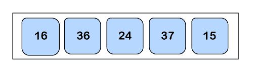

**传球 1:**

*   **比较一个 <sub>0</sub> 和一个<sub>1</sub>T5**

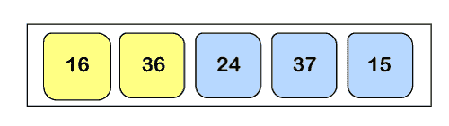

作为一个<sub>0</sub>T4 一个 <sub>1</sub> 所以阵势会保持原样。

*   **比较一个 <sub>1</sub> 和一个<sub>2</sub>T5**


现在一个<sub>1</sub>T4 一个 <sub>2</sub> ，所以我们将互换他们两个。

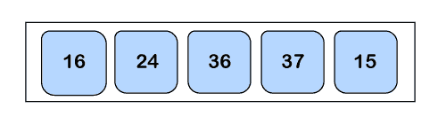

*   **比较一个 <sub>2</sub> 和一个<sub>3</sub>T5**

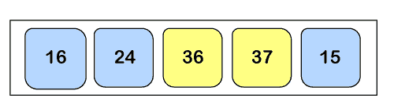

作为一个<sub>2</sub>T4 一个 <sub>3</sub> 所以阵势会保持原样。

*   **比较一个 <sub>3</sub> 和一个<sub>4</sub>T5**

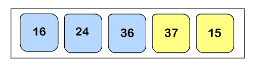

这里一个<sub>3</sub>T4 一个 <sub>4</sub> ，所以我们会再次互换他们两个。

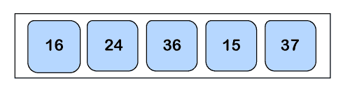

**传球 2:**

*   **比较一个 <sub>0</sub> 和一个<sub>1</sub>T5**

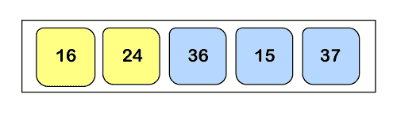

作为一个<sub>0</sub>T4 一个 <sub>1</sub> 所以阵势会保持原样。

*   **比较一个 <sub>1</sub> 和一个<sub>2</sub>T5**

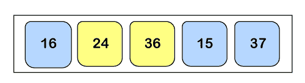

这里一个<sub>1</sub>T4 一个 <sub>2</sub> ，所以阵势还是会保持原样。

*   **比较一个 <sub>2</sub> 和一个<sub>3</sub>T5**

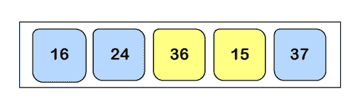

在这种情况下，一个<sub>2</sub>T4 一个 <sub>3</sub> ，所以他们两个都会被交换。

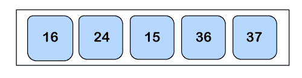

**传球 3:**

*   **比较一个 <sub>0</sub> 和一个<sub>1</sub>T5**

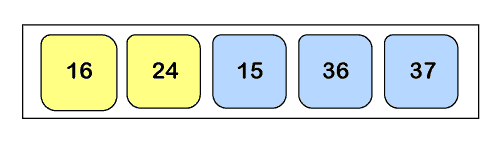

作为一个<sub>0</sub>T4 一个 <sub>1</sub> 所以阵势会保持原样。

*   **比较一个 <sub>1</sub> 和一个<sub>2</sub>T5**

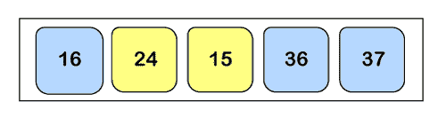

现在一个<sub>1</sub>T4 一个 <sub>2、</sub>所以他们两个都会被交换。

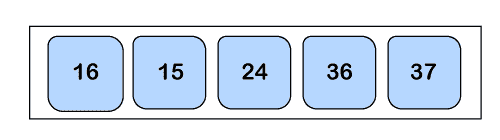

**第 4 关:**

*   **比较一个 <sub>0</sub> 和一个<sub>1</sub>T5**

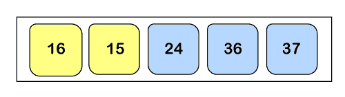

这里一个<sub>0</sub>T4 一个 <sub>1</sub> ，所以我们将两者互换。

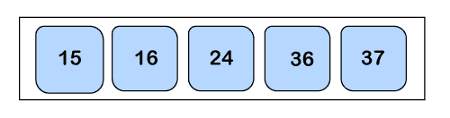

因此，数组被排序，因为不需要更多的交换。

## 冒泡排序的复杂性分析

**输入:**给定 n 个输入元素。

**输出:**对列表进行排序的步骤数。

**逻辑:**如果给我们 n 个元素，那么在第一遍中，它会做 n-1 个比较；第二遍，它会做 n-2；在第三遍，它会做 n-3 等等。因此，比较的总数可以通过以下方式找到:


因此，冒泡排序算法包含时间复杂度为 **O(n <sup>2</sup> )** 和空间复杂度为 **O(1)** ，因为它需要一些额外的内存空间用于临时变量的交换。

### 时间复杂性:

*   **最佳情况复杂度**:对于已经排序的数组，冒泡排序算法的最佳情况时间复杂度为 **O(n)** 。
*   **平均案例复杂度**:冒泡排序算法的平均案例时间复杂度为 **O(n <sup>2</sup> )** ，当 2 个或 2 个以上的元素混杂时，即既不按升序也不按降序，就会出现这种情况。
*   **最差情况复杂度**:最差情况时间复杂度也是 **O(n <sup>2</sup> )** ，发生在我们把一个数组的降序排序为升序的时候。

## 冒泡排序的优点

1.  很容易理解。
2.  不需要任何额外的内存。
3.  这种算法的代码很容易编写。
4.  比其他排序算法占用的空间更少。

## 冒泡排序的缺点

1.  当我们有大量未排序的列表时，它不会很好地工作，而且它需要更多的资源，最终会占用太多的时间。
2.  它只是为了学术目的，而不是为了实际实施。
3.  它涉及排序算法的 n <sup>2</sup> 步序。

* * *