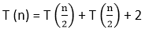
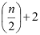
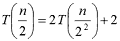
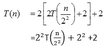
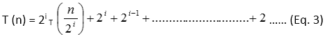
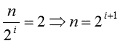
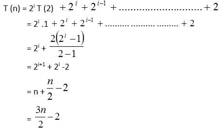
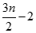
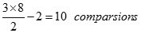

# 最大最小问题

> 原文：<https://www.javatpoint.com/daa-max-min-problem>

**问题:**分析算法，从一个数组中找出最大最小元素。

```
Algorithm: Max ?Min Element (a [])
Max:  a [i]
Min:   a [i]
For i= 2 to n do
If a[i]> max then
max = a[i]
if a[i] < min then
min: a[i]
return (max, min)

```

### 分析:

**方法 1:** 如果我们将一般方法应用于大小为 n 的数组，则所需的比较次数为 2n-2。

**方法-2:** 在另一种方法中，我们将问题分成子问题，并找到每组的最大值和最小值，现在是最大值。每组的最大值将与另一组的唯一最大值进行比较，最小值与最小值进行比较。

设 n =数组中项目的大小

设 T (n) =在大小为 n 的数组上应用该算法所需的时间。这里我们将这些项划分为 T(n/2)。

2 这里倾向于将最小值与最小值和最大值与最大值进行比较，如上例所示。



t(n)= 2t→【eq(I)】

T (2) = 1，比较两个元素/项目所需的时间。(时间以比较次数为单位)

→【eq(ii)】

将等式(ii)放入等式(I)中



同样，在每个子问题或解剖结构上递归地应用相同的过程

{使用递归方式，我们将使用一些停止条件来停止算法}



递归将停止，当 →(等式。4)

将等式 4 代入等式 3。



比较的次数需要在 n 个元素/项目上应用除法和征服算法= 

比较的数量要求对 n 个元素应用一般方法= (n-1) + (n-1) = 2n-2

从这个例子中，我们可以分析，如何通过使用这种技术来减少比较的次数。

**分析:**假设我们有大小为 8 个元素的数组。

**方法 1:** 需要(2n-2)、(2x8)-2=14 次比较
方法 2: 需要

很明显；我们可以通过使用适当的技术来减少比较的次数(复杂性)。

* * *