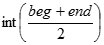
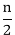
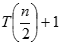
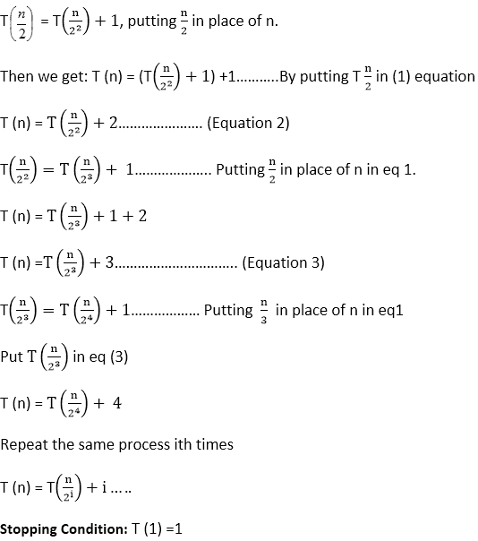
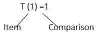
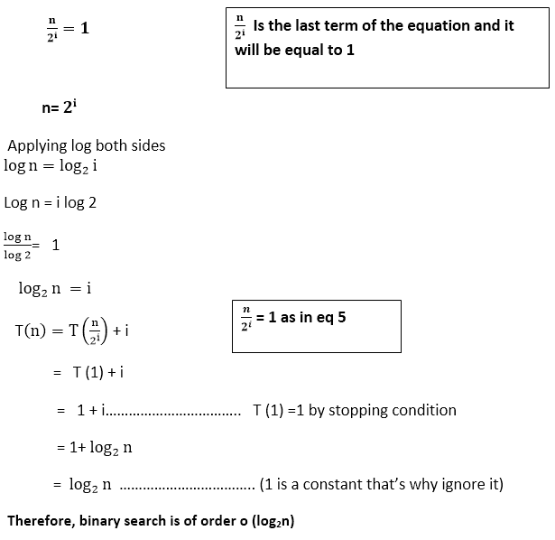

# 二进位检索

> 原文：<https://www.javatpoint.com/daa-binary-search>

1.在二分搜索法技术中，我们通过递归地将间隔分成两半来搜索排序数组中的元素。

2.首先，我们把整个数组作为一个区间。

3.如果透视元素(要搜索的项目)小于间隔中间的项目，我们将丢弃列表的后半部分，并通过计算新的中间和最后一个元素递归地重复列表前半部分的过程。

4.如果透视元素(要搜索的项目)大于间隔中间的项目，我们将丢弃列表的前半部分，并通过计算新的开始和中间元素递归处理后半部分。

5.反复检查，直到找到值或间隔为空。

### 分析:

1.  **输入:**大小为 n 的数组 A，已经按照升序或降序排序。
2.  **输出:**分析搜索大小为 n 的排序数组中的元素项。
3.  **逻辑:**让 T (n) =排序数组中一个项目与 n 个元素的比较次数。

*   设置 BEG = 1 和 END = n
*   找到 mid = 
*   将搜索项目与中间项目进行比较。

**情况 1:** 项= A[mid]，然后 LOC = mid，但它是最好的情况，T (n) = 1

**情况二:**项≠A【中】，那么我们就把阵分成大小相等的两部分。

再次找到半排序数组的中点，并与搜索元素进行比较。

重复相同的过程，直到找到搜索元素。

T (n) = ......(等式 1)

{将搜索元素与中间元素进行比较的时间，然后与数组中选定的一半部分的一半进行比较}

至少将只剩下一个项，这就是为什么那个项会比较出来，并且只做一个比较，这就是为什么

**是方程的最后一项，等于 1**

* * *