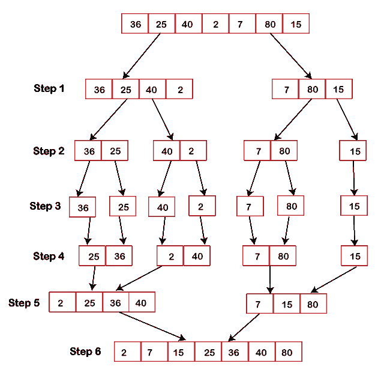
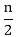
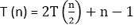
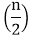
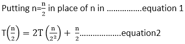
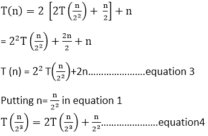
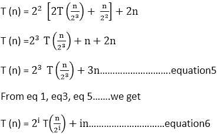
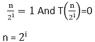
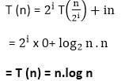

# 合并排序

> 原文：<https://www.javatpoint.com/daa-merge-sort>

合并排序是属于[分治](https://www.javatpoint.com/divide-and-conquer-introduction)技术范畴的另一种排序算法。它是成功构建递归算法的最佳排序技术之一。

## 分治策略

在这种技术中，我们将一个问题分成两半，分别求解。在找到每一半的解后，我们把它们合并回来，代表主要问题的解。

假设我们有一个数组 **A** ，这样我们的主要关注点将是对子部分进行排序，该子部分从索引 **p** 开始，到索引 **r** 结束，由**A【p】表示..r]** 。

**除**

如果假设 **q** 是介于 **p** 和 **r** 之间的中心点，那么我们将分割子阵列**A【p..r]** 成两列**A【p..q]** 和**A【q+1，r】**。

**征服**

将阵列分成两半后，下一步是征服。在这一步中，我们分别对两个子阵列**进行排序..q]** 和**A【q+1，r】**。如果我们没有达到基本情况，那么我们再次遵循相同的过程，即，我们进一步分割这些子阵列，然后分别对它们进行排序。

**组合**

当征服步骤获得基本步骤时，我们成功地获得了排序的子阵列**A【p..q]** 和**A【q+1，r】**，之后我们将它们合并回一个新的排序数组**【p..r]** 。

## 合并排序算法

MergeSort 函数继续将一个数组分成两半，直到满足一个条件，我们尝试对大小为 1 的子数组执行 MergeSort，即 **p == r** 。

然后，它将单独排序的子阵列组合成更大的阵列，直到整个阵列被合并。

```
ALGORITHM-MERGE SORT
1\. If p
```

这里我们调用 **MergeSort(A，0，length(A)-1)** 对完整数组进行排序。

如下图所示，合并排序算法递归地将数组分成两半，直到满足基本条件，此时数组中只剩下 1 个元素。然后，合并函数拾取排序后的子数组，并将其合并回整个数组。

下图说明了分割(拆分)过程。


```
FUNCTIONS: MERGE (A, p, q, r)

1\. n 1 = q-p+1
2\. n 2= r-q
3\. create arrays [1.....n 1 + 1] and R [ 1.....n 2 +1 ]
4\. for i ← 1 to n 1
5\. do [i] ← A [ p+ i-1]
6\. for j ← 1 to n2
7\. do R[j] ← A[ q + j]
8\. L [n 1+ 1] ← ∞
9\. R[n 2+ 1] ← ∞ 
10\. I ← 1
11\. J ← 1
12\. For k ← p to r
13\. Do if L [i] ≤ R[j]
14\. then A[k] ← L[ i]
15\. i ← i +1
16\. else A[k] ← R[j]
17\. j ← j+1

```


### 合并排序的合并步骤

递归算法主要依赖于基本情况，以及它将从基本情况中得到的结果合并回来的能力。合并排序没有什么不同的算法，只是这里**合并**步骤更重要。

对于任何给定的问题，合并步骤都是这样一种解决方案，它将两个单独排序的列表(数组)组合在一起，以构建一个大型排序列表(数组)。

合并排序算法支持三个指针，即一个指针用于两个数组，另一个指针用于保留最终排序数组的当前索引。

```
Did you reach the end of the array?
    No:
        Firstly, start with comparing the current elements of both the arrays. 
        Next, copy the smaller element into the sorted array.
        Lastly, move the pointer of the element containing a smaller element.
    Yes:
        Simply copy the rest of the elements of the non-empty array

```

## 合并( )函数逐步解释

考虑以下未排序数组的示例，我们将借助合并排序算法对其进行排序。

A= (36，25，40，2，7，80，15)

**步骤 1:** 合并排序算法迭代地将一个数组分成相等的两半，直到我们获得一个原子值。如果一个数组中有奇数个元素，那么其中一半的元素会比另一半多。

**步骤 2:** 将一个数组划分为两个子数组后，我们会注意到它并没有妨碍元素在原始数组中的顺序。现在，我们将进一步将这两个阵列分成另一半。

**步骤 3:** 同样，我们将划分这些数组，直到我们达到一个原子值，即一个无法进一步划分的值。

**步骤 4:** 接下来，我们将按照分解它们的相同方式将它们合并回来。

**步骤 5:** 对于每个列表，我们将首先比较元素，然后将它们组合起来形成一个新的排序列表。

**步骤 6:** 在下一次迭代中，我们将比较两个数据值的列表，并将它们合并回找到的数据值列表，所有数据值都以排序的方式放置。



因此数组被排序。

## 合并排序分析:

设 T (n)是合并排序算法花费的总时间。

*   分拣两半最多需要 2T 时间。
*   当我们合并排序后的列表时，我们会得出一个 n-1 的比较总数，因为剩下的最后一个元素需要在合并后的列表中复制下来，并且不会有比较。

因此，关系式将为



但是我们忽略“-1”，因为在合并列表中复制该元素需要一些时间。

所以 T (n) = 2T  + n...等式 1

#### 注意:停止条件 T (1) =0，因为最后只剩下 1 个需要复制的元素，不会有比较。



将 2 个方程放入 1 个方程中



将 4 个方程放在 3 个方程中



从停止条件:



将日志应用于两侧:

log n = log<sub>2</sub>I
log n = I log 2
T4 = I
T6】log<sub>2</sub>n = I

从等式 6



**最佳情况复杂度:**对于已经排序的数组，合并排序算法的最佳情况时间复杂度为 **O(n*log n)** 。

**平均案例复杂度:**合并排序算法的平均案例时间复杂度为 **O(n*log n)** ，当 2 个或 2 个以上的元素混杂在一起时，即既不按升序也不按降序，就会出现这种情况。

**最坏情况复杂度:**最坏情况时间复杂度也是 **O(n*log n)** ，当我们将一个数组的降序排序为升序时，就会出现这种情况。

**空间复杂度:**归并排序的空间复杂度为 **O(n)** 。

## 合并排序应用程序

合并排序的概念适用于以下领域:

*   逆序计数问题
*   外部分类
*   电子商务应用

* * *