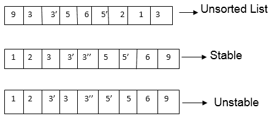

# 稳定排序

> 原文：<https://www.javatpoint.com/daa-stable-sorting>

如果两个具有相同键的对象在排序输出中以相同的顺序出现，就像它们在输入未排序数组中出现一样，那么排序算法被认为是稳定的。

一些排序算法本质上是稳定的，如插入排序、合并排序和冒泡排序等。

排序算法不稳定，如快速排序、堆排序等。

### 稳定排序的另一种定义:

稳定排序是一种保留输入集原始顺序的排序，其中比较算法不区分两个或多个项目。稳定排序将保证输出中保留具有相同等级的数据的原始顺序。

* * *

## 就地排序算法:

1.  就地排序算法直接修改作为输入接收的列表，而不是创建随后被修改的新列表。
2.  在这种排序中，它使用少量的额外空间来操作输入集。换句话说，当算法仍在执行时，输出被放置在正确的位置，这意味着输入将在运行时被期望的输出覆盖。
3.  就地，排序算法仅通过元素的替换或交换来更新输入。
4.  不在位的算法有时被称为不在位或不在位。
5.  一个算法只能有固定数量的额外空间，通常包括函数调用和指针；这个空间是 0(对数 n)。

**注:**

1.  冒泡排序、插入排序和选择排序是就地排序算法。因为只需要交换输入数组中的元素。
2.  冒泡排序和插入排序可以作为稳定的算法应用，但选择排序不能(没有重大修改)。
3.  合并排序是一种稳定的算法，但不是原地算法。它需要额外的阵列存储。
4.  快速排序并不稳定，但它是一种就地算法。
5.  堆排序是一种就地算法，但并不稳定。

* * *