# 下限理论

> 原文：<https://www.javatpoint.com/daa-lower-bound-theory>

下限理论概念基于执行算法所需的最小时间的计算，被称为下限理论或基本上限理论。

下限理论使用许多方法/技术来找出下限。

**概念/目标:**主要目标是计算执行算法所需的最小比较次数。

## 技术:

下限理论使用的技术有:

1.  比较树。
2.  先知和对手的争论
3.  状态空间法

### 1.比较树:

在比较排序中，我们仅使用元素之间的比较来获得关于输入序列(a1；主动脉第二声......an)。

**给定一个 <sub>i</sub> ，一个 <sub>j</sub> 从(a <sub>1</sub> ，一个 <sub>2</sub> .....a <sub>n</sub> 我们执行其中一个比较**

*   一个<sub>我</sub>T4 一个 <sub>j</sub> 不到
*   a <sub>i</sub> ≤ a <sub>j</sub> 小于或等于
*   一<sub>我</sub>T4 一 <sub>j</sub> 大于
*   a <sub>i</sub> ≥ a <sub>j</sub> 大于或等于
*   a <sub>i</sub> = a <sub>j</sub> 等于

为了确定它们的相对顺序，如果我们假设所有元素都是不同的，那么我们只需要考虑一个 <sub>i</sub> ≤ a <sub>j</sub> '= '被排除&，≥，≤，>，<是等价的。

考虑对三个数字 a1、a2 和 a3 进行排序。有 3 个！= 6 种可能的组合:

```

 (a1, a2, a3), (a1, a3, a2),
 (a2, a1, a3), (a2, a3, a1)
 (a3, a1, a2), (a3, a2, a1)

```

基于比较的算法定义了决策树。

**决策树:**决策树是一个完整的二叉树，它显示了元素之间的比较，这些元素由适当的排序算法在给定大小的输入上执行。控制、数据移动和算法的所有其他条件都被忽略。

在决策树中，将有一个长度为 n 的数组。

所以，总叶数将为 n！(即比较总数)

如果树高是 h，那么肯定

```
    n! ≤2n (tree will be binary)

```

以比较 a1、a2 和 a3 为例。

左子树为真条件，即 a <sub>i</sub> ≤ a <sub>j</sub>

右子树将为假条件，即 a<sub>I</sub>T4 a<sub>j</sub>

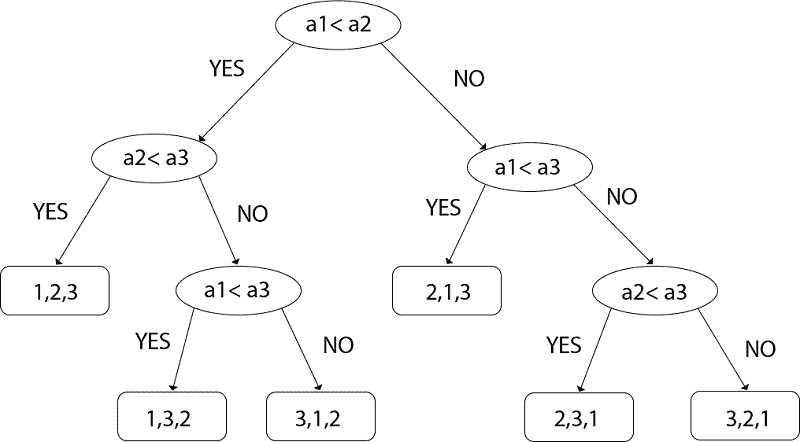

**图:决策树**

所以从上面看，我们得到了

```
N! ≤2n   

```

从两边取原木

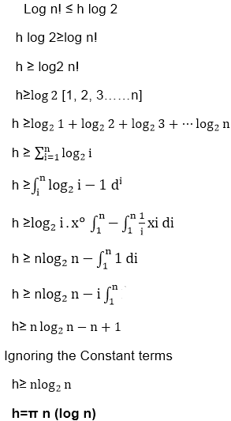

### 二分搜索法的比较树:

**示例:**假设我们根据以下位置有一个项目列表:

```

1,2,3,4,5,6,7,8,9,10,11,12,13,14

```

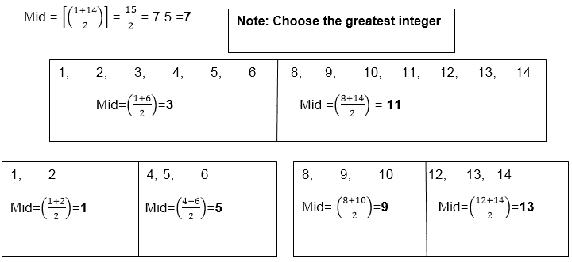

**最后一个中点是:**

```

2,	4,	6,	8,	10,	12,	14

```

因此，我们将考虑所有的中点，并且我们将通过具有逐步的中点来制作它的树。

粗体字母是这里的中点

根据中点，树将是:

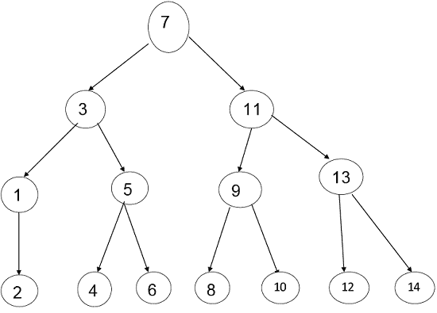

**步骤 1:** 内部节点最大 k 级节点数为 2 <sup>k</sup> -1

**例如**

```
 2k-1
 23-1= 8-1=7
Where k = level=3

```

**步骤 2:** 比较树中内部节点的最大数量为 n！

#### 注意:这里的内部节点是叶子。

**步骤 3:** 从条件 1 &条件 2 我们得到

```
N! ≤ 2k-1
 14 < 15
 Where N = Nodes

```

**步骤 4:** 现在，n+1 ≤ 2 <sup>k</sup>

在这里，二分搜索法的内部节点总是小于 2 <sup>k</sup> 。

**第五步:**

```
n+1<= 2k
   Log (n+1) = k log 2
 k >= 
  k >=log2(n+1)

```

**步骤 6:**

```

 T (n) = k

```

**步骤 7:**

```
T (n) >=log2(n+1)

```

这里，使用二分搜索法执行 n 个术语搜索任务的最小比较次数

* * *

### 2.甲骨文和对手论点:

另一种获得下限的技术是利用“神谕”。

给定一些估计模型，如比较树，神谕告诉我们每次比较的结果。

为了得到一个好的下限，甲骨文尽最大努力让算法尽可能地工作。

它通过决定下一个分析的结果来做到这一点，这个结果是确定最终答案最重要的工作。

通过保持已完成工作的步调，可以推导出问题的最坏情况下限。

**示例:(合并问题)**给定集合 A (1: m)和 B (1: n)，其中 A 和 B 中的信息被排序。考虑结合这两个集合的算法的下限，以给出单独的排序集合。

考虑所有 m+n 个元素都是特定的，A (1) < A (2)<.... a="" b=""/>

初等组合学告诉我们，有 C ((m+n，n))种方式，A 和 B 可以合并在一起，同时仍然保持 A 和 B 中的顺序。

因此，如果我们需要比较树作为组合算法的模型，那么将会有 C ((m+n)，n))个外部节点，因此任何基于比较的合并算法都至少需要 log C ((m+n，m)个比较。

如果我们让 MERGE (m，n)是用于合并 m 项和 n 项的最小比较次数，那么我们得到不等式

```

Log C ((m+n), m) MERGE (m, n) m+n-1\. 

```

当 m 比 n 小得多时，上界和下界可以迅速分开很远。

* * *

### 3.状态空间法:

1.状态空间方法是一组规则，显示算法可以从单个比较的给定状态中假设的可能状态(n 元组)。

2.一旦给定了状态转换，就可以通过论证使用更少的转换不能达到完成状态来导出下限。

3.给定 n 个不同的项目，找出赢家和输家。

4.目的:状态变化时计数，这是状态空间法的目的。

5.在这种方法中，我们将通过计算状态变化的次数来计算比较的次数。

6.用状态空间法分析找出最小和最大项目的问题。

7.状态:它是属性的集合。

8.通过这一点，我们整理出两类问题:

1.  从元素数组中找出最大和最小的元素。
2.  从一个元素数组中找出最大和第二大的元素。

9.对于最大的项目，我们需要 7 个比较，第二大的项目是什么？

```
Now we count those teams who lose the match with team A 
    Teams are: B, D, and E
So the total no of comparisons are: 7
Let n is the total number of items, then
    Comparisons = n-1 (to find the biggest item) 
No of Comparisons to find out the 2nd biggest item = log2n-1

```

10.在此**中，比较次数**等于算法执行期间状态变化的**次数**。

**例:**状态(A、B、C、D)

1.  无法比较的项目数。
2.  获胜但从未失败的项目数(最终赢家)。
3.  失败但从未赢过的物品数量(最终输家)
4.  有时输有时赢的物品数量。

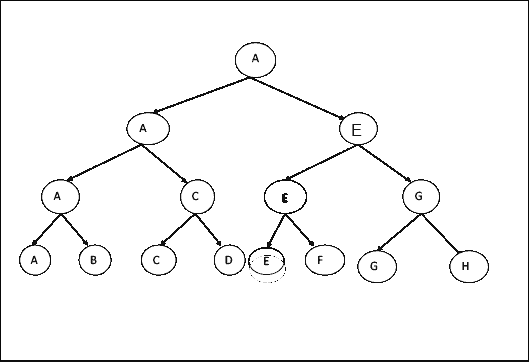

首先，甲、乙比较或匹配他们之间。甲赢了，丙赢了，丙赢了，等等。我们可以假设 B 赢，以此类推。我们可以假设乙代替甲获胜，它可以是任何取决于我们自己的东西。

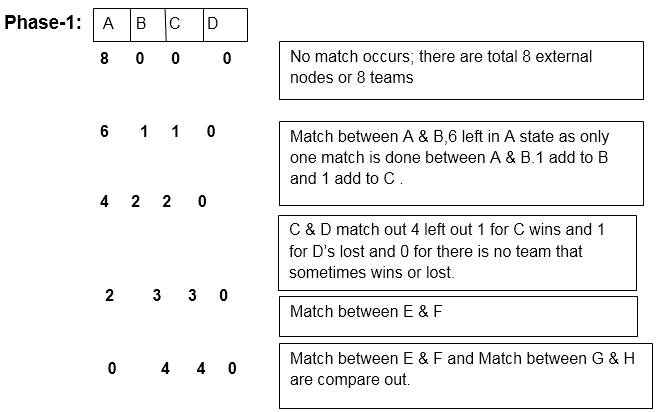

在阶段 1 中有 4 个状态
如果团队是 8，那么有 4 个状态
就好像 n 个团队有 n/2 个状态。

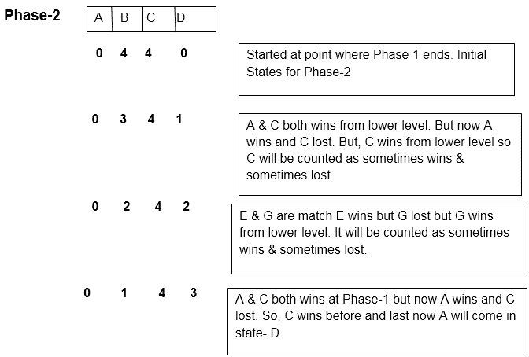

4 在 C 状态下是不变的，因为 B、D、F、H 都是输了的队伍，永远不会赢。

因此在阶段 2 中有 3 个状态，
如果 n 是 8，则状态是 3
如果 n 个队是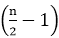状态。

**阶段-3:** 这是一个考虑 C 状态下的球队的阶段，他们之间会有比赛，找出从来没有赢过的球队。

在这个结构中，我们将向上移动，表示谁在比赛后没有获胜。

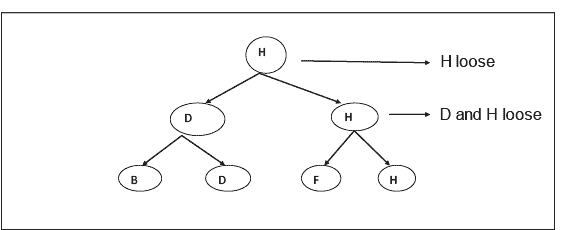

这里 H 是从来没有赢过的球队。借此，我们实现了第二个目标。

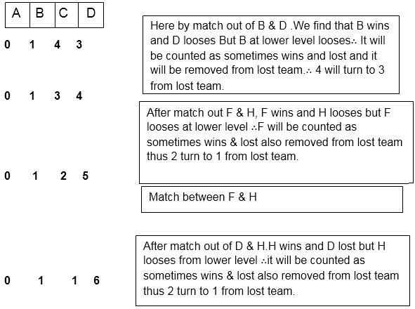

因此，在阶段 3
中有 3 个状态，如果 n 个队是状态

### 注意:所有状态值的总和始终等于“n”。

因此，通过添加所有阶段的状态，我们将得到:-

**一期+二期+三期**

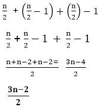

假设我们有 8 支队伍，那么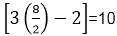状态就在那里(至少)来找出哪一支是永远不会赢的队伍。

因此，等式为:

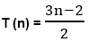

下界(L (n))是特定问题的一个性质，即排序问题，矩阵乘法不是解决该问题的任何特定算法。

下限理论认为，对于任意输入，任何计算的执行时间都不能少于(L (n))乘以单位，也就是说，在最坏的情况下，基于比较的排序算法必须至少花费 **L (n)** 时间。

L (n)是最大可能完成的基本计算。

**利用微不足道的下限**来产生界限最好的替代方法是计算问题输入中必须准备的元素数量和需要产生的输出项目数量。

**下限理论**是已经被用来以可能的最有效的方式建立给定算法的方法。这是通过发现一个函数 **g (n)** 来实现的，该函数是任何算法解决给定问题所必须花费的时间的下限。现在，如果我们有一个算法，它的计算时间与 **g (n)** 相同，那么我们知道渐近地我们不能做得更好。

如果 **f (n)** 是某个算法的时间，那么我们写**f(n)=ω(g(n))**表示 **g (n)** 是 f (n) 的**下界。如果存在正常数 **c** 和 **n0** ，使得 **|f (n)| > = c|g (n)|** 对所有 **n > n0** 都可以正式写出这个方程。此外，为了在常数因子内开发下限，我们更意识到这样一个事实，即只要有可能，就要确定更精确的界限。**

推导好的**下限**比安排高效算法更具挑战性。发生这种情况是因为下限陈述了一个关于解决问题的所有可能算法的事实。一般来说，我们无法枚举和分析所有这些算法，因此下界证明往往很难获得。

* * *