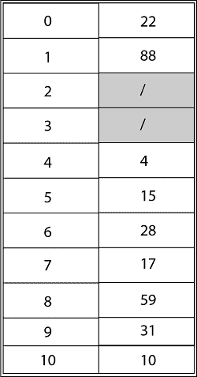
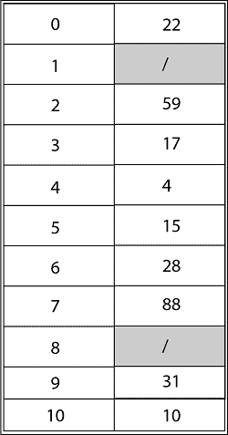

# 散列法

> 原文：<https://www.javatpoint.com/daa-hashing>

哈希是将字符串转换为通常较短的固定长度值或键，表示原始字符串。

哈希用于索引和检索数据库中的项目，因为使用最短的哈希键查找项目比使用原始值查找项目更快。它也用于许多加密算法中。

哈希代码是通过使用密钥生成的，密钥是唯一的值。

散列是一种技术，其中给定的关键字段值通过对其应用相同的操作被转换成记录的存储位置的地址。

散列的优点是允许基本操作的执行时间保持不变，即使对于较大的一方。

## 为什么我们需要哈希？

假设我们有 50 名员工，我们必须给每个员工 4 位数的密钥(至于安全性)，我们希望在输入密钥后，直接将用户映射到存储数据的特定位置。

如果我们按照 4 位数给出位置号码，我们将不得不保留 0000 到 9999 的地址，因为任何人都可以使用任何人作为密钥。浪费很多。

为了解决这个问题，我们使用散列法，它将产生与用户密钥相对应的哈希表索引的较小值。

## 通用散列法

假设 H 是散列函数的有限集合，这些散列函数将给定的键宇宙映射到范围{0，1.....m-1}。如果对于每对不同的密钥 k，l∈U，h(k)= h(l)的散列函数 h∈ H 的数量最多为|H|/m，则这样的集合被认为是通用的。换句话说，对于从 H 中随机选择的散列函数，如果 h(k)和 h(l)是从集合{0，1，...m-1}。

## 重散列

如果哈希表的任何阶段变得接近满，的操作的运行时间将开始占用太多时间，在这种情况下插入操作可能会失败，最佳解决方案如下:

1.  创建一个两倍大小的新哈希表。
2.  扫描原始哈希表，计算新的哈希值并插入新的哈希表。
3.  释放原始哈希表占用的内存。

**示例:**考虑使用主散列函数 h’(k)= k mod m 的开放寻址将密钥 10、22、31、4、15、28、17、88 和 59 插入长度为 m = 11 的散列表中。说明使用线性探测、使用带有 c 1 =1 和 c 2 =3 的二次探测以及使用带有 h 2 (k) = 1 + (k mod (m-1)的双散列插入这些密钥的结果

**解决方案:**使用线性探测，哈希表的最终状态将是:

使用带有 c 1 =1，c 2 =3 的二次探测，哈希表的最终状态将是 h (k，I)=(h '(k)+c1* I+c2* I2)mod m，其中 m=11 和 h' (k) = k mod m。

使用双重哈希，哈希表的最终状态将是:

* * *