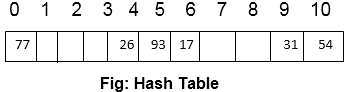
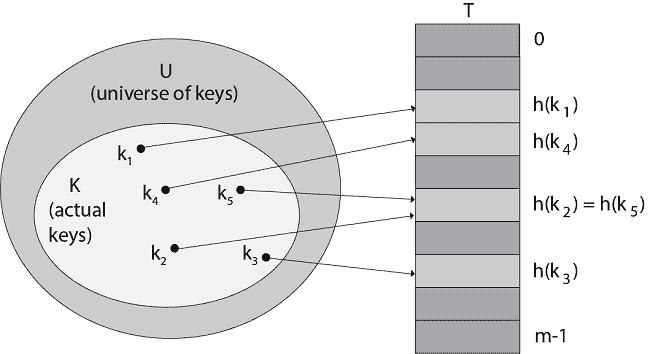

# 散列表

> 原文：<https://www.javatpoint.com/daa-hash-tables>

它是一个物品的集合，这些物品的存储方式使得以后很容易找到它们。

哈希表中的每个位置都称为插槽，可以容纳一个项目，并由从 0 开始的整数值命名。

哈希表中某项和该项所属的槽之间的映射称为哈希函数。散列函数接受一个密钥并返回它的散列编码或散列值。

假设我们有一组整数 54，26，93，17，77，31。我们的第一个散列函数被要求为“余数方法”，它简单地获取项目并将其除以表大小，返回余数作为其散列值，即

```

   h item = item % (size of table) 
Let us say the size of table = 11, then
54 % 11 = 10   26 % 11 = 4    93 % 11 = 5
17 % 11 = 6	   77 % 11 = 0    31 % 11 = 9	

```

| 项目 | 哈希值 |
| Fifty-four | Ten |
| Twenty-six | four |
| Ninety-three | five |
| Seventeen | six |
| Seventy-seven | Zero |
| Thirty-one | nine |



现在，当我们需要搜索任何元素时，我们只需要将它除以表的大小，就可以得到哈希值。所以我们得到了 O (1)搜索时间。

现在再取一个元素 44，当我们在 44 上应用散列函数时，我们得到(44 % 11 = 0)，但是 0 散列值已经有一个元素 77。这个问题被称为碰撞。

**冲突:**根据哈希函数，在同一个插槽中需要两个或多个项目。这被称为碰撞。



**图:**使用哈希函数 h 将键映射到哈希表槽。因为键 K2 和 k5 映射到同一个槽，所以它们会发生冲突。

## 为什么要使用哈希表？

1.  如果 **U** (键的宇宙)很大，存储一个大小为【U】的表 T 可能是不可能的。
2.  键的设置 **k** 相对于 **U** 可能较小，所以分配给 **T** 的空间会浪费。

因此哈希表需要更少的存储空间。带有密钥 k 的间接寻址元素存储在带有散列的槽 k 中，它存储在 h (k)中，其中 h 是散列 f <sup>n</sup> ，散列(k)是密钥 k 的值。散列 f <sup>n</sup> 需要的数组范围。

## 哈希表的应用:

哈希表的一些应用有:

1.  **数据库系统:**具体来说，需要高效随机访问的那些。通常，数据库系统试图在两种访问方法之间发展:顺序访问和随机访问。哈希表是高效随机访问的一个组成部分，因为它们提供了一种在恒定时间内定位数据的方法。
2.  **符号表:**编译器用来维护程序中符号数据的表。编译器经常访问关于符号的信息。因此，非常有效地实现符号表至关重要。
3.  **数据字典:**支持添加、删除和搜索数据的数据结构。虽然散列表和数据字典的操作是相似的，但是也可以使用其他数据结构来实现数据字典。
4.  **关联数组:**关联数组由这样排列的数据组成，即一个数组的第 n 个<sup>元素对应于另一个数组的第 n 个<sup>元素。关联数组有助于通过几个关键字段来索引数据的逻辑分组。</sup></sup>

* * *