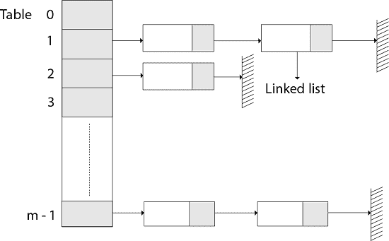
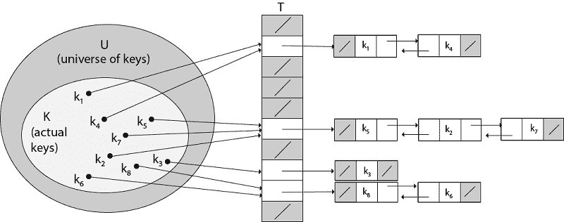
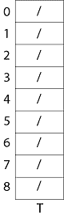
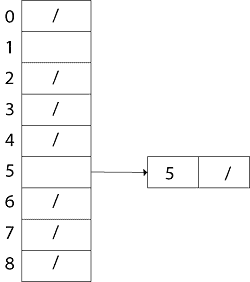
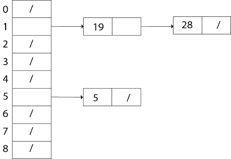
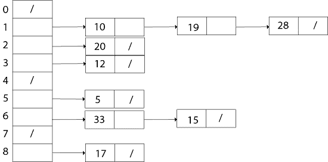

# 散列法

> 原文：<https://www.javatpoint.com/daa-hashing-method>

有两种主要方法用于实现哈希:

1.  带链接的哈希
2.  开放寻址哈希

## 1.带链接的哈希

在带链接的哈希中，S 中的元素存储在哈希表 T [0...m-1]的大小，其中 m 比 n 稍大，s 的大小。散列表据说有 m 个槽。与散列方案相关联的是散列函数 h，它从 U 映射到{0...m-1}。每个密钥 k ∈S 存储在位置 T [h (k)]中，我们说 k 被散列到槽 h (k)中。如果 S 中的多个密钥被散列到同一个槽中，那么我们就有了**冲突**。

在这种情况下，散列到同一个槽中的所有密钥被放置在与该槽相关联的链表中，该链表被称为槽处的链。哈希表的加载因子定义为∝=n/m，它代表每个槽的平均键数。我们通常在 m=θ(n)的范围内工作，因此∝通常是一个常数，通常∝<1。



### 通过链接解决冲突:

在链接中，我们将散列到同一个槽的所有元素放入同一个链表中，如图所示，槽 j 包含一个指针，指向散列到 j 的所有存储元素的列表头；如果没有这样的元素，槽 j 包含 NIL。



**图:通过链接解决冲突。**

每个哈希表槽 T [j]包含哈希值为 j 的所有键的链表。

**例如**，h (k1) = h (k4)和 h (k5) = h (k7) =h (K2)。链表可以是单链表，也可以是双链表；我们将其显示为双重链接，因为这样删除会更快。

### 带链接的哈希分析:

给定存储 n 个元素的具有 m 个槽的哈希表 T，我们将 T 的负载因子α定义为 n/m，即存储在链中的元素的平均数量。因此，搜索的最坏情况运行时间是θ(n)加上计算散列函数的时间-不比我们对所有元素使用一个链表好。很明显，哈希表并不用于它们最差的性能。

散列的平均性能取决于散列函数 h 平均在 m 个时隙中分配要存储的密钥集的程度。

**示例:**让我们考虑将元素 5、28、19、15、20、33、12、17、10 插入到链式哈希表中。假设哈希表有 9 个槽，哈希函数为 h (k) =k mod 9。

**解决方案:**链式哈希表的初始状态



**插入 5:**

```

h (5) = 5 mod 9 =5

```

为 T [5]创建一个链表，并在其中存储值 5。



同样，插入 28。h (28) = 28 mod 9 =1。为 T [1]创建一个链表，并在其中存储值 28。现在插入 19 h (19) = 19 mod 9 = 1。在链表开头的槽 T [1]中插入值 19。



```

Now insert h 15, h (15) = 15 mod 9 = 6\. Create a link list for T [6] and store value 15 in it.
Similarly, insert 20, h (20) = 20 mod 9 = 2 in T [2].
Insert 33, h (33) = 33 mod 9 = 6
In the beginning of the linked list T [6]. Then,
  Insert 12, h (12) = 12 mod 9 = 3 in T [3].
    Insert 17, h (17) = 17 mod 9 = 8 in T [8].
    Insert 10, h (10) = 10 mod 9 = 1 in T [1].

```

因此，插入密钥 10 后的链式哈希表是



## 2.开放寻址哈希

在开放寻址中，所有元素都存储在哈希表中。也就是说，每个表条目由动态集合的一个组成部分或 NIL 组成。当搜索一个项目时，我们始终检查表槽，直到找到所需的对象或者我们确定该元素不在表中。因此，在开放寻址中，负载系数α永远不能超过 1。

开放寻址的优点是避免了指针。在这种情况下，我们计算要检查的插槽序列。通过不共享指针释放的额外内存为哈希表提供了相同内存量的更多插槽，从而可能产生更少的冲突和更快的检索。

检查哈希表中位置的过程称为探测。

因此，散列函数变成

```

h : U x {0,1,....m-1}  →  {0,1,....,m-1}.  

```

对于开放寻址，我们要求对于每个密钥 k，探测序列

```

{h, (k, 0), h (k, 1)....h (k, m-1)}
Be a Permutation of (0, 1...... m-1)

```

HASH-INSERT 过程将哈希表 T 和密钥 k 作为输入

```
HASH-INSERT (T, k)
 1\. i ← 0
 2\. repeat j ← h (k, i)
 3\. if T [j] = NIL
 4\. then T [j] ← k
 5\. return j
 6\. else ← i= i +1
 7\. until i=m
 8\. error "hash table overflow"

```

HASH-SEARCH 过程将哈希表 T 和密钥 k 作为输入，如果发现槽 j 包含密钥 k，则返回 j，如果密钥 k 不在表 T 中，则返回 NIL。

```
HASH-SEARCH.T (k)
 1\. i ← 0
 2\. repeat j ← h (k, i)
 3\. if T [j] =j
 4\. then return j
 5\. i ← i+1
 6\. until T [j] = NIL or i=m
 7\. return NIL

```

* * *