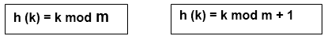
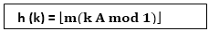

# 散列函数

> 原文：<https://www.javatpoint.com/daa-hash-function>

哈希函数用于索引原始值或键，然后在每次检索与该值或键相关联的数据时使用。因此，散列总是单向操作。不需要通过分析散列值来“逆向工程”散列函数。

## 良好散列函数的特征:

1.  哈希值完全由被哈希的数据决定。
2.  散列函数使用所有的输入数据。
3.  哈希函数将数据“统一”分布在整个可能的哈希值集中。
4.  哈希函数为相似的字符串生成复杂的哈希值。

## 一些流行的散列函数是:

### 1.分割方法:

选择一个比 k 中 n 个键的数目小的数 m(数 m 通常被选择为质数或没有小除数的数，因为这通常是最小的冲突数)。

哈希函数是:



**例如:**如果哈希表的大小为 m = 12，密钥为 k = 100，那么 h (k) = 4。因为它只需要一次除法运算，所以按除法散列相当快。

### 2.乘法方法:

创建散列函数的乘法分两步操作。首先，我们将密钥 k 乘以 0 < A < 1 范围内的常数 A，提取 kA 的小数部分。然后，我们将这个值增加 m，得到结果的下限。

哈希函数是:



其中“k A mod 1”表示 k A 的小数部分，即 k A -⌊k A⌋.

### 3.中间平方法:

密钥 k 是平方的。那么函数 H 由下式定义

```

H (k) = L

```

其中 L 是从 k <sup>2</sup> 两端删除数字得到的。我们强调 k <sup>2</sup> 的相同位置必须用于所有按键。

### 4.折叠方法:

密钥 k 被分成若干部分 k <sub>1</sub> ，k <sub>2</sub> ....k <sub>n</sub> 其中除了最后一个部分之外，每个部分都具有与所需地址相同的位数。

然后将各部分加在一起，忽略最后一次进位。

```
H (k) = k1+ k2+.....+kn

```

**示例:**公司有 68 名员工，每个员工分配一个唯一的四位数员工号。假设 L 由 2 位地址组成:00、01 和 02....99.我们将上述散列函数应用于以下每个员工编号:

```

3205,		7148,		2345

```

**(a)除法方法:**选择一个接近 99 的素数 m，如 m =97，然后

```

H (3205) = 4,		H (7148) = 67,			H (2345) = 17.

```

即 3205 除以 17 得到 4 的余数，7148 除以 97 得到 67 的余数，2345 除以 97 得到 17 的余数。

**(b)中方格法:**

```
k = 3205       7148       2345
k2= 10272025   51093904   5499025
h (k) = 72     93         99

```

注意，从右数第四和第五位数字被选作散列地址。

**(c)折叠方法:**将密钥 k 分成 2 部分，相加得到如下散列地址:

```

H (3205) = 32 + 50 = 82		H (7148) = 71 + 84 = 55
H (2345) = 23 + 45 = 68

```

* * *