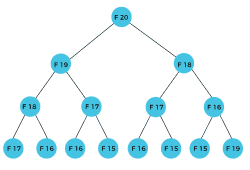
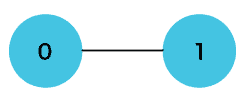
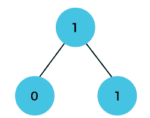
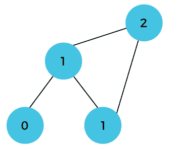
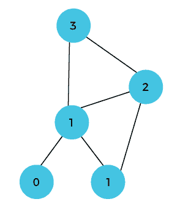
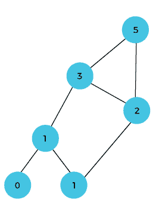

# 动态规划

> 原文：<https://www.javatpoint.com/dynamic-programming>

动态规划是一种将问题分解为子问题，并将结果保存起来以备将来使用的技术，这样我们就不需要再次计算结果。子问题被优化以优化整体解，这被称为最优子结构性质。动态规划的主要用途是解决优化问题。在这里，优化问题是指当我们试图找出问题的最小或最大解时。动态规划保证在问题存在解的情况下找到问题的最优解。

动态规划的定义说，它是一种解决复杂问题的技术，首先分解成一组更简单的子问题，每个子问题只解决一次，然后存储它们的解以避免重复计算。

**我们通过一个例子来理解这个方法。**

**考虑斐波那契数列的一个例子。以下数列为斐波那契数列:**

**0、1、1、2、3、5、8、13、21、34、55、89、144、…**

上述系列中的数字不是随机计算的。数学上，我们可以用下面的公式写出每个术语:

**F(n) = F(n-1) + F(n-2)，**

基础值 F(0) = 0，F(1) = 1。要计算其他数字，我们遵循上述关系。例如，F(2)是 **f(0)** 和**F(1)**的和，等于 1。

### 我们如何计算 F(20)？

F(20)项将使用斐波那契数列的第 n 个公式计算。下图显示了 F(20)的计算方法。



从上图中我们可以看出，F(20)是由 F(19)和 F(18)之和计算出来的。在动态规划方法中，我们试图将问题分成相似的子问题。在上述情况下，我们遵循这种方法，其中 F(20)进入类似的子问题，即 F(19)和 F(18)。如果我们回顾一下动态规划的定义，它说类似的子问题不应该被计算一次以上。然而，在上述情况下，子问题被计算两次。在上面的例子中，F(18)被计算了两次；类似地，F(17)也计算了两次。然而，这种技术非常有用，因为它解决了类似的子问题，但是我们在存储结果时需要谨慎，因为我们并不特别喜欢存储我们已经计算过一次的结果，否则会导致资源浪费。

在上面的例子中，如果我们计算右边子树中的 F(18)，那么它会导致资源的大量使用，并降低整体性能。

上述问题的解决方案是将计算结果保存在数组中。首先，我们计算 F(16)和 F(17)，并将它们的值保存在一个数组中。F(18)是通过对 F(17)和 F(16)的值求和来计算的，它们已经保存在一个数组中。F(18)的计算值保存在数组中。F(19)的值是使用 F(18)和 F(17)的和计算的，它们的值已经保存在数组中。F(19)的计算值存储在数组中。F(20)的值可以通过将 F(19)和 F(18)的值相加来计算，并且 F(19)和 F(18)的值都存储在数组中。F(20)的最终计算值存储在数组中。

### 动态编程方法是如何工作的？

以下是动态编程遵循的步骤:

*   它把复杂的问题分解成更简单的子问题。
*   它找到了这些子问题的最优解。
*   它存储子问题的结果(记忆化)。存储子问题结果的过程称为记忆。
*   它重用它们，以便同一子问题被计算不止一次。
*   最后，计算复杂问题的结果。

以上五个步骤是动态规划的基本步骤。动态编程适用于具有如下属性的程序:

有重叠子问题和最优子结构的问题。这里的最优子结构是指通过简单地组合所有子问题的最优解，就可以得到优化问题的解。

在动态规划的情况下，当我们存储中间结果时，空间复杂度会增加，但是时间复杂度会降低。

## 动态规划方法

动态编程有两种方法:

*   自上而下的方法
*   自下而上的方法

### 自上而下的方法

自上而下的方法遵循记忆技术，而自下而上的方法遵循列表方法。在这里，记忆等于递归和缓存的总和。递归意味着调用函数本身，而缓存意味着存储中间结果。

**优势**

*   非常容易理解和实现。
*   它只在需要的时候解决子问题。
*   很容易调试。

**缺点**

它使用递归技术，在调用堆栈中占据更多内存。有时当递归太深时，会出现堆栈溢出的情况。

它会占用更多内存，从而降低整体性能。

**我们通过一个例子来理解动态规划。**

```

int fib(int n)
{
   if(n<0)
   error;
 if(n==0)
 return 0;
 if(n==1)
return 1;
sum = fib(n-1) + fib(n-2);
}

```

在上面的代码中，我们使用了递归方法来找出斐波那契数列。当“n”的值增加时，函数调用也会增加，计算量也会增加。在这种情况下，时间复杂度呈指数级增加，变成 2 <sup>n</sup> 。

这个问题的一个解决方案是使用动态编程方法。我们可以重用之前计算的值，而不是一次又一次地生成递归树。如果我们使用动态规划方法，那么时间复杂度将是 O(n)。

当我们在斐波那契数列的实现中应用动态编程方法时，代码将如下所示:

```

static int count = 0; 
int fib(int n)
{
if(memo[n]!= NULL)
return memo[n];
count++;
   if(n<0)
   error;
 if(n==0)
 return 0;
 if(n==1)
return 1;
sum = fib(n-1) + fib(n-2);
memo[n] = sum;
}

```

在上面的代码中，我们使用了记忆技术，将结果存储在一个数组中以重用这些值。这也称为自上而下的方法，我们从顶部开始，将问题分解为子问题。

### 自下而上的方法

自底向上的方法也是可以用来实现动态编程的技术之一。它使用制表技术来实现动态编程方法。它解决了同样的问题，但它消除了递归。如果我们去掉递归，就没有堆栈溢出问题，也没有递归函数的开销。在这种制表技术中，我们解决问题并将结果存储在矩阵中。

应用动态编程有两种方式:

*   **自上而下**
*   **自下而上**

自底向上是避免递归的方法，从而节省了内存空间。自底向上是一种从头开始的算法，而递归算法是从末尾开始并向后工作。在自下而上的方法中，我们从基本案例开始寻找最终答案。我们知道，斐波那契数列的基本情况是 0 和 1。由于底部方法从基本情况开始，所以我们将从 0 和 1 开始。

**要点**

*   我们解决了解决较大子问题所需的所有较小的子问题，然后使用较小的子问题转向较大的问题。
*   我们使用 for 循环来迭代子问题。
*   自下而上的方法也称为列表或表格填充方法。

**我们通过一个例子来了解一下。**

假设我们有一个数组，在[0]和[1]位置分别有 0 和 1 值，如下所示:


由于自下而上的方法从较低的值开始，因此将 a[0]和 a[1]处的值相加，得到 a[2]的值，如下所示:


a[3]的值将通过将 a[1]和 a[2]相加来计算，它变成 2，如下所示:


a[4]的值将通过将 a[2]和 a[3]相加来计算，它变成 3，如下所示:


a[5]的值将通过将 a[4]和 a[3]的值相加来计算，它变成 5，如下所示:


下面给出了使用自底向上方法实现斐波那契数列的代码:

```

int fib(int n)
{
    int A[];
    A[0] = 0, A[1] = 1;
    for( i=2; i<=n; i++)
    {
         A[i] = A[i-1] + A[i-2]
    }
    return A[n];
}

```

在上面的代码中，基本情况是 0 和 1，然后我们使用 for 循环来查找斐波那契数列的其他值。

**让我们通过图示来理解。**

最初，前两个值，即 0 和 1，可以表示为:



当 i=2 时，值 0 和 1 相加，如下所示:



当 i=3 时，值 1 和 1 相加，如下所示:



当 i=4 时，值 2 和 1 相加，如下所示:



当 i=5 时，值 3 和 2 相加，如下所示:



在上面的例子中，我们从底部开始，到达顶部。

* * *