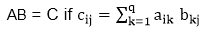
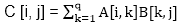
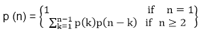
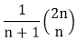
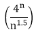
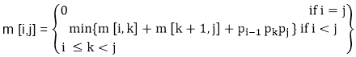

# 矩阵链乘法

> 原文：<https://www.javatpoint.com/matrix-chain-multiplication>

它是动态规划下的一种方法，在这种方法中，先前的输出被作为下一个的输入。

这里，链表示一个矩阵的列等于第二个矩阵的行[总是]。

总的来说:

```
If A = ⌊aij⌋ is a p x q matrix 
   B = ⌊bij⌋ is a q x r matrix
   C = ⌊cij⌋ is a p x r matrix

```

然后



给定以下矩阵{A <sub>1</sub> 、A <sub>2</sub> 、A <sub>3</sub> ，...A <sub>n</sub> }我们必须执行矩阵乘法，这可以通过一系列矩阵乘法来完成

```
A1 xA2 x,A3 x.....x An

```

矩阵乘法运算本质上是**关联**而不是交换的。这里，我们的意思是我们必须遵循上面的乘法矩阵顺序，但是我们可以根据自己的需要在上面的乘法后面加上**括号**。

一般来说，对于 1≤ i≤ p 和 1≤ j ≤ r



可以观察到，矩阵“C”的总条目数为“pr”，因为矩阵的维数为 p×r。此外，每个条目需要 O (q)次计算，因此计算矩阵“C”所有可能条目的总时间与维数 p×q×r 的乘积成正比

还注意到，我们可以通过重新排序括号来节省操作的数量。

**例 1:** 我们有 3 个矩阵，A <sub>1</sub> ，A <sub>2</sub> ，A <sub>3</sub> 的顺序分别是(10×100)，(100×5)和(5×50)。

三个矩阵可以通过两种方式相乘:

1.  **A <sub>1</sub> 、(A <sub>2</sub> 、A <sub>3</sub> ):** 先相乘(A <sub>2</sub> 和 A <sub>3</sub> )再相乘并与 A <sub>1</sub> 合成。
2.  **(A <sub>1</sub> 、A <sub>2</sub> 、A <sub>3</sub> :** 先相乘(A <sub>1</sub> 和 A <sub>2</sub> )再相乘并与 A <sub>3</sub> 合成。

情况 1 中标量乘法的数量为:

```

(100 x 5 x 50) + (10 x 100 x 50) = 25000 + 50000 = 75000

```

情况 2 中标量乘法的数量为:

```

(100 x 10 x 5) + (10 x 5 x 50) = 5000 + 2500 = 7500

```

为了找到计算乘积的最佳方法，我们可以简单地以各种可能的方式将表达式插入括号中，并计算每次需要多少标量乘法。

矩阵链乘法问题可以表述为“找到要相乘的矩阵链的最佳括号，使得标量乘法的次数最小化”。

**给矩阵加括号的方法数量:**

有非常多的方法来给这些矩阵加上括号。如果有 n 个项目，最外面的一对括号可以有(n-1)种放置方式。

```
(A1) (A2,A3,A4,................An)
Or (A1,A2)  (A3,A4 .................An)
Or (A1,A2,A3)  (A4 ...............An)
........................

Or(A1,A2,A3.............An-1) (An)

```

可以观察到，在分裂 kth 矩阵之后，我们剩下两个带括号的矩阵序列:一个由‘k’矩阵组成，另一个由‘n-k’矩阵组成。

现在有左子列表的“左”括号和右子列表的“右”括号，那么总数将是左。右:



同样 p (n) = c (n-1)，其中 c (n)是第 n 个**卡特隆数**

c (n) = 

在应用斯特林公式时

c(n)=ω

这表明 4 <sup>n</sup> 增长更快，因为它是指数函数，然后 n <sup>1.5</sup> 。

* * *

## 动态规划算法的发展

1.  描述最优解的结构。
2.  递归定义最优解的值。
3.  以自下而上的方式计算最优解的值。
4.  根据计算的信息构造最优解。

* * *

## 动态规划方法

设 A <sub>i，j</sub> 为矩阵 I 到 j 相乘的结果，可见 A <sub>i，j</sub> 的维数为 p <sub>i-1</sub> x p <sub>j</sub> 矩阵。

动态规划解决方案包括将问题分解成子问题，这些子问题的解决方案可以组合起来解决全局问题。

在最高级的括号中，我们将两个矩阵相乘

```
A1.....n=A1....k x Ak+1....n)

```

因此，我们剩下两个问题:

*   如何拆分矩阵序列？
*   如何给子序列 A 加上括号 <sub>1.....k</sub> andA <sub>k+1......n</sub> ？

寻找“k”最佳值的第一个问题的一个可能答案是检查“k”的所有可能选项，并考虑其中的最佳选项。但是可以观察到，检查所有可能性将导致总可能性的指数数量。还可以注意到，只存在 O (n <sup>2</sup> )个不同序列的矩阵，这样就达不到指数增长。

**步骤 1:最优括号的结构:**我们在动态范式中的第一步是找到最优子结构，然后用它来构造问题的最优解，从最优解到子问题。

让甲<sub>我....j</sub> 其中 i≤ j 表示评估产品得到的矩阵

A <sub>i</sub> A <sub>i+1</sub> ....一 <sub>j</sub> 。

如果我< j then any parenthesization of the product A<sub>我</sub> A <sub>i+1</sub> ......A <sub>j</sub> 必须将 A <sub>k</sub> 和 A <sub>k+1</sub> 之间的乘积拆分为 i ≤ k ≤ j 范围内的某个整数 k，也就是说，对于 k 的某个值，我们首先计算矩阵 A <sub>i.....k</sub> & A <sub>k+1....j</sub> 然后将它们相乘得到最终产品 A <sub>i....j</sub> 。计算成本 A <sub>i....k</sub> 加上计算 A <sub>k+1 的成本....j</sub> 加上两者相乘的成本就是父母化的成本。

**第二步:递归解:**设 m [i，j]是计算 matrixA <sub>i 所需的最小标量乘法数....j</sub> 。

如果 i=j，链只由一个矩阵 A 组成 <sub>i....所以计算乘积不需要标量乘法。因此，对于 i= 1，2，3，m [i，j] = 0....名词（noun 的缩写）</sub>

如果 i <j we="" assume="" that="" to="" optimally="" parenthesize="" the="" product="" split="" it="" between="" a="">k 和 A <sub>k+1</sub> ，其中 i≤ k ≤j，那么 m【I，j】等于计算子产品 A <sub>i 的最小成本....k</sub> 和 A <sub>k+1....j</sub> +将它们相乘的成本。我们知道 A <sub>i</sub> 有尺寸 p <sub>i-1</sub> x p <sub>i</sub> ，所以计算产品 A <sub>i....k</sub> 和 A <sub>k+1....j</sub> 取 p<sub>I-1</sub>p<sub>k</sub>p<sub>j</sub>标量乘法，我们得到</j>

```
m [i,j] = m [i, k] + m [k + 1, j] + pi-1  pk pj

```

“k”只有(j-1)个可能值，即 k = i，i+1.....j-1。由于最佳括号必须使用这些值中的一个来表示“k ”,我们只需要检查它们就可以找到最佳值。

所以产品 A <sub>i</sub> A <sub>i+1</sub> 的最小附加成本......一 <sub>j</sub> 变



为了构造一个最优解，让我们将 s [i，j]定义为“k”的值，在这个值上，我们可以拆分乘积 A <sub>i</sub> A <sub>i+1</sub> .....为了获得最佳的括号，即 s [i，j] = k

```
m [i,j] = m [i, k] + m [k + 1, j] + pi-1  pk pj

```

* * *