# 矩阵链乘法示例

> 原文：<https://www.javatpoint.com/matrix-chain-multiplication-example>

**例:**我们给出了序列{4，10，3，12，20 和 7}。矩阵的大小是 4×10，10×3，3×12，12×20，20×7。我们需要计算 M [i，j]，0 ≤ i，j≤ 5。我们知道 M [i，i] = 0 代表所有 I。

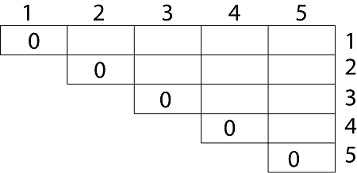

让我们开始远离对角线的工作。我们计算两个矩阵乘积的最优解。

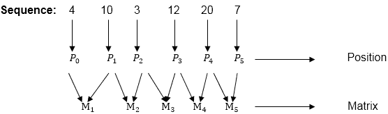

这里 P <sub>0</sub> 到 P <sub>5</sub> 是位置，M <sub>1</sub> 到 M <sub>5</sub> 是尺寸矩阵(p <sub>i</sub> 到 p <sub>i-1</sub> )

在序列的基础上，我们做了一个公式

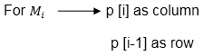

在动态编程中，由“0”完成的每个方法的初始化。所以我们用“0”初始化它。它会按对角线排序。

我们必须整理所有的组合，但最小输出组合被考虑在内。

```
Calculation of Product of 2 matrices:
1\. m (1,2) = m1  x m2
           = 4 x 10 x  10 x 3
           = 4 x 10 x 3 = 120

2\. m (2, 3) = m2 x m3
            = 10 x 3  x  3 x 12
            = 10 x 3 x 12 = 360

3\. m (3, 4) = m3 x m4 
            = 3 x 12  x  12 x 20
            = 3 x 12 x 20 = 720

4\. m (4,5) = m4 x m5
           = 12 x 20  x  20 x 7
           = 12 x 20 x 7 = 1680

```

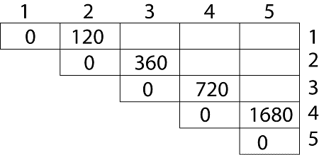

*   我们用相等的 I，j 值“0”初始化对角元素。
*   在第二条对角线被整理出来之后，我们得到了与之对应的所有值

现在第三条对角线将以同样的方式解出来。

**现在是 3 个矩阵的乘积:**

```
M [1, 3] = M1 M2 M3

```

1.  有两种情况可以解这个乘法:(M<sub>1</sub>x M<sub>2</sub>)+M<sub>3</sub>，M<sub>1</sub>+(M<sub>2</sub>x M<sub>3</sub>
2.  在解决这两种情况后，我们选择输出最小的情况。

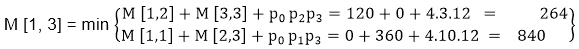

**M [1，3] =264**

由于比较两种输出 **264** 在两种情况下都是最小的，所以我们在表格中插入 **264** 并且(M<sub>1</sub>x M<sub>2</sub>)+M<sub>3</sub>选择该组合进行输出。

```
M [2, 4] = M2 M3 M4

```

1.  有两种情况可以解这个乘法:(M<sub>2</sub>x M<sub>3</sub>)+M<sub>4</sub>，M<sub>2</sub>+(M<sub>3</sub>x M<sub>4</sub>
2.  在解决这两种情况后，我们选择输出最小的情况。

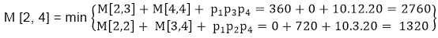

**M [2，4] = 1320**

由于比较两种输出 **1320** 在两种情况下都是最小的，所以我们在表格中插入 **1320** 和 M<sub>2</sub>+(M<sub>3</sub>x M<sub>4</sub>)选择该组合进行输出。

```
M [3, 5] = M3  M4  M5

```

1.  有两种情况可以解这个乘法:(M<sub>3</sub>x M<sub>4</sub>)+M<sub>5</sub>，M<sub>3</sub>+(M<sub>4</sub>xM<sub>5</sub>
2.  在解决这两种情况后，我们选择输出最小的情况。

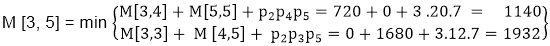

```
M [3, 5] = 1140

```

由于比较两种输出 **1140** 在两种情况下都是最小的，所以我们在表格中插入 **1140** 并且(M<sub>3</sub>x M<sub>4</sub>)+M<sub>5</sub>选择该组合进行输出。

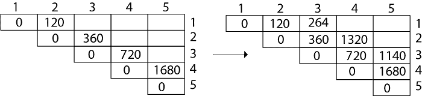

现在是 4 个矩阵的乘积:

```
M [1, 4] = M1  M2 M3 M4

```

有三种情况可以解决这个乘法问题:

1.  (M<sub>1</sub>x M<sub>2</sub>x M<sub>3</sub>)M<sub>4</sub>
2.  M<sub>1</sub>x(M<sub>2</sub>x M<sub>3</sub>x M<sub>4</sub>
3.  (M<sub>1</sub>xM<sub>2</sub>)x(M<sub>3</sub>x M<sub>4</sub>

解决这些情况后，我们选择输出最小的情况

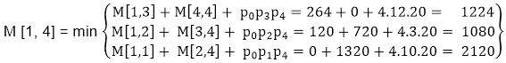

**M [1，4] =1080**

由于比较不同情况下的输出，那么“ **1080** ”是最小输出，所以我们在表中插入 1080，在输出制作中取出(M<sub>1</sub>xM<sub>2</sub>)x(M<sub>3</sub>x M<sub>4</sub>组合，

```
M [2, 5] = M2 M3 M4 M5

```

有三种情况可以解决这个乘法问题:

1.  (M<sub>2</sub>x M<sub>3</sub>x M<sub>4</sub>)x M<sub>5</sub>
2.  M<sub>2</sub>x(M<sub>3</sub>x M<sub>4</sub>x M<sub>5</sub>
3.  (M<sub>2</sub>x M<sub>3</sub>)x(M<sub>4</sub>x M<sub>5</sub>

解决这些情况后，我们选择输出最小的情况

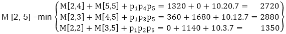

```
M [2, 5] = 1350

```

由于比较不同情况下的输出，那么“ **1350** ”是最小输出，所以我们在表中插入 1350，在输出制作中取出 M<sub>2</sub>x(M<sub>3</sub>x M<sub>4</sub>xM<sub>5</sub>组合。

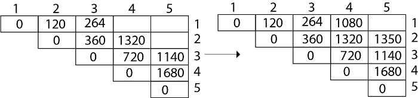

**现在是 5 个矩阵的乘积:**

```
M [1, 5] = M1  M2 M3 M4 M5

```

有五种情况可以解决这个乘法问题:

1.  (M<sub>1</sub>x M<sub>2</sub>xM<sub>3</sub>x M<sub>4</sub>)x M<sub>5</sub>
2.  M<sub>1</sub>x(M<sub>2</sub>XM<sub>3</sub>x M<sub>4</sub>XM<sub>5</sub>
3.  (M<sub>1</sub>x M<sub>2</sub>XM<sub>3</sub>)x M<sub>4</sub>XM<sub>5</sub>
4.  M<sub>1</sub>x M<sub>2</sub>x(M<sub>3</sub>x M<sub>4</sub>xM<sub>5</sub>

解决这些情况后，我们选择输出最小的情况

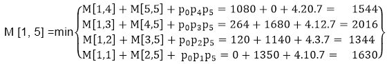

```
M [1, 5] = 1344

```

由于比较不同情况下的输出，那么“ **1344** ”是最小输出，所以我们在表中插入 1344，在输出制作中取出 M<sub>1</sub>x M<sub>2</sub>x(M<sub>3</sub>x M<sub>4</sub>x M<sub>5</sub>组合。

**最终输出为:**

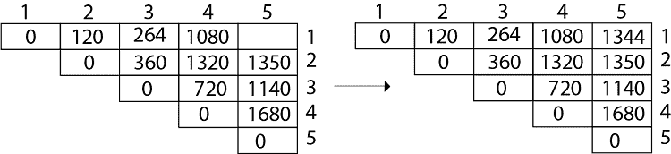

**步骤 3:计算最优成本:**让我们假设矩阵 A <sub>i</sub> 具有维度 p <sub>i-1</sub> x p <sub>i</sub> 对于 i=1，2，3....n .输入为序列(p <sub>0</sub> ，p <sub>1</sub> ，......p <sub>n</sub> )其中长度[p] = n+1。该程序使用辅助表 m [1....n，1.....n]存储 m [i，j]需要一个辅助表 s [1.....n，1.....记录 k 的哪个指数在计算 m [i，j]时达到最佳成本。

该算法首先针对 i=1，2，3 计算 m [i，j] ← 0.....n，长度为 1 的链的最小成本。