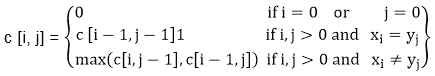

# 最长公共序列(LCS)

> 原文：<https://www.javatpoint.com/longest-common-sequence>

给定序列的子序列就是省略了某些元素的给定序列。

给定两个序列 X 和 Y，我们说序列 Z 是 X 和 Y 的公共序列，如果 Z 是 X 和 Y 的子序列。

在最长公共子序列问题中，我们给出了两个序列 X = (x 1 x 2 ....x m )和 Y =(Y1Y2Yn)并希望找到 X 和 Y 的最大长度公共子序列。LCS 问题可以使用动态规划来解决。

* * *

## 最长公共序列的特征

一种蛮力方法我们找到 X 的所有子序列，并检查每个子序列，看看它是否也是 Y 的子序列，这种方法需要指数时间，使得它对于长序列不切实际。

给定一个序列 X = (x 1 x 2 .....我们为 i=0、1 和 2 定义了 X 的第 I 个前缀...m 为 XI=(X1X2.....x i )。例如:如果 X = (A，B，C，B，C，A，B，C)那么 X 4 = (A，B，C，B)

**LCS 的最优子结构:**让 X = (x 1 x 2 ....x m 和 Y = (y 1 y 2 .....)y n 为序列，让 Z = (z 1 z 2 ......z k 是 X 和 y 中的任何一个 LCS

*   如果 x m = y n ，那么 z k =x_m=y n 和 Z k-1 就是 X m-1 和 Y n-1 的 LCS
*   如果 Xmyn，那么 ZkXm表示 Z 是 X m-1 和 y 的 LCS
*   如果 XmYn，那么 ZkYn表示 Z 是 X 和 Y 的 LCSn-1

**第二步:递归解:** LCS 有重叠子问题属性，因为要找到 X 和 Y 的 LCS，我们可能需要找到 X 的 LCSm-1和 Y n-1 。如果 x m ≠ y n ，那么我们必须解决两个子问题寻找 X 和 Y 的 LCSn-1。无论何时，LCS 不再是 X 和 Y 的 LCS，但是每个子问题都有找到 X 的 LCSm-1和 Y n-1 的子问题。

设 c [i，j]为序列 XI和 Yj的 LCS 长度。如果 i=0 和 j =0，其中一个序列的长度为 0，那么 LCS 的长度为 0。LCS 问题的最优子结构给出了递推公式

**第三步:计算一个 LCS 的长度:**让两个序列 X = (x 1 x 2 .....x m 和 Y = (y 1 y 2 .....y n )作为输入。它将 c [i，j]值存储在表 c [0......m，0..........n]。表 b [1..........m，1..........这有助于我们构造一个最优解。c [m，n]包含 X，y 的 LCS 长度

* * *