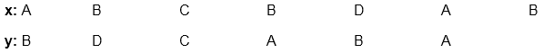
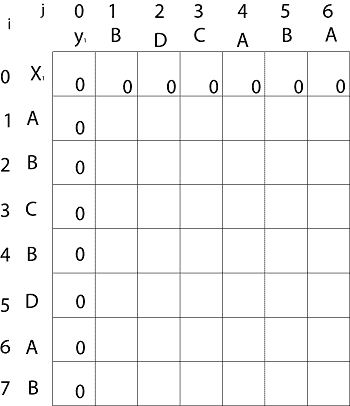
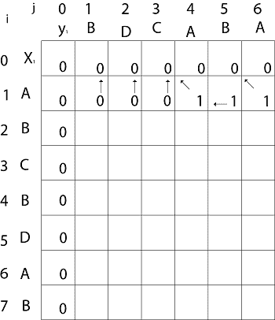
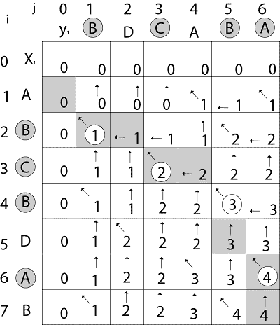
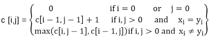
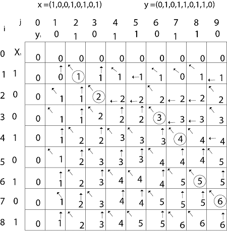

# 最长公共序列算法

> 原文：<https://www.javatpoint.com/longest-common-sequence-algorithm>

```
LCS-LENGTH (X, Y)
 1\. m ← length [X]										
 2\. n ← length [Y]
 3\. for i ← 1 to m
 4\. do c [i,0] ← 0
 5\. for j ← 0 to m
 6\. do c [0,j] ← 0
 7\. for i ← 1 to m
 8\. do for j ← 1 to n
 9\. do if xi= yj	
 10\. then c [i,j] ← c [i-1,j-1] + 1	
 11\. b [i,j] ← "↖"
 12\. else if c[i-1,j] ≥ c[i,j-1]
 13\. then c [i,j] ← c [i-1,j]
 14\. b [i,j] ← "↑"
 15\. else c [i,j] ← c [i,j-1]
 16\. b [i,j] ← "← "
 17\. return c and b.

```

## 最长公共序列示例

**示例:**给定两个序列 X [1...m]和 Y [1.....n]。找到两者最长的公共子序列。



```
here X = (A,B,C,B,D,A,B) and Y = (B,D,C,A,B,A)
     m = length [X] and n = length [Y]
     m = 7 and n = 6
Here x1= x [1] = A   y1= y [1] = B
     x2= B  y2= D	
     x3= C  y3= C
     x4= B  y4= A
     x5= D  y5= B
     x6= A  y6= A
     x7= B
Now fill the values of c [i, j] in m x n table
Initially, for i=1 to 7 c [i, 0] = 0
          For j = 0 to 6 c [0, j] = 0

```

那就是:



```
Now for i=1 and j = 1
	x1 and y1 we get x1 ≠ y1 i.e. A ≠ B
And 	c [i-1,j] = c [0, 1] = 0
	c [i, j-1] = c [1,0 ] = 0
That is, c [i-1,j]= c [i, j-1] so c [1, 1] = 0 and b [1, 1] = ' ↑  '

Now for i=1 and j = 2
x1 and y2 we get x1 ≠ y2 i.e. A ≠ D
	c [i-1,j] = c [0, 2] = 0
	c [i, j-1] = c [1,1 ] = 0
That is, c [i-1,j]= c [i, j-1] and c [1, 2] = 0 b [1, 2] = '  ↑  '

Now for i=1 and j = 3
	x1 and y3 we get x1 ≠ y3 i.e. A ≠ C
	c [i-1,j] = c [0, 3] = 0
	c [i, j-1] = c [1,2 ] = 0
so c [1,3] = 0     b [1,3] = ' ↑ '

Now for i=1 and j = 4
	x1 and y4 we get. x1=y4 i.e A = A 
	 c [1,4] = c [1-1,4-1] + 1
		   = c [0, 3] + 1
 		   = 0 + 1 = 1
	c [1,4] = 1
	b [1,4] = '  &nwarr;  '

Now for i=1 and j = 5
           x1 and y5  we get x1 ≠ y5
           c [i-1,j] = c [0, 5] = 0
	c [i, j-1] = c [1,4 ] = 1
Thus c [i, j-1] >  c [i-1,j] i.e. c [1, 5] = c [i, j-1] = 1\. So b [1, 5] = '←'

Now for i=1 and j = 6
           x1 and y6   we get x1=y6
                     c [1, 6] = c [1-1,6-1] + 1
                              = c [0, 5] + 1 = 0 + 1 = 1
		   c [1,6] = 1
		   b [1,6] = '  ↖  '

```



```
Now for i=2 and j = 1
 We get x2 and y1 B = B i.e.  x2= y1
             c [2,1] = c [2-1,1-1] + 1
                     = c [1, 0] + 1
                     = 0 + 1 = 1   
             c [2, 1] = 1 and b [2, 1] = ' ↖ '
Similarly, we fill the all values of c [i, j] and we get

```



**步骤 4:构建 LCS:** 初始调用是 PRINT-LCS (b，X，X.length，Y.length)

```
PRINT-LCS (b, x, i, j)
 1\. if i=0 or j=0
 2\. then return
 3\. if b [i,j] = ' ↖ '
 4\. then PRINT-LCS (b,x,i-1,j-1)
 5\. print x_i
 6\. else if b [i,j] = '  ↑  '
 7\. then PRINT-LCS (b,X,i-1,j)
 8\. else PRINT-LCS (b,X,i,j-1)

```

**例:**确定(1，0，0，1，0，1，0，1)和(0，1，0，1，1，0，1，1，1，0)的 LCS。

**解:**设 X = (1，0，0，1，0，1，0，1)和 Y = (0，1，0，1，1，0，1，1，0)。



我们正在寻找 c [8，9]。构建了下表。



从表中我们可以推断出 LCS = 6。有几个这样的序列，例如(1，0，0，1，1，0) (0，1，0，1，0，1)和(0，0，1，1，0，1)

* * *