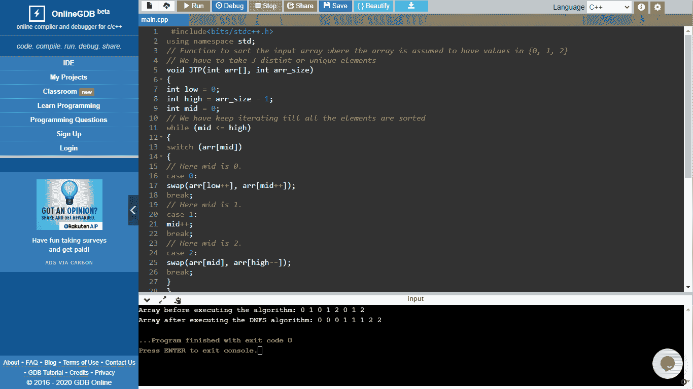
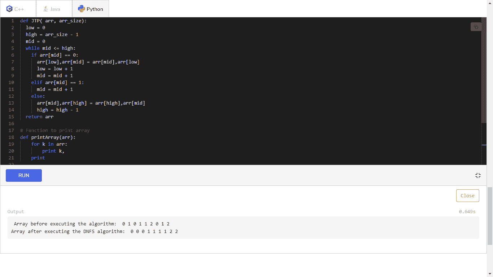

# 荷兰国旗

> 原文：<https://www.javatpoint.com/daa-dutch-national-flag>

**荷兰国旗(DNF) -** 是 Edsger Dijkstra 提出的一个编程问题。荷兰的国旗由三种颜色组成:白色、红色和蓝色。任务是随机排列白色、红色和蓝色的球，使相同颜色的球放在一起。对于 DNF(荷兰国旗)，我们以线性时间对 0、1 和 2 的数组进行排序，这不会消耗任何额外的空间。我们必须记住，该算法只能在具有三个唯一元素的数组上实现。

### 算法-

*   投三分球，即-低、中、高。
*   我们在开始使用低指针和中指针，高指针将指向给定数组的末尾。

### 案例:

*   如果数组[mid] =0，则用数组[low]交换数组[mid]，并将两个指针递增一次。
*   如果数组[mid] = 1，则不需要交换。将中间指针递增一次。
*   如果 array [mid] = 2，那么我们用 array [high]交换 array [mid]，并将 high 指针递减一次。

### 代码-

### (用 C 语言)

```

#include<bits/stdc++.h>  
using namespace std;  
// Function to sort the input array where the array is assumed to have values in {0, 1, 2}
// We have to take 3 distint or unique elements 
void JTP(int arr[], int arr_size)  
{ 
int low = 0;  
int high = arr_size - 1;  
int mid = 0;  
// We have keep iterating till all the elements are sorted  
while (mid <= high)  
{  
switch (arr[mid])  
{  
// Here mid is 0\.  
case 0:  
swap(arr[low++], arr[mid++]);  
break;  
// Here mid is 1\.  
case 1:  
mid++;  
break;  
// Here mid is 2\.  
case 2:  
swap(arr[mid], arr[high--]);  
break;  
}  
}  
}  
// Now, we write the function to print array arr[]  
void printArray(int arr[], int arr_size)  
{  
// To iterate and print every element, we follow these steps  
for (int i = 0; i < arr_size; i++)  
cout << arr[i] << " ";  
}  
//Main Code  
int main()  
{  
int arr[] = {0,1,0,1,2,0,1,2};  
int n = sizeof(arr)/sizeof(arr[0]);  
cout << "Array before executing the algorithm: ";  
printArray(arr, n);   
JTP(arr, n);  
cout << "\nArray after executing the DNFS algorithm: ";  
printArray(arr, n);  
return 0;  
}

```

**输出-**

执行算法前的数组:0 1 0 1 2 0 1 2

执行 DNFS 算法后的数组:0 0 0 1 1 1 2 2



### 代码-

### (在 JAVA 中)

```

import java.io.*; 
class DNF { 
static void JTP(int arr[], int arr_size) 
{ 
int low = 0; 
int high = arr_size - 1; 
int mid = 0, temp=0; // We use temporary variable for swapping 
while (mid <= high) 
{ 
switch (arr[mid]) 
{
case 0: // Here mid pointer points is at 0.
{ 
temp = arr[low]; 
arr[low] = arr[mid]; 
arr[mid] = temp; 
low++; 
mid++; 
break;
} 
case 1: // Here mid pointer points is at 1.
mid++; 
break; 
case 2: // Here mid pointer points is at 2.
{ 
temp = arr[mid]; 
arr[mid] = arr[high]; 
arr[high] = temp; 
high--; 
break; 
} 
} 
} 
} 
// Now we have to call function to print array arr[] 
static void printArray(int arr[], int arr_size) 
{ 
int i; 
for (i = 0; i < arr_size; i++) 
System.out.print(arr[i]+" "); 
System.out.println(""); 
} 
//Now we use driver function to check for above functions
public static void main (String[] arguments) 
{ 
int arr[] = {0, 1, 0, 1, 2, 0, 1, 2}; 
int arr_size = arr.length; 
System.out.println("Array before executing the DNFS algorithm : "); 
printArray(arr, arr_size); 
JTP(arr, arr_size); 
System.out.println("\nArray after executing the DNFS algorithm : "); 
printArray(arr, arr_size); 
} 
}

```

**输出-**

执行 DNFS 算法前的数组:0 1 0 1 2 0 1 2

执行 DNFS 算法后的数组:0 0 0 1 1 1 2 2


### 代码-

### (在 PYTHON 中)

```

def JTP( arr, arr_size): 
  low = 0
  high = arr_size - 1
  mid = 0
  while mid <= high: 
    if arr[mid] == 0: 
      arr[low],arr[mid] = arr[mid],arr[low] 
      low = low + 1
      mid = mid + 1
    elif arr[mid] == 1: 
      mid = mid + 1
    else: 
      arr[mid],arr[high] = arr[high],arr[mid] 
      high = high - 1
  return arr 

# Function to print array 
def printArray(arr): 
	for k in arr: 
		print k, 
	print

# Driver Program 
arr = [0, 1, 0, 1, 1, 2, 0, 1, 2] 
arr_size = len(arr)
print " Array before executing the algorithm: ", 
printArray(arr) 
arr = JTP(arr, arr_size) 
print "Array after executing the DNFS algorithm: ", 
printArray(arr)

```

**输出-**

执行算法前的数组:0 1 0 1 2 0 1 2

执行 DNFS 算法后的数组:0 0 0 1 1 1 2 2



* * *