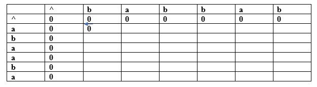
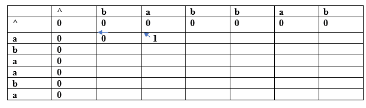
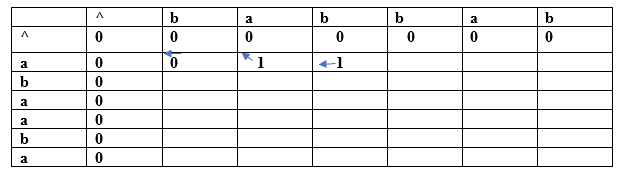
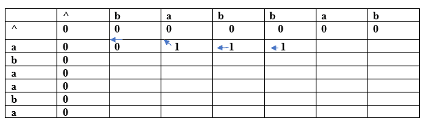
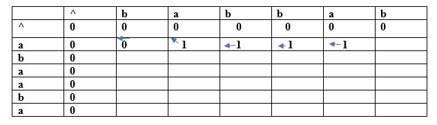
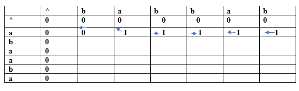
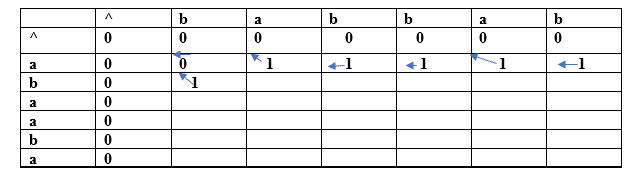
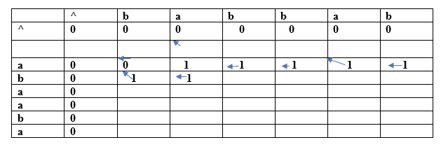
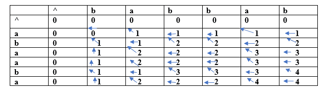
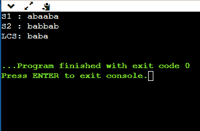

# 最长公共子序列

> 原文：<https://www.javatpoint.com/longest-common-subsequence>

这里最长意味着子序列应该是最大的。共性是指这两个字符串中的某些字符是相同的。子序列意味着从以递增顺序书写的字符串中提取一些字符以形成子序列。

**我们通过一个例子来理解子序列。**

假设我们有一个字符串“w”。

**W <sub>1</sub> = abcd**

**以下是可以从上述字符串创建的子序列:**

*   腹肌
*   弹底引信（base detonating 的缩写）
*   交流电
*   广告
*   （同 AutomaticCallDistribution）自动呼叫分配
*   bcd

以上是子序列，因为子字符串中的所有字符都是按照它们的位置递增的顺序书写的。如果我们写 ca 或 da，那么它将是一个错误的子序列，因为字符不是以递增的顺序出现的。可能的子序列总数是 2 <sup>n</sup> ，其中 n 是字符串中的字符数。在上面的字符串中，“n”的值是 4，所以子序列的总数是 16。

**W <sub>2</sub> = bcd**

通过简单地观察字符串 w1 和 w2，我们可以说 bcd 是最长的公共子序列。如果字符串很长，那么就不可能找到这两个字符串的子序列，并比较它们来找到最长的公共子序列。

**借助表格利用动态规划寻找 LCS。**

**考虑两个字符串:**

X= a b a a b a

Y= b a b b a b

**(a，b)**

**对于指数 i=1，j=1**



因为两个字符不同，所以我们考虑最大值。两者包含相同的值，即 0，因此将 0 放入(a，b)。假设我们从“X”字符串中获取 0 值，因此我们将箭头指向“a”，如上表所示。

**(a，a)**

**对于指数 i=1，j=2**



两个字符是相同的，因此该值将通过将 1 和上对角线值相加来计算。这里，上对角线的值是 0，所以这个条目的值是(1+0)等于 1。这里，我们考虑的是上对角线值，所以箭头会指向对角线。

**(a，b)**

**对于指数 i=1，j=3**



因为两个字符不同，所以我们考虑最大值。字符“a”具有最大值，即 1。新条目，即(a，b)将包含指向 1 值的值 1。

**(a，b)**

**对于指数 i=1，j=4**



因为两个字符不同，所以我们考虑最大值。字符“a”具有最大值，即 1。新条目，即(a，b)将包含指向 1 值的值 1。

**(a，a)**

**对于指数 i=1，j=5**



这两个字符是相同的，因此该值将通过将 1 和上对角线值相加来计算。这里，上对角线的值是 0，所以这个条目的值是(1+0)等于 1。这里，我们考虑的是上对角线值，因此箭头将指向对角线。

**(a，b)**

**对于指数 i=1，j=6**



因为两个字符不同，所以我们考虑最大值。字符“a”具有最大值，即 1。新条目，即(a，b)将包含指向 1 值的值 1。

**(b，b)**

**对于指数 i=2，j=1**



这两个字符是相同的，因此该值将通过将 1 和上对角线值相加来计算。这里，上对角线的值是 0，所以这个条目的值是(1+0)等于 1。这里，我们考虑的是上对角线值，因此箭头将指向对角线。

**(b，a)**

**对于指数 i=2，j=2**



因为两个字符不同，所以我们考虑最大值。字符“a”具有最大值，即 1。新条目，即(a，b)将包含指向 1 值的值 1。

这样，我们就会找到完整的表格。最后一张桌子是:



在上表中，我们可以观察到所有条目都已填充。现在我们到了最后一个值为 4 的单元格。该单元格向左移动，其中包含 4 个值。；因此，LCS 的第一个字符是“a”。

左侧单元格沿对角线向上移动，其值为 3；因此，下一个字符是“b”，它变成了“ba”。现在单元格有 2 个值向左移动。下一个单元格也有 2 个向上移动的值；因此，下一个字符是“a ”,它变成了“aba”。

下一个单元格的值 1 向上移动。现在我们到达了具有对角向上移动的值的单元(b，b );因此，下一个字符是“b”。最长的公共子序列的最后一个字符串是“baba”。

**为什么动态规划方法在解决 LCS 问题时比递归算法更有效？**

如果我们使用动态编程方法，那么函数调用的数量就会减少。动态编程方法存储每个函数调用的结果，以便函数调用的结果可以在将来的函数调用中使用，而不需要再次调用函数。

在上面的动态算法中，从 x 元素和 y 元素之间的比较中获得的结果被存储在表中，以便结果可以被存储用于未来的计算。

动态规划方法完成一个表所花费的时间是 O(mn)，递归算法所花费的时间是 2 <sup>max(m，n)</sup> 。

**最长公共子序列的算法**

```

Suppose X and Y are the two given sequences
Initialize a table of LCS having a dimension of X.length * Y.length
X.label = X
Y.label = Y
LCS[0][] = 0
LCS[][0] = 0
Loop starts from the LCS[1][1]
Now we will compare X[i] and Y[j]
   if X[i] is equal to Y[j] then
     LCS[i][j] = 1 + LCS[i-1][j-1]
     Point an arrow LCS[i][j]
Else
   LCS[i][j] = max(LCS[i-1][j], LCS[i][j-1])

```

**用 C 编程语言实现 LCS 算法**

```

// The longest common subsequence in C
#include #include <string.h>int i, j, m, n, LCS_table[20][20];
char S1[20] = "abaaba", S2[20] = "babbab", b[20][20];
void lcsAlgo() {
  m = strlen(S1);
  n = strlen(S2);
 // Filling 0's in the matrix
  for (i = 0; i <= m; i++)
    LCS_table[i][0] = 0;
  for (i = 0; i <= n; i++)
    LCS_table[0][i] = 0;
 // Creating the mtrix in bottom-up way
  for (i = 1; i <= m; i++)
    for (j = 1; j <= n; j++) {
      if (S1[i - 1] == S2[j - 1]) {
        LCS_table[i][j] = LCS_table[i - 1][j - 1] + 1;
      } else if (LCS_table[i - 1][j] >= LCS_table[i][j - 1]) {
        LCS_table[i][j] = LCS_table[i - 1][j];
      } else {
        LCS_table[i][j] = LCS_table[i][j - 1];
      }
    }

  int index = LCS_table[m][n];
  char lcsAlgo[index + 1];
  lcsAlgo[index] = '\0';

  int i = m, j = n;
  while (i > 0 && j > 0) {
    if (S1[i - 1] == S2[j - 1]) {
      lcsAlgo[index - 1] = S1[i - 1];
      i--;
      j--;
      index--;
    }

    else if (LCS_table[i - 1][j] > LCS_table[i][j - 1])
      i--;
    else
      j--;
  }

  // Printing the sub sequences
  printf("S1 : %s \nS2 : %s \n", S1, S2);
  printf("LCS: %s", lcsAlgo);
}

int main() {
  lcsAlgo();
  printf("\n");
}</string.h> 
```

**输出**



* * *