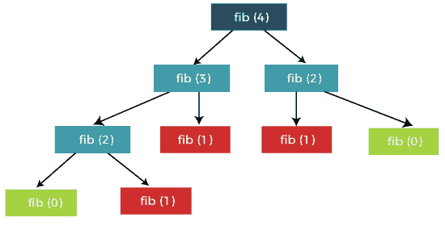
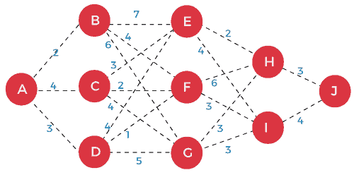
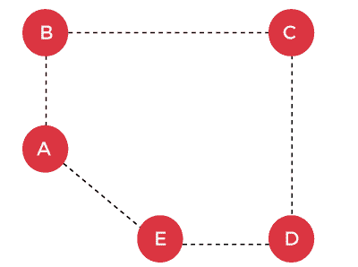
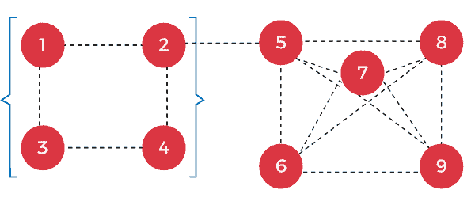

# 最优子结构性质

> 原文：<https://www.javatpoint.com/optimal-substructure-property>

给定的最优子结构性质，如果给定问题的最优解可以通过寻找所有子问题的最优解来获得。换句话说，给定较小问题的解决方案，我们可以解决较大的问题。假设我们已经给出了一个复杂的问题，那么我们将把这个问题最优地分解成更简单的问题，以找到给定复杂问题的最优解。

**例如:f(n) = f(n-1) + f(n-2)**



在上面的例子中，问题 f(n)被分解成两个更小的问题，即 F(n-1)和 f(n-2)。这两个较小的问题也可以进一步分解成较小的问题。

上图显示了如何将问题分解为子问题。这一过程将持续到问题无法进一步解决。一旦子问题没有进一步划分，我们就拿基础案例来寻找解决方案。

```

int fib(n)
{
    if(n==0)
     return 0;
    if(n==1)
     return 1
   int left = fib(n-1);
   int right = fib(n-2);
   return left+right;
}

```

**最优性原则**

理查德·贝尔曼是一位科学家，他在 1957 年从事动态规划的研究。

**我们通过一个例子来理解最优性。**



设 **F(x)** 为从节点**x**到达 **J** 所需的最小距离，假设 F(J) =0。顶点 H 到顶点 J 的距离是 3，顶点 I 到顶点 J 的距离是 4。

现在我们计算从顶点 E 到顶点 J 的距离如下:

F(E) =最小值{ 1+F(H)，4+F(I)}

=最小值{4，8}

最小值为 4；因此，从顶点 E 到顶点 J 的距离是 4。

现在我们计算从顶点 F 到顶点 J 的距离如下:

F(F) =最小值{ 6+F(H)，3+F(I)}

=最小值{9，7}

最小值为 7；因此，从顶点 F 到顶点 J 的距离是 7。

现在我们计算从顶点 G 到顶点 J 的距离如下:

F(G) =最小值{ 3+F(H)，3+F(I)}

=最小值{6，7}

最小值为 6；因此，从顶点 G 到顶点 J 的距离是 6。

现在我们计算从顶点 B 到顶点 J 的距离如下:

F(B) =最小值{ 7+F(E)，4+F(F)，6+F(G)}

=最小{11，11，12}

最小值为 11；因此，从顶点 B 到顶点 J 的距离是 11。

现在我们计算从顶点 C 到顶点 J 的距离如下:

F(C) =最小值{ 3+F(E)，2+F(F)，4+F(G)}

=最小值{6，4，8}

最小值为 4；因此，从顶点 C 到顶点 J 的距离是 11。

现在我们计算从顶点 D 到顶点 J 的距离如下:

F(D) =最小值{ 4+F(E)，1+F(F)，5+F(G)}

=最小值{8，8，11}

最小值为 8；因此，从顶点 D 到顶点 J 的距离是 8。

现在我们计算从顶点 A 到顶点 J 的距离如下:

F(A) =最小值{ 2+F(B)，4+F(C)，3+F(D)}

= min{13，11，11}

最小值为 11；因此，从顶点 A 到顶点 J 的距离是 11。因此，我们可以说 A 到 J 的最小距离是 11。现在，我们有两种方法可以通过顶点 D 从顶点 A 到达 J:

*   第一种方式是从顶点 A 到顶点 D，然后 D 到 F，F 到 I，然后 I 到 j。
*   第二种方式是从顶点 A 到顶点 D，然后 D 到 E，再 E 到 H，然后 H 到 j。

在这里，我们使用问题的子解构建了一个最优解。因此，我们可以说上述问题有一个最优子结构。

**我们可以利用矛盾的证明来证明上述问题。**

让 R <sub>a</sub> ... <sub>j</sub> 是从节点 A 到 j 的最优路径

让我们假设这条最佳路径通过节点 k 到达目的地。

现在，路径可以分成 R <sub>和 a</sub> .. <sub>k</sub> 和 R <sub>k</sub> ... <sub>J</sub>

**让我们通过图示来理解。**

假设从 A 到 K 有一条较短的路径，将其命名为 R` <sub>a</sub> .. <sub>k</sub>

如果 R` <sub>a</sub> ..<sub>k</sub>T8【R<sub>a</sub>.. <sub>k</sub>

然后 R` <sub>a</sub> .. <sub>k</sub> + R <sub>k</sub> .. <sub>j</sub> < R <sub>a</sub> .. <sub>k</sub> + R <sub>k</sub> .. <sub>j</sub>

上述关系不可能成立，因为我们已经知道 R <sub>a</sub> .. <sub>k</sub> + R <sub>k</sub> .. <sub>j</sub> 是一个最优解，如前所述。因此，R` <sub>a</sub> .. <sub>k</sub> ，不存在从 a 到 k 的较短路径，R <sub>a</sub> .. <sub>k</sub> + R <sub>k</sub> .. <sub>j</sub> 确实是最优解。

### 没有最优子结构的问题

如果没有最优子结构，会出现两个问题:

*   最长路径问题
*   最大团问题

**先看最长路径问题。**

考虑下面有 5 个顶点的图。



问题的目标是在不重复一条边的情况下找到两个顶点之间的最长路径。假设我们想找到从 A 到 C 的最长路径，即最长路径(A，C)。从 A 到 C 有两种旅行方式:

*   首先，我们从 A 到 E，E 到 D，然后 D 到 c。
*   第二种方式是从 A 到 B，再从 B 到 c。

第一种方法提供最长路径的解决方案，因为第二种方法不提供最长路径。最优性原理如下所示:

上图描绘了从 A 到 B，再从 B 到 C 的路径，这就是最优解。但是最优路径不是最长路径的解。

如果最优性原则适用于最长路径问题，那么我们应该把这个问题分成几个部分。从 A 到 C 的最长路径可以写成:

**最长路径(A，C) =最长 _ 路径(A，D) + (D-C)**

有两种可能的方法可以找到从 A 到 D 的最长路径:

*   第一条路是从 A 到 E，再从 E 到 d。
*   第二种方式是从 A 到 B，B 到 C，然后 C 到 d。

第二种方式提供了最长的路径。如果我们将此路径添加到边(D-C)，将会有一个重复的边，即 D 到 C，这是不允许的。因此，在这种情况下，一个问题的子解不会组合起来形成整体最优解。因此，我们可以说最长路径问题并不表现出最优子结构。

**最大团问题**

在这里，团意味着所有的顶点都相互连接。最大团意味着图中顶点最多。让我们通过一个例子来理解最大团。

考虑下图:



顶点:{1，2，3，4，5，6，7，8，9}

最大团数:{5，6，7，8，9}

如果最优性原则适用于最大团问题，那么我们应该把这个问题分成几个部分:

顶点= {1，2，3，4，5，6，7} + {8，9}

最大点击= {5，6，7，8，9}

拉帮结派= {1，2，3，4}，{5，6，7} + {8，9}

* * *