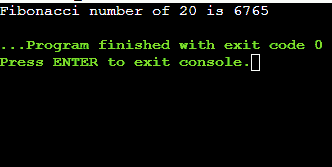
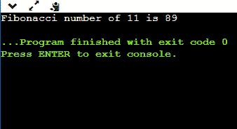

# 重叠子问题

> 原文：<https://www.javatpoint.com/overlapping-sub-problems>

动态规划是一种通过将问题分解成子问题并存储子问题的结果来解决复杂问题的方法，以避免一次又一次地重复计算同一个子问题。

以下是一个问题的两个属性，表明给定的问题可以通过使用动态编程方法来解决:

*   **最优子结构**
*   **重叠子问题**

我们已经讨论了最优子结构。现在我们将讨论重叠子问题。

### 什么是重叠子问题？

动态编程用于需要一次又一次解决相同子问题的地方。它类似于分治法，通过结合所有子问题的解决方案来计算解决方案。使用动态编程是因为子问题的解决方案可以存储在表中，这样就不需要一次又一次地重新计算。当没有常见或重叠的子问题时，不需要动态编程，因为没有必要一次又一次地将结果存储在表中。

例如，二分搜索法不需要动态编程，因为它没有共同的子问题。相比之下，斐波那契数列的递归程序有许多常见的子问题，因此需要动态规划方法来优化解决问题。

**斐波那契数列的递归程序**

```

int fib(int n)
{
    if(n<=1)
     return n;
   return fib(n-2)+fib(n-2);
}

```

如果我们想计算 fib(5)，那么 f(5)的图示如下所示:


如上图所示，fib(3)的值被计算了两次，fib(2)的值被计算了三次。我们可以将计算出的值存储在表中，这样就不需要一次又一次地重新计算子问题的值，而不是一次又一次地计算值。

有两种方法可以用来存储这些值:

*   表格
*   记忆化

### 什么是记忆化？

记忆是一种存储子问题结果的技术。记忆技术几乎类似于递归技术，只是在计算子问题之前，记忆会查看查找表。在记忆技术中，使用查找表。最初，查找表用 NIL 值初始化。每当我们需要子问题的解决方案时，我们首先查看查找表，如果在查找表中找不到解决方案，我们就计算子问题，并将结果存储到查找表中，以便以后可以重用。

```

/* C program of memoization for nth Fibonacci number */
#include #define MAX 50
int lookup[MAX];  // array declaration of MAX size
/* Function to initialize NIL values in lookup table */
void _initialize()
{
  int i;
  for (i = 0; i < MAX; i++) // for loop
    lookup[i] = -1;
} 
/* Fibonacci function for nth Fibonacci number */
int fib(int n)
{
   if (lookup[n] == -1)   // condition check
   {
      if (n <= 1)
         lookup[n] = n;
      else
         lookup[n] = fib(n-1) + fib(n-2);
   }

   return lookup[n];
}
int main ()
{
  int n = 20;   // variable declaration
  initialize(); // calling function initialize()
  printf("Fibonacci number of 20 is %d ", fib(n));
  return 0;
} 
```

**节目解说**

在上面的代码中，我们已经使用#define 指令声明了一个 MAX 变量。值 50 分配给最大值变量。查找是一个最大大小为 int 类型的数组。最初，我们为查找数组赋值-1。函数 fib(n)是为了寻找 n 的斐波那契数而创建的，在这个函数中，我们将检查 lookup[n]的值是否等于-1。如果 n 的值小于或等于-1，则 lookup[n]的值等于 n；否则，它将包含两个子问题的解的总和，即 fib(n-1) + fib(n-2)。

**输出**



### 什么是制表？

在制表技术中，我们以自下而上的方式解决子问题，并使用子问题的解决方案到达更大的子问题。制表技术可用于通过使用较小子问题的解迭代地生成较大子问题的解。

```

/* C program of Tabulation*/
#include /* Fibonacci function for nth Fibonacci number */
int fib(int n)
{
int f[n+1];  // array declaration
int i; // variable declaration
f[0] = 0; f[1] = 1;  // base cases
for (i = 2; i <= n; i++)   // for loop
f[i] = f[i-1] + f[i-2];
return f[n];
}
int main ()
{
int n = 11;
printf("Fibonacci number of 11 is %d ", fib(n));
return 0;
} 
```

**节目解说**

在上面的代码中，我们已经声明了一个大小为 n+1 的数组。基本情况是 **f[0]** 和 **f[1]** ，数值分别为 0 和 1。借助于陈述 **f[i] = f[i-1] + f[i-2】，我们已经通过使用所有较小问题的解决方案找到了所有较大问题的解决方案。**

**输出**



**制表**和**记忆**都用来存储子问题的解。在**记忆中，**表项按需填写；这意味着并非强制要求所有条目都已填写完整。在制表技术中，所有的表格条目都是从第一个条目开始一个接一个地填充的。

* * *