# 分支定界与回溯

> 原文：<https://www.javatpoint.com/branch-and-bound-vs-backtracking>

在了解分支定界和回溯的区别之前，我们应该分别了解分支定界和回溯。

**什么是回溯？**

回溯只不过是**蛮力方法的修改过程。**它是一种技术，其中一个问题的多个解决方案可用，并且它在所有可用选项中搜索问题的解决方案。让我们考虑暴力搜索的例子，因为回溯遵循暴力搜索方法。

考虑这个盒子，我们有三个不同颜色的物体。一个物体是红色，第二个物体是绿色，第三个物体是蓝色。现在，我们必须把这些物体放在盒子里，我们有多种选择。根据蛮力方法，我们必须考虑所有选项，并在所有可能的选项中确定最佳选项。

**让我们考虑一下这个问题所有可能的解决方案。**

假设我们先填充红色物体，然后填充绿色物体，然后填充蓝色物体。这是这个问题的第一个解决方案。可能的解决方案是红色、绿色和蓝色。

第二种解决方案是先保留红色对象，然后是蓝色对象，然后是绿色对象。可能的解决方案是红色、蓝色和绿色。

第三种解决方案可以是先保留绿色对象，然后是红色对象，然后是蓝色对象。可能的解决方案是绿色、红色和蓝色。

第四种解决方案是先保留绿色对象，然后是蓝色对象，然后是红色对象。可能的解决方案是绿色、蓝色和红色。

第五种解决方法是先保留蓝色物体，然后是绿色物体，然后是红色物体。可能的解决方案是蓝色、绿色和红色。

第六种解决方案是先保留蓝色对象，然后是红色对象，然后是绿色对象。可能的解决方案是蓝色、红色和绿色。

 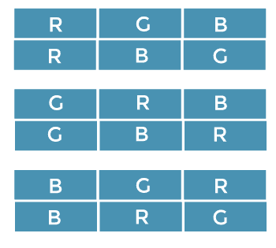

以上是可能的解决方案，我们必须从所有可能的解决方案中找出最好的解决方案。这种方法被称为蛮力方法。回溯类似于蛮力方法，但它是蛮力方法的修改过程。

**让我们看看回溯和蛮力方法有什么不同。**

上图显示了上述问题的可能解决方案。现在我们将看到这些解决方案是如何在回溯中表示的。

在回溯中，解以树的形式表示，该树被称为状态空间树。由于回溯遵循 DFS，因此将使用 DFS 形成树，这被称为**状态空间树。**

**让我们创建树。**

考虑第一种方案，即**红、绿、蓝、**，可以用树的形式表示，如下图所示。

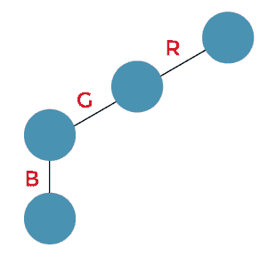

考虑第二种方案，即**红、蓝、绿。**因为蓝色之后没有更多的物体，所以我们将回溯并移动到绿色。我们不取绿色，而是先取蓝色再取绿色，如下图:

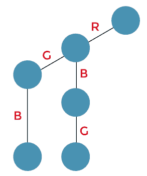

下一个解决方案是**绿色、红色和蓝色。**由于我们无法探索绿色物体，所以我们向后移动，到达蓝色物体。我们无法探索蓝色物体，所以我们再次向后移动，到达红色物体。我们将使用绿色对象，而不是红色对象。在绿色物体之后，我们使用红色物体，然后使用蓝色物体。我们无法进一步探索蓝色物体。现在，绿色、红色和蓝色序列形成如下所示:

下一个解决方案是**绿色、蓝色和红色。**由于我们无法探索蓝色物体，我们向后移动，到达红色物体。我们将使用蓝色对象，然后使用红色对象，而不是使用红色对象。现在形成了绿、蓝、红序列。

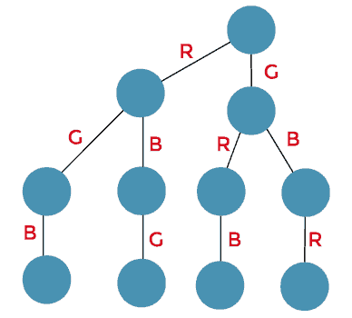

下一个方案是**蓝绿红。**由于我们无法探索红色物体，所以我们回溯并到达蓝色物体。我们无法探索蓝色物体，所以我们回溯并到达绿色物体。我们将使用蓝色对象，然后使用绿色对象，然后使用红色对象，而不是使用绿色对象。序列，即蓝色、绿色和红色，形成如下所示:

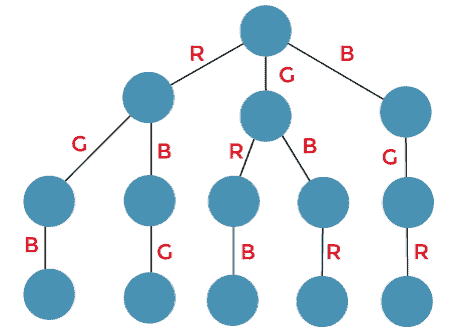

下一个方案是**蓝、红、绿。**因为我们不能探索红色物体，所以我们回溯并到达绿色物体。我们使用红色物体，然后使用绿色物体，而不是使用绿色物体。

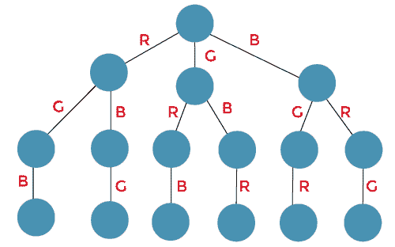

上面是状态空间树，显示了与问题相关的所有可能的解决方案。因此，我们可以说状态空间树可以用来表示回溯中的所有解。使用回溯，我们可以解决有一些约束的问题，我们可以找到基于这些约束的解决方案。假设在上例中；约束是蓝色的对象不能在中间(边界函数)。

第一种方案是**红、绿、蓝。**由于蓝色物体不在中间，所以我们确实需要进行任何修改。

第二种方案是**红、蓝、绿。**因为蓝色在中间，所以我们将删除绿色，如下所示:

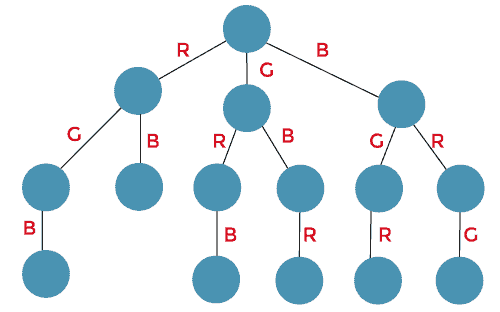

下一个解决方案是**绿色、红色和蓝色。**由于蓝色物体不在中间，所以我们确实需要进行任何修改。

下一个解决方案是**绿色、蓝色和红色。**因为蓝色在中间，所以我们将删除红色，如下所示:

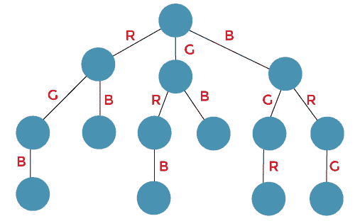

上面是解决方案中间没有蓝色对象的状态空间树。

**分支和绑定**

这类似于回溯。概念分支、定界和回溯遵循蛮力方法，生成状态空间树。但是他们都遵循不同的方法。生成树的方式不同。

回溯遵循 DFS，而分支 n 界限遵循 BFS 生成树。现在我们将通过一个例子来理解分支 n 的界限。因为它遵循 BFS，所以首先添加相同级别的所有节点，然后我们进入下一个级别。

**考虑我们在回溯中讨论的同一个例子。**

首先，我们取根节点。

现在我们有三种选择红色、绿色或蓝色物体的可能性，如下所示。在这种情况下，我们已经完成了第一级。

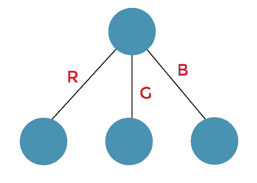

现在我们进入下一个阶段。

在红色物体的情况下，我们有两种选择绿色或蓝色物体的可能性，如下所示:

在绿色物体的情况下，我们有两种选择红色或蓝色物体的可能性，如下所示:

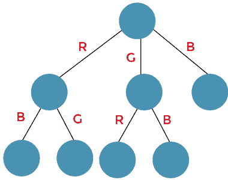

在蓝色物体的情况下，我们有两种选择红色或绿色物体的可能性，如下所示:

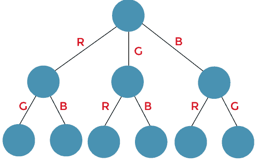

我们进入第三层。

在绿色对象的情况下，只能添加一个对象，即蓝色。

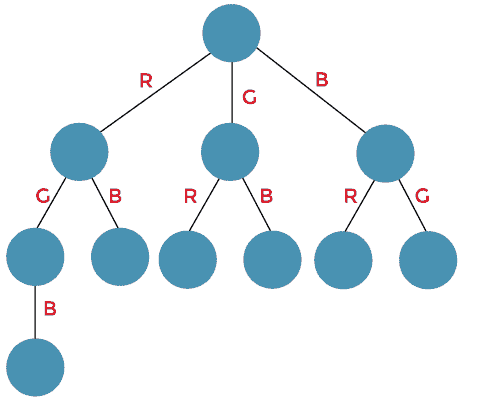

在蓝色对象的情况下，只能添加一个对象，即绿色。

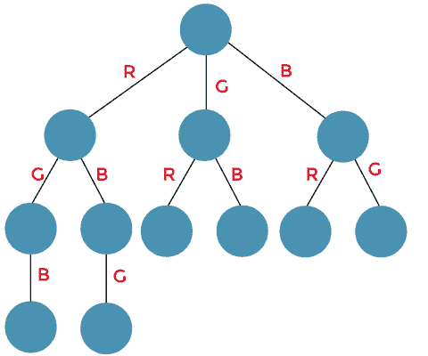

在红色对象的情况下，只能添加一个对象，即蓝色。

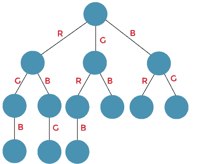

在蓝色对象的情况下，只能添加一个对象，即红色。

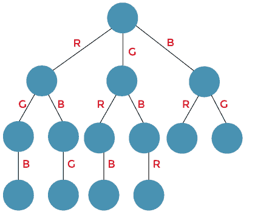

在绿色对象的情况下，只能添加一个对象，即红色。

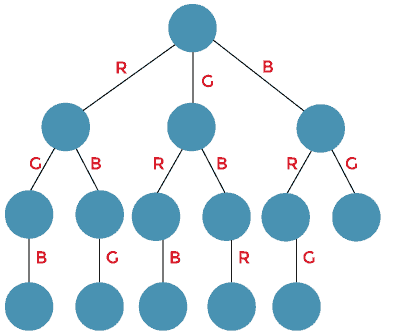

在红色对象的情况下，只能添加一个对象，即绿色。

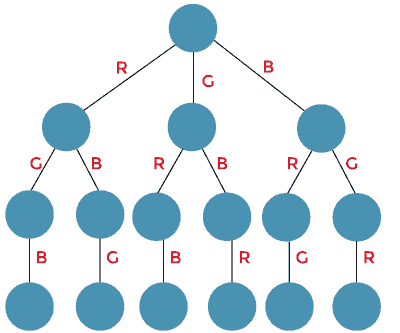

**示例:**

使用回溯可以解决的问题有:

*   8 皇后问题
*   回溯背包问题

使用分支定界可以解决的问题是:

*   旅行推销员问题

### 分支 n 定界和回溯的区别

| 追踪 | 分支和绑定 |
| 回溯是一种解决问题的技术，因此它解决了决策问题。 | 分支 n 界是一种解决问题的技术，因此它解决了优化问题。 |
| 当我们使用回溯法找到解决方案时，可能会做出一些错误的选择。 | 当我们找到使用分支 n 界限的解决方案时，它会提供更好的解决方案，因此不会有做出错误选择的机会。 |
| 回溯使用深度优先搜索。 | 分支 n 界不必使用深度优先搜索。它甚至可以使用广度优先搜索和最佳优先搜索。 |
| 搜索状态空间树，直到获得问题的解。 | 需要完全搜索状态空间树，因为最优解可以出现在状态空间树的任何地方。 |
| 在回溯中，尝试了所有可能的解决方案。如果解不满足约束，那么我们回溯并寻找另一个解。 | 在分支和绑定中，基于搜索；计算边界值。根据边界值，我们要么停止，要么扩展。 |
| 回溯的应用是 n 皇后问题，子集和。 | 分枝定界的应用有背包问题、旅行商问题等。 |
| 回溯比分支定界更有效。 | 分支 n 界限效率较低。 |
| 它包含可行性功能。 | 它包含边界函数。 |
| 回溯通过首先找到子问题的解，然后基于第一个子问题的解递归地解决其他问题来解决给定的问题。 | 分支定界通过将问题分成至少两个子问题来解决给定的问题。 |

* * *