# 分支和绑定

> 原文：<https://www.javatpoint.com/branch-and-bound>

**什么是分支定界？**

分支定界是用于解决问题的技术之一。它类似于回溯，因为它也使用状态空间树。它用于解决最优化问题和最小化问题。如果我们已经给出了一个最大化问题，那么我们可以通过简单地将这个问题转换成一个最大化问题，使用分支定界技术来转换它。

**我们通过一个例子来了解一下。**

Jobs = {j1，j2，j3，j4}

P = {10，5，8，3}

d = {1，2，1，2}

以上是给出的工作、问题和难题。我们可以用下面给出的两种方法编写解决方案:

假设我们要执行作业 j1 和 j2，那么解决方案可以用两种方式表示:

表示解决方案的第一种方式是作业子集。

S1 = {j1，j4}

表示解决方案的第二种方式是，第一个作业完成，第二个和第三个作业没有完成，第四个作业完成。

S2 = {1，0，0，1}

解决方案 s1 是可变尺寸解决方案，而解决方案 s2 是固定尺寸解决方案。

**首先，我们将看到子集方法，在这里我们将看到变量大小。**

**第一种方法:**

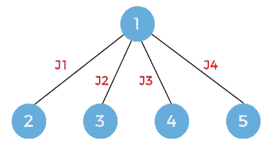

在这种情况下，我们首先考虑第一份工作，然后第二份工作，然后第三份工作，最后我们考虑最后一份工作。

从上图中我们可以看到，执行的是广度优先搜索，而不是深度优先搜索。在这里，我们从广度上探索解决方案。在回溯中，我们走深度方向，而在分支和绑定中，我们走广度方向。

现在完成了一个级别。一旦我接受了第一份工作，那么我们可以考虑 j2、j3 或 j4。如果我们按照路线走，那么它会说我们在做作业 j1 和 j4，所以我们不会考虑作业 j2 和 j3。

现在我们将考虑节点 3。在这种情况下，我们正在执行任务 j2，因此我们可以考虑任务 j3 或 j4。这里，我们已经丢弃了作业 j1。

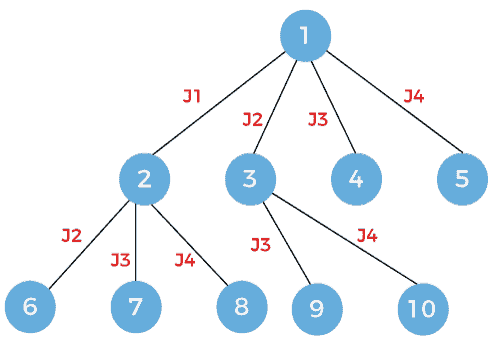

现在我们将展开节点 4。因为这里我们做的是工作 j3，所以我们只考虑工作 j4。

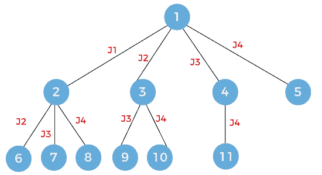

现在我们将展开节点 6，这里我们将考虑作业 j3 和 j4。

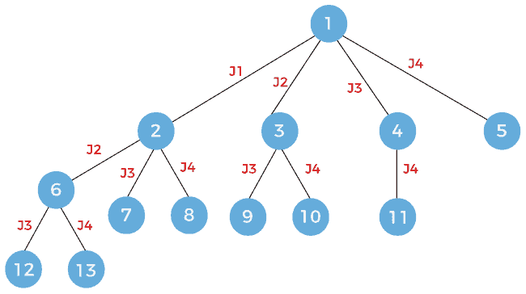

现在我们将展开节点 7，这里我们将考虑作业 j4。

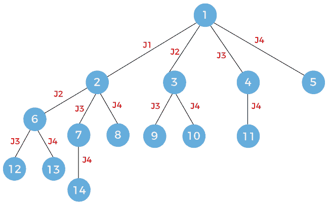

现在我们将展开节点 9，这里我们将考虑作业 j4。

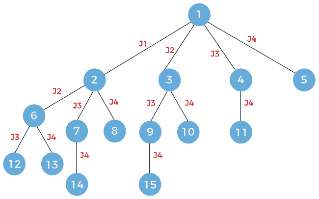

最后一个节点，即节点 12，将被展开。这里，我们考虑工作 j4。

以上是解决方案 s1 = {j1，j4}的状态空间树

**第二种方法:**

我们将看到另一种解决问题的方法来实现解决方案 s1。

首先，我们考虑如下所示的节点 1:

现在，我们将展开节点 1。扩展后，状态空间树将显示为:

每次扩展时，节点将被推入堆栈，如下所示:

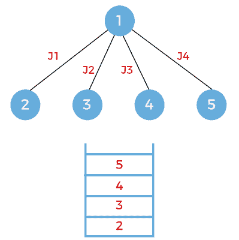

现在，扩展将基于出现在堆栈顶部的节点。由于节点 5 出现在堆栈的顶部，因此我们将展开节点 5。我们将从堆栈中弹出节点 5。由于节点 5 在最后一个作业中，即 j4，因此没有进一步扩展的范围。

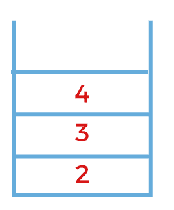

出现在堆栈顶部的下一个节点是节点 4。弹出节点 4 并展开。在扩展时，将考虑作业 j4，并将节点 6 添加到堆栈中，如下所示:

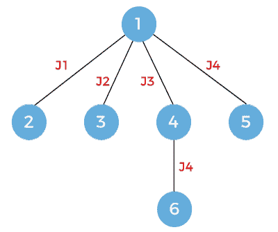

下一个节点是要扩展的 6。弹出节点 6 并展开。由于节点 6 在最后一个作业中，即 j4，因此没有进一步扩展的范围。

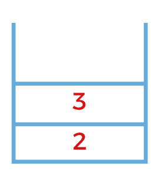

下一个要扩展的节点是节点 3。由于节点 3 在作业 j2 上工作，因此节点 3 将扩展到两个节点，即分别在作业 3 和 4 上工作的 7 和 8。节点 7 和 8 将被推入堆栈，如下所示:

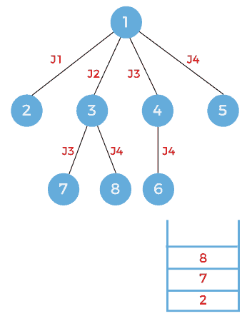

出现在堆栈顶部的下一个节点是节点 8。弹出节点 8 并展开。由于节点 8 在作业 j4 上工作，因此没有进一步扩展的余地。

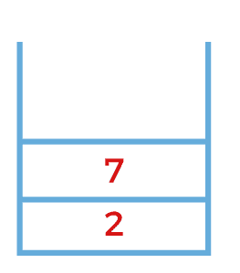

出现在堆栈顶部的下一个节点是节点 7。弹出节点 7 并展开。由于节点 7 在作业 j3 上工作，因此节点 7 将进一步扩展到在作业 j4 上工作的节点 9，如下所示，并且节点 9 将被推入堆栈。

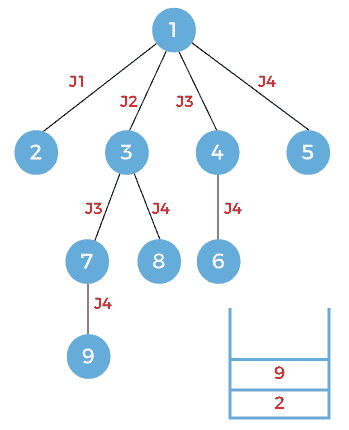

出现在堆栈顶部的下一个节点是节点 9。由于节点 9 在作业 4 上工作，因此没有进一步扩展的余地。

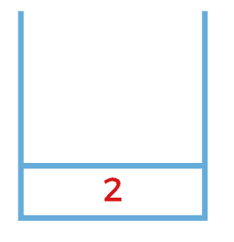

出现在堆栈顶部的下一个节点是节点 2。由于节点 2 在作业 j1 上工作，因此这意味着节点 2 可以进一步扩展。它可以扩展到三个节点，分别命名为 10、11、12，分别处理作业 j2、j3 和 j4。这些新节点将被推入堆栈，如下所示:

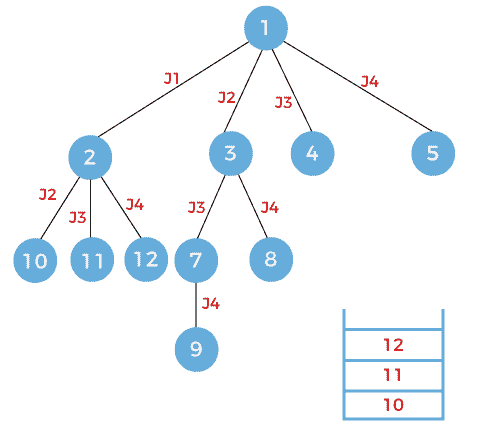

在上面的方法中，我们使用遵循后进先出原则的堆栈探索了所有节点。

**第三种方法**

还有一种方法可以用来寻找解决方案，那就是最小成本分支定界法。在这种技术中，根据节点的成本来探索节点。节点的成本可以用问题来定义，在给定问题的帮助下，我们可以定义成本函数。一旦定义了成本函数，我们就可以定义节点的成本。

**让我们首先考虑成本无穷大的节点 1，如下所示:**

现在我们将展开节点 1。节点 1 将扩展为四个节点，命名为 2、3、4 和 5，如下所示:

**我们假设节点 2、3、4 和 5 的成本分别为 25、12、19 和 30。**

因为它是成本最小的分支 n 界，所以我们将探索成本最小的节点。在上图中，我们可以观察到开销最小的节点是节点 3。因此，我们将探讨成本为 12 的节点 3。

由于节点 3 在作业 j2 上工作，因此它将被扩展为两个名为 6 和 7 的节点，如下所示:

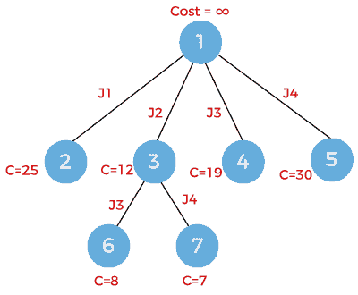

节点 6 处理作业 j3，而节点 7 处理作业 j4。节点 6 的成本是 8，节点 7 的成本是 7。现在我们必须选择成本最低的节点。节点 7 的成本最低，因此我们将探索节点 7。由于节点 7 已经在作业 j4 上工作，因此没有进一步扩展的余地。

* * *