# 最长重复后续

> 原文：<https://www.javatpoint.com/longest-repeated-subsequence>

给定字符串中重复时间最长的子序列；最长重复子序列的长度应该使得两个子序列不应该具有相同位置的字符，即给定的两个子序列中的第<sup>个</sup>字符不应该在原始字符串中具有相同的索引。子序列意味着当我们从给定的字符串中移除一个或多个元素并创建一个新的字符串时。

**目的:**用于寻找最长重复子序列。它找到了 LRS 长度和 LRS 弦。

**约束:**两个子序列的第 i <sup>个</sup>字符在字符串 s 中不应该有相同的索引

**例 1:**

**输入字符串:AAB**

**子序列 s1: A**

**子序列 s2: A**

以上是长度为 1 的两个子序列。在上述两个子序列中不能考虑“B”字符，因为它在原始字符串的同一索引处。

**例 2:**

**输入字符串:AABB**

**子序列 s1: AB**

**子序列 s2: AB**

以上是长度为 2 的两个子序列。在两个子序列中，“A”在原始串中具有不同的索引，即分别为第一和第二索引，“B”在原始串中具有不同的索引，即分别为第三和第四索引。

**例 3:**

**输入字符串:aabecdd**

**子序列 s1: ABD**

**子序列 s2: ABD**

以上是长度为 3 的两个子序列。在这两个子序列中，“A”在原始串中具有不同的索引，即分别为 1 <sup>st</sup> 和 2 <sup>nd</sup> 索引，“B”在原始串中具有不同的索引，即分别为 3 <sup>rd</sup> 和 5 <sup>th</sup> 索引，“D”在原始串中具有不同的索引，即分别为 7 <sup>th</sup> 和 8 <sup>th</sup> 索引。

**例 4:**

**输入字符串为:AABEBECDD**

最长的重复子序列是“ABED”

最长重复子序列的长度是 4。

**例 5:**

**输入字符串为:“ABCD”**

因为不存在出现不止一次的字符，所以在上面给定的字符串中不会存在重复的子序列。

**例 6:**

**输入字符串为:“BBC”**

最长的重复子序列是“b ”,因为“b”重复了两次，我们不能考虑“c”字符，因为它在两个子序列中的索引相同。

**例 7:**

**输入字符串为“a b x a y b c d c”**

最长的重复子序列是“abc”，因为在两个子序列中；字符“a”、“b”和“c”出现在两个子序列的不同索引处。

最长重复子序列的长度是 3。

**重要示例**

**输入字符串:A X X X**

**0 1 2 3**

学生:一个 X 一个 X

后续 s1: x x

1 2

后续 s2: x x

2 3

正如我们在上面两个子序列中观察到的，对应的字符在原始字符串中具有不同的索引。因此，它们是有效的。

**与 LCS 相似**

考虑下面给出的字符串:

S: AABBX(消歧义)

字符串中每个字符的索引如下所示:

0 1 2 3 4

学生:A A B B X

给定字符串的 LCS 将是:

S: AABBX(消歧义)

给定字符串的 LRS 将是:

S1: AB

S2: AB

以上是长度为 2 的两个子序列。在这两个子序列中，“A”在原始字符串中具有不同的索引，即 S1 的“A”索引为 0，S2 的“A”索引为 1。两个子序列中字符“B”的指数也不同，即 S1 的“B”指数为 2，s 2 的“B”指数为 3。

LRS = LCS(不包括同一索引中的字符)

#### 注意:必须有多个字符实例可以贡献给 LRS。

**在同一索引找到排除字符的 LCS？**

**0 1 2**

S1: X X X

S2: X X X

以上两个子序列相同，即 XXX。如果我们考虑 S1 指数 0 的 X 和 S2 指数 1 的 X，考虑 S1 指数 1 的 X 和 S2 指数 2 的 X。所以，XX 是最长的公共子序列，它的长度最大，这也是最长的重复子序列。LCS 和 LRS 的长度是 2。

**算法**

```

for i=0 to N
for j=0 to N
  if(i==0 || j==0)
  lcs[i][j] = 0;
elseif(S1[i] == S2[j] && (i!=j))
  lcs[i][j] = 1+ lcs[i-1][j-1];
else
  lcs[i][j] = max(lcs[i-1][j], lcs[i][j-1]);

```

**让我们在同一个索引处试运行寻找 LCS 排除字符。**

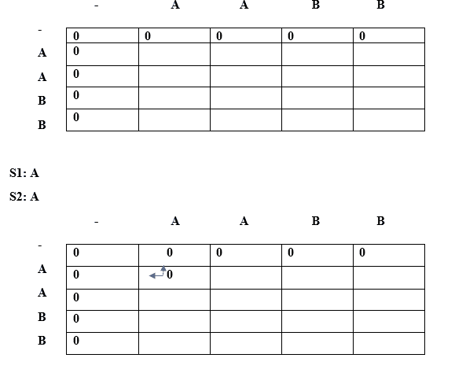
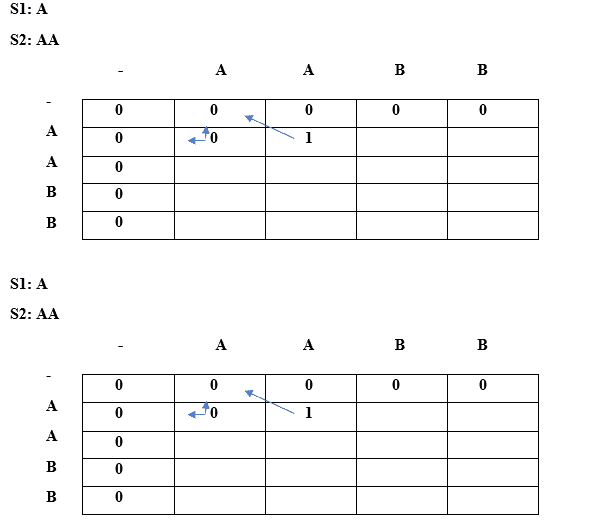
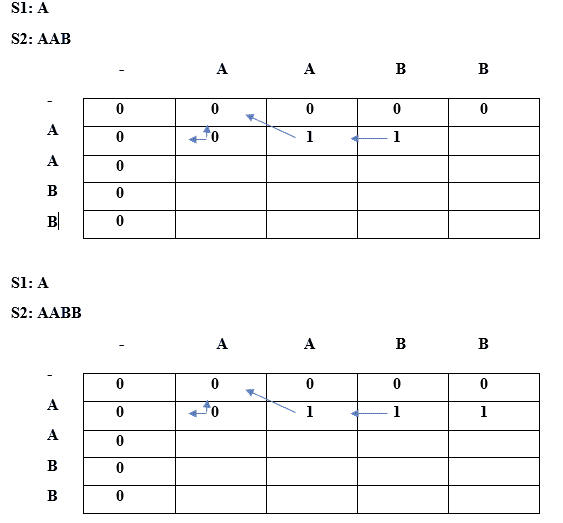

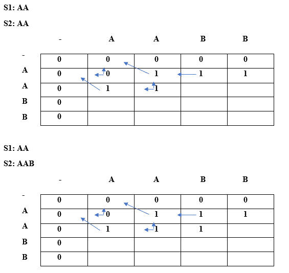
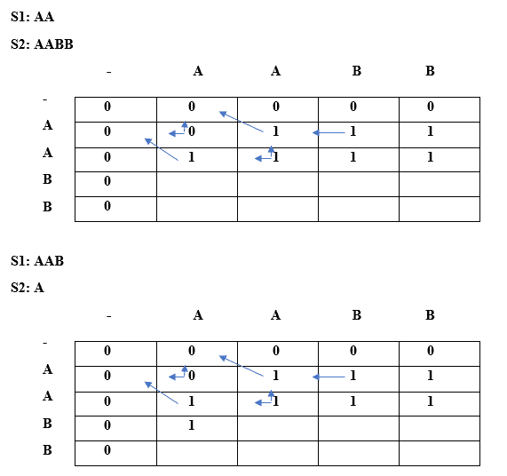
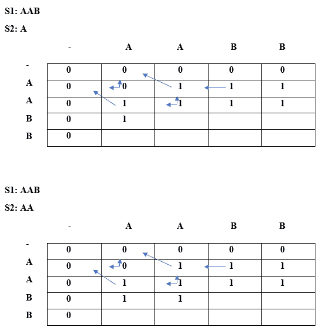
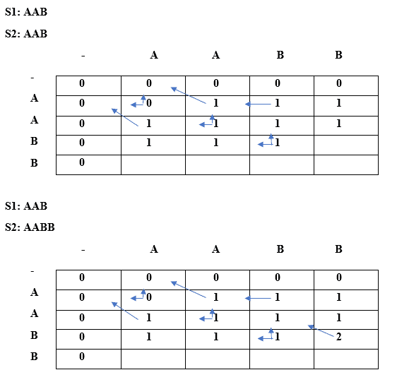
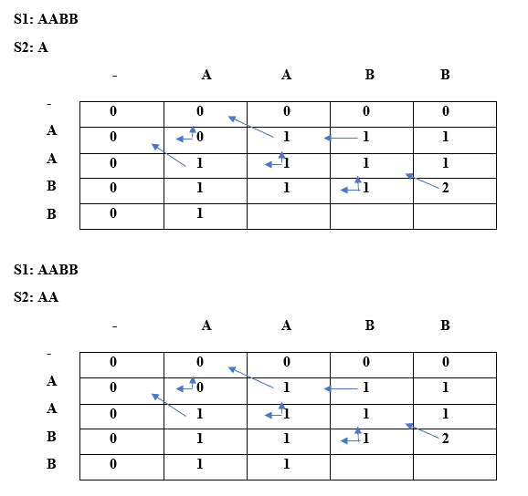
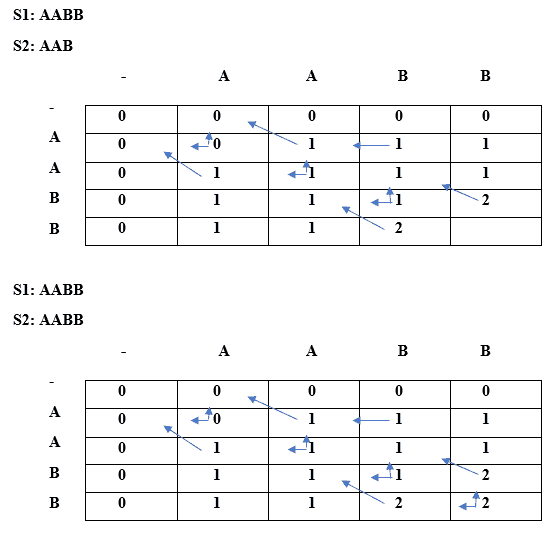

在上表中我们可以观察到，最长的重复子序列的长度是 2。

现在我们将找出 LRS 弦。这里也将使用相同的算法。我们将采用字符串类型的 LCS 数组，而不是整数类型的 LCS 数组。

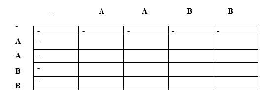

首先，我们将在上表所示的空字符串下放置“-”。

当 i =0 时，j=0

由于 lcs[i] = lcs[j]，即‘A’，而 i==j，所以根据算法满足情况 3 的条件。因此，'-'将出现在 lcs[0][0]上，如下表所示:

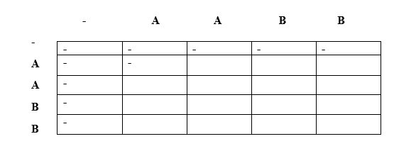

**当 i=0 时，j=1**

因为 lcs[i]=lcs[j]但是我！=j 所以情况 2 条件成立。这里，lcs[0][1] = A + " " = A

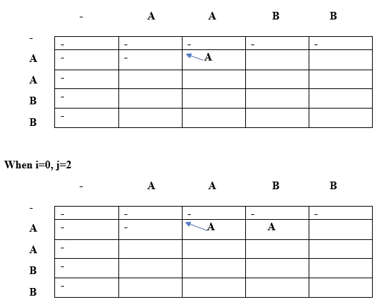

因为 lcs[0]！= lcs[2]所以我们将取顶部和左侧的最大值。

Lcs[0][2] =最大值(lcs[i-1][j]，lcs[i][j-1])

Max("，' A') //最大值为' A '，因此 lcs[0][2]等于' A '。

**当 i=0 时，j=3**

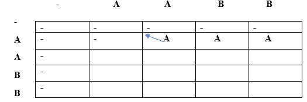

因为 lcs[0]！= lcs[3]所以我们将取顶部和左侧的最大值。

Lcs[0][2] =最大值(lcs[i-1][j]，lcs[i][j-1])

Max("，' A') //最大值为' A '，因此 lcs[0][3]等于' A '。

**当 i=1 时，j=0**

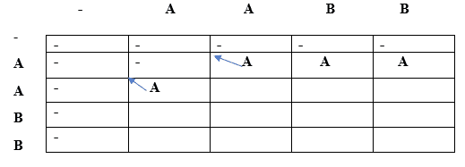

既然 lcs[i]等于 lcs[j]，即‘A’但是我！=j 所以 lcs[1][0]等于(对角线元素+当前元素)。因此，lcs[1][0]等于(“+‘A’)=‘A’。

**当 i=1 时，j=1**

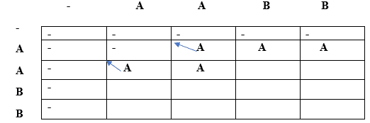

由于 lcs[i] = lcs[j]，即 A 和 i==j，因此根据算法满足条件 3。lcs[1][1]将是顶部和左侧的最大值。顶部和左侧都相同，即 A，因此 lcs[1][1]将等于“A”。

**当 i=1 时，j=2**

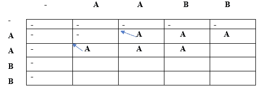

由于 lcs[i]不等于 lcs[j]，I 不等于 j，因此 lcs[i][j]将是顶部和左侧的最大值。顶部和左侧都相同，即 A，因此 lcs[1][2]将等于“A”。

**当 i=1，j=3 时**


由于 lcs[i]不等于 lcs[j]，I 不等于 j，因此 lcs[i][j]将是顶部和左侧的最大值。顶部和左侧都相同，即 A，因此 lcs[1][2]将等于“A”。

**当 i=2 时，j=0**

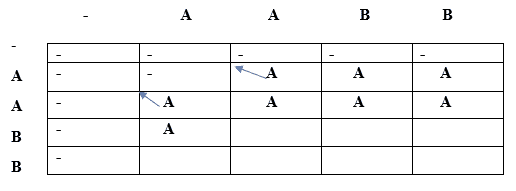

由于 lcs[i]不等于 lcs[j]，I 不等于 j，因此 lcs[i][j]将是顶部和左侧的最大值。顶部和左侧都相同，即 A，因此 lcs[2][0]将等于“A”。

**当 i=2 时，j=1**

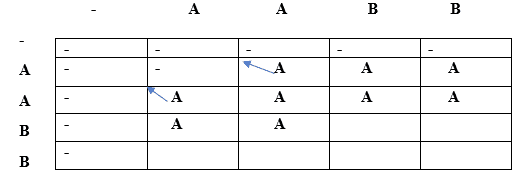

由于 lcs[i]不等于 lcs[j],并且它们的指数也不同，因此满足条件 3。因此，lcs[2][1]将是顶部和左侧的最大值。顶部和左侧都是相同的，即 A，因此 lcs[2][1]将等于“A”。

**当 i=2 时，j=2**

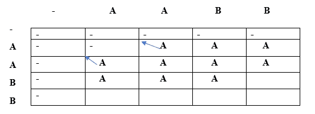

由于 lcs[i]等于 LCS[j],“I”也等于“j ”,因此满足条件 3。因此，lcs[i][j]将是顶部和左侧的最大值。顶部和左侧都是相同的，即 A，因此 lcs[2][2]将等于“A”。

**当 i=2，j=3 时**

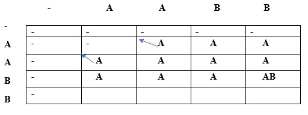

由于 lcs[i]等于 LCS[j],“I”不等于“j ”,因此条件 2 得到满足。因此，lcs[2][3]将等于(对角线元素+当前元素)= A + B = AB。

同样，我们将填充最后一行并获得下表:

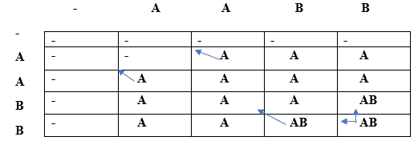

从上表中我们可以观察到 AB 是最长的重复子序列。我们基本上通过使用(i==j)和 s[i] == s[j]的约束找到了 LCS，那么它将不会对重复子序列有贡献，否则它会有贡献。

* * *