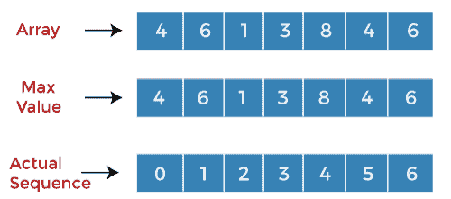
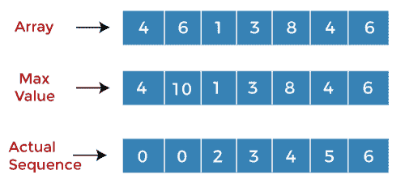
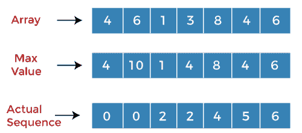
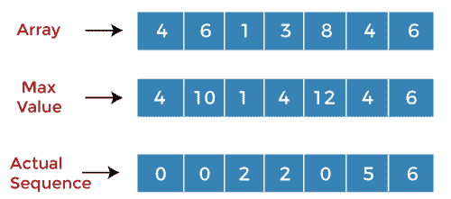
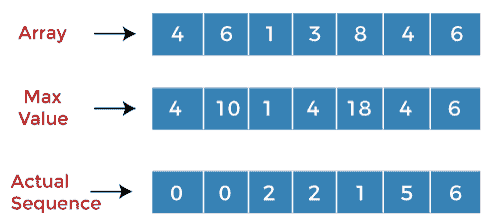
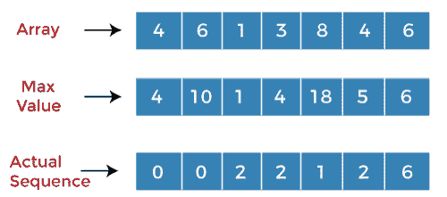
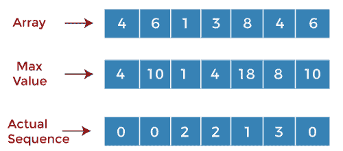
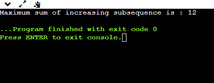

# 最大和随后增加

> 原文：<https://www.javatpoint.com/maximum-sum-increasing-subsequence>

最大和递增子序列是整数列表的子序列，其中和是最大的，并且在子序列中，所有元素按递增顺序排序。

```

For example:
Consider the array of a given integers:
A[] = {3, 2, 6, 4, 5, 1}

```

**输出**

```
Maximum sum increasing subsequence is {3, 4, 5}   

```

**我们再考虑一个例子，看清楚。**

**考虑下面给出的数组:**

**数组:4，6，1，3，8，4，6**

这里，我们考虑三个数组；第一个数组存储数组值，第二个数组存储最大值，第三个数组存储实际序列。



最初，第二个数组存储问题中给出的数组的值，第三个数组存储对应于每个值的索引，如下所示:

假设有两个变量，I 和 j。对于每一个“I”，“j”会一直跑到“i-1”。将“I”处的值与“j”处的值进行比较。

**当 i=0 时，j=0**

**A[i]=4**

**A[j] = 4**

由于“I”和“j”处的值相同，我们将增加“I”的值，并且“I”的值变为 1。

**当 i=1 时，j =0**

**A[i] = 6**

**A[j] = 4**

既然 A[i] > A[j]，那么我们将把‘I’和‘j’处的值相加，即(6+4)等于 10。我们将在第二个数组中的 i=1 处用 10 替换值 6。在第三个数组中，索引 i=1 处的值 1 被 0 替换，并且“I”的值递增，如下所示:



**当 i=2 时，j=0**

A[i] = 1

A[j] = 4

既然 A[i]

**当 i=2 时，j=1**

**A[i] = 1**

**A[j] = 6**

因为 A[j] > A[i]，所以不会有加法，“I”的值会递增。“I”的值变为 3，“j”的值设置为 0。

**当 i=3 时，j=0**

A[3] = 3

A[0] = 4

因为 A[j] > A[i]，所以没有加法，j 的值递增。“j”的值变为 1。

**当 i=3 时，j=1**

A[3] = 3

A[1] = 6

既然 A[i]

**当 i=3 时，j=2**

A[3] = 3

A[2] = 1

既然 A[i] > A[j]，那么我们将把‘I’和‘j’处的值相加，即(3+1)等于 4。我们将在第二个数组中的 i=3 处用 4 替换值 3。在第三个数组中，索引 i=3 处的值 3 被 2 替换，并且“I”的值增加，如下所示:



**当 i=4 时，j=0**

A[4] = 8

A[j] = 4

既然 A[i] > A[j]，那么我们就把‘I’和‘j’处的值相加，即(8+4)等于 12。我们将在第二个数组中 i=4 时用 12 替换值 8。在第三个数组中，索引 i=4 处的值 4 被替换为 0，并且“j”的值如下所示递增:



**当 i=4 时，j=1**

**A[4] = 8**

**A[1] = 6**

既然 A[i] > A[j]，那么我们就把‘I’和‘j’处的值相加。第二个数组中对应于 j 的值是 10，所以我们将加上(8+10)等于 18。由于 18>12，因此第二个数组中的 12 将被 18 替换。值 0 在第三个数组的索引 4 处被 1 替换，如下所示:



**当 i=4 时，j=2**

**A[4] = 8**

**A[2] = 1**

既然 A[i]>A[j]，那么我们就把‘I’和‘j’处的值相加。第二个数组中对应‘j’的值是 1，所以我们将(8+1)加等于 9。值 9 小于值 18，因此不会有替换。

**当 i=4 时，j=3**

A[4] = 8

A[3] = 3

既然 A[i]>A[j]，那么我们就把‘I’和‘j’的值相加。第二个数组中对应于“j”的值是 4，所以我们将加上(8+4)等于 12。值 12 小于值 18，因此不会有替换。“I”的值会递增。

**当 i=5 时，j=0**

A[5] = 4

A[0] = 4

由于“j”处的值不小于“I”处的值，因此我们将增加“j”的值。

**当 i=5 时，j=1**

A[5] = 4

A[1] = 6

由于 A[i]小于 A[j]，因此“j”的值将递增。

**当 i=5 时，j=2**

A[5] = 4

A[2] = 1

既然 A[i]>A[j]，那么我们就把‘I’和‘j’的值相加。第二个数组中对应‘j’的值是 1，所以我们将(1+4)加等于 5。值 5 大于值 4，因此第二个数组中索引 5 处的 4 将被 5 替换。在第三个数组中，索引 5 处的值 5 被 2 替换，如下所示:



**当 i=5，j=3 时**

A[5] = 4

A[3] = 3

既然 A[i] >A[j]，那么我们就把‘I’和‘j’处的值相加。第二个数组中对应‘j’的值是 4，所以我们将(4+4)加等于 8。值 8 大于值 5，因此第二个数组中索引 5 处的 5 将被 8 替换。在第三个数组中，索引 5 处的值 2 被 3 替换。

**当 i=5，j=4 时**

A[5] = 4

A[4] = 8

因为 A[j] > A[i]，所以“I”的值递增。“I”的值变为 6，“j”设置为 0。

**当 i=6 时，j=0**

A[6] = 6

A[0] = 4

既然 A[i] >A[j]，那么我们就把‘I’和‘j’的值相加。第二个数组中对应于‘j’的值是 4，所以我们将加上(4+6)等于 10。值 10 大于值 6，因此第二个数组中索引 6 处的 6 将被 10 替换。在第三个数组的索引 6 处，值 6 被 0 替换。



**当 i=6 时，j=1**

A[6] = 6

A[1] = 6

因为 A[6] == A[1]，所以“j”的值递增。“j”的值等于 2。

**当 i=6 时，j=2**

**A[6] = 6**

**A[2] = 1**

既然 A[i] >A[j]，那么我们就把‘I’和‘j’处的值相加。第二个数组中对应于‘j’的值是 1，所以我们将加上(1+6)等于 7。值 7 小于值 10，因此不会有替换。

**当 i=6 时，j=3**

A[6] = 6

A[3] = 3

既然 A[i] >A[j]，那么我们就把值加在‘I’和‘j’上。第二个数组中对应于‘j’的值是 4，所以我们将加上(4+6)等于 10。计算值与第二个数组中索引 6 处的值相同。

**当 i=6 时，j=4**

A[6] = 6

A[4] = 8

既然 A[j] > A[i]所以不会有替代者。“j”的值递增，变成 5。

**当 i=6 时，j=5**

A[6] = 6

A[5] = 4

既然 A[i] >A[j]，那么我们就把‘I’和‘j’处的值相加。第二个数组中对应于‘j’的值是 8，所以我们将加上(8+6)等于 14。值 14 大于值 10，因此第二个数组中索引 6 处的 10 将被 14 替换。在第三个数组中，索引 6 处的值 0 被 5 替换，如下所示:


正如我们在最大值数组中观察到的，18 是递增子序列的最大和。现在我们将在子序列中找到构成 18 的元素。

18 对应的元素是 8；因此，子序列中的第一个元素是 8。

**子序列:8**

实际序列数组中对应于 18 的值是 1。索引 1 处的值是 6。因此，子序列中的第二个元素是 6。

**子序列:6，8**

移动到实际序列数组中的索引 1。索引 1 处的值为 0。数组中索引 0 处的值是 4。所以，子序列中的第三个元素是 4。

**子序列:4，6，8**

**在 C** 中实现

```

// Program to calculate the maximum sum increasing subsequence 
#include <stdio.h>
// maximum_sum returns the maximum sum of increasing subsequence
int maximum_sum(int a[], int n)
{
    int i, j;
    int maximum_sum[n];
    int max=0;
    // Initializing the maximum_sum[] values for all the indexes 
    for (int i=0; i<n ; i++)
    {
        maximum_sum[i] = a[i];
    }    
    // Computing the values for all the indexes of maximum_sum[]
    for(int i=0; i<n; i++)
    {
        for(int j=0; j<i; j++)
        {
            if((a[i]>a[j]) && (maximum_sum[i]< (maximum_sum[j]+a[i]) ))
            {
                maximum_sum[i] = maximum_sum[j] + a[i];
            }
        }
    }
 // Calculating the maximum element from the maximum_sum[] array
    for(int i = 0; i<n; i++)
    {        
        //printf("%d,", maximum_sum[i]);
        if(max < maximum_sum[i])
        {
            max = maximum_sum[i];
        }
    }
 return max;
}
// main() method
int main()
{
  int arr[5] = {1, 5, 6, 4, 3}; // array initialization
  int size = sizeof(arr)/sizeof(arr[0]);

  printf("Maximum sum of increasing subsequence is : %d", maximum_sum(arr, size));
  return 0;
}

```

**输出**



* * *