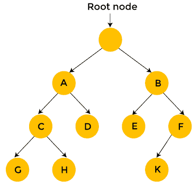

# 暴力方法

> 原文：<https://www.javatpoint.com/brute-force-approach>

蛮力方法是一种找到所有可能的解决方案来找到给定问题的满意解决方案的方法。蛮力算法尝试了所有的可能性，直到没有找到满意的解决方案。

**这样的算法可以有两种类型:**

*   **优化:**在这种情况下，找到了最优解。为了找到最佳解决方案，它可能会找到所有可能的解决方案来找到最佳解决方案，或者如果知道最佳解决方案的价值，它会在找到最佳解决方案时停止寻找。例如:寻找旅行推销员问题的最佳路径。这里的最佳路径意味着旅行所有的城市和旅行成本应该是最低的。
*   **满意:**一找到满意的解就停止寻找解。或者举个例子，找到 10%以内的旅行推销员路径。
*   暴力算法通常需要指数时间。可以使用各种试探法和优化:
*   **启发式:**一个帮助你决定我们应该先看哪些可能性的经验法则。
*   **优化:**某一种可能性被淘汰了，没有探索全部。

**我们通过一个例子来了解一下蛮力搜索。**

**假设我们已经将问题转换为如下所示的树的形式:**

蛮力搜索考虑树的每一个状态，状态以节点的形式表示。就首发位置而言，我们有两种选择，即 A 状态和 B 状态。我们可以生成状态 A，也可以生成状态 B，在状态 B 的情况下，我们有两个状态，即状态 E 和状态 f。

在暴力搜索的情况下，每个状态都被逐一考虑。正如我们在上面的树中可以观察到的，强力搜索需要 12 个步骤来找到解决方案。

另一方面，使用深度优先搜索的回溯仅在状态提供可行解决方案时才考虑下面的状态。考虑上面的树，从根节点开始，然后移动到节点 A，再移动到节点 C，如果节点 C 没有提供可行解，那么考虑状态 G 和 h 就没有意义了，我们从节点 C 回溯到节点 A，然后从节点 A 移动到节点 D，由于节点 D 没有提供可行解，我们丢弃这个状态，从节点 D 回溯到节点 A。

我们移动到节点 B，然后我们从节点 B 移动到节点 E。我们从节点 E 移动到节点 K；因为 k 是一个解，所以需要 10 步才能找到解。这样，我们可以在一次迭代中消除更多的状态。因此，我们可以说回溯比蛮力方法更快、更有效。

### 强力算法的优点

**以下是蛮力算法的优点:**

*   这个算法找到了所有可能的解，也保证了它找到了问题的正确解。
*   这种类型的算法适用于广泛的领域。
*   主要用于解决比较简单的小问题。
*   它可以被认为是解决简单问题的比较基准，不需要任何特定的领域知识。

### 强力算法的缺点

以下是强力算法的缺点:

*   这是一个低效的算法，因为它需要求解每个状态。
*   寻找正确的解决方案是一个非常缓慢的算法，因为它解决了每个状态，而不考虑解决方案是否可行。
*   与其他算法相比，蛮力算法既没有建设性，也没有创造性。

* * *