# 使用分支和绑定的旅行销售员问题

> 原文：<https://www.javatpoint.com/traveling-salesperson-problem-using-branch-and-bound>

给定顶点，这里的问题是我们必须精确地遍历每个顶点一次，然后回到起点。考虑下图:

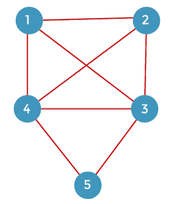

从上图中我们可以看到，图中给出了 5 个顶点。我们必须找到一次通过所有顶点并返回起始顶点的最短路径。我们主要将起始顶点视为 1，然后遍历顶点 2、3、4 和 5，最后返回顶点 1。

**问题的相邻矩阵如下:**

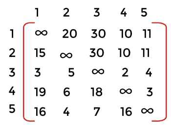

现在我们来看看如何使用分支 n 界限来解决这个问题。

**我们先了解一下方法，然后再解决上面的问题。**

下图给出了四个顶点:

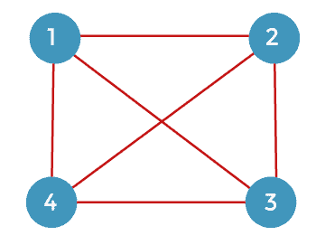

假设我们从顶点 1 开始旅行，然后回到顶点 1。有各种方法可以穿过所有顶点并返回顶点 1。我们需要一些可以用来最小化总成本的工具。为了解决这个问题，我们制作了一个状态空间树。从起始顶点 1 开始，我们可以转到顶点 2、3 或 4，如下图所示。

从顶点 2，我们可以到顶点 3 或 4。如果我们考虑顶点 3，我们移动到剩余的顶点，即 4。如果我们考虑下图所示的顶点 4:

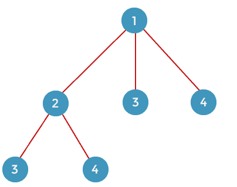

从顶点 3 开始，我们可以转到剩余的顶点，即 2 或 4。如果我们考虑顶点 2，那么我们移动到剩余的顶点 4，如果我们考虑顶点 4，那么我们移动到剩余的顶点，即下图所示的 3:

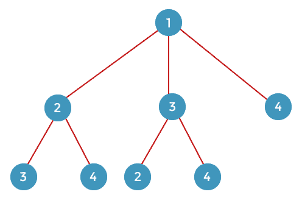

从顶点 4 开始，我们可以转到剩余的顶点，即 2 或 3。如果我们考虑顶点 2，那么我们移动到剩余的顶点，即 3，如果我们考虑顶点 3，那么我们移动到剩余的顶点，即下图所示的 2:

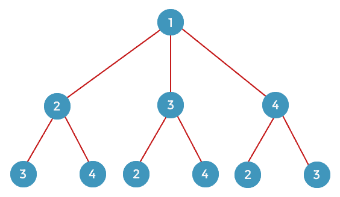

以上是完整的状态空间树。状态空间树显示了所有的可能性。回溯和分支 n 界都使用状态空间树，但它们解决问题的方法不同。分支 n 界限是比回溯更好的方法，因为它更有效。为了解决使用分支 n 界的问题，我们使用了水平顺序。首先，我们将观察节点的生成顺序。在创建节点时，我们将同时计算节点的成本。如果我们发现任何节点的成本大于上限，我们将移除该节点。因此，在这种情况下，我们将只生成有用的节点，而不是所有的节点。

**我们来考虑一下上面的问题。**

正如我们在上面的相邻矩阵中可以观察到的，10 是第一行的最小值，2 是第二行的最小值，2 是第三行的最小值，3 是第三行的最小值，3 是第四行的最小值，4 是第五行的最小值。

现在，我们将减少矩阵。我们将用一行的所有元素减去最小值。首先，我们评估第一行。让我们假设两个变量，即 I 和 j，其中“I”代表行，“j”代表列。

当 i = 0 时，j =0

M[0][0] = ∞-10= ∞

当 i = 0 时，j = 1

M[0][1] = 20 - 10 = 10

当 i = 0 时，j = 2

M[0][2] = 30 - 10 = 20

当 i = 0 时，j = 3

M[0][3] = 10 - 10 = 0

当 i = 0 时，j = 4

M[0][4] = 11 - 10 = 1

评估第一行后，矩阵如下所示:

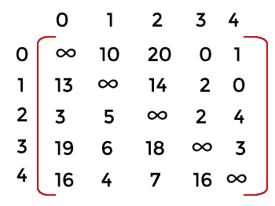

考虑第二行。

当 i = 1 时，j =0

M[1][0] = 15-2= 13

当 i = 1 时，j = 1

M[1][1] = ∞ - 2= ∞

当 i = 1，j = 2 时

M[1][2] = 16 - 2 = 14

当 i = 1，j = 3 时

M[1][3] = 4 - 2 = 2

当 i = 1，j = 4 时

M[1][4] = 2 - 2 = 0

评估第二行后，矩阵如下所示:

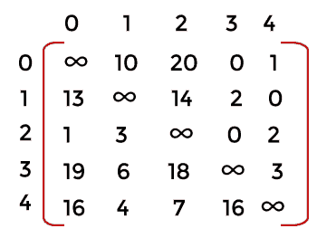

考虑第三行:

当 i = 2 时，j =0

M[2][0] = 3-2= 1

当 i = 2，j = 1 时

M[2][1] = 5 - 2= 3

当 i = 2 时，j = 2

M[2][2] = ∞ - 2 = ∞

当 i = 2，j = 3 时

M[2][3] = 2 - 2 = 0

当 i = 2，j = 4 时

M[2][4] = 4 - 2 = 2

评估第三行后，矩阵如下所示:

考虑第四行:

当 i = 3 时，j =0

M[3][0] = 19-3= 16

当 i = 3，j = 1 时

M[3][1] = 6 - 3= 3

当 i = 3，j = 2 时

M[3][2] = 18 - 3 = 15

当 i = 3 时，j = 3

M[3][3] = ∞ - 3 = ∞

当 i = 3，j = 4 时

M[3][4] = 3 - 3 = 0

评估第四行后，矩阵如下所示:

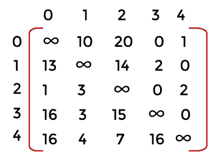

考虑第五行:

当 i = 4 时，j =0

M[4][0] = 16-4= 12

当 i = 4，j = 1 时

M[4][1] = 4 - 4= 0

当 i = 4，j = 2 时

M[4][2] = 7 - 4 = 3

当 i = 4，j = 3 时

M[4][3] = 16 - 4 = 12

当 i = 4 时，j = 4

M[4][4] = ∞ - 4 = ∞

评估第五行后，矩阵如下所示:

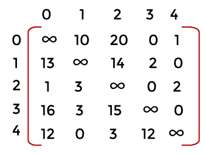

上面的矩阵是相对于行的简化矩阵。

现在我们相对于列来简化矩阵。在降矩阵之前，我们先求所有列的最小值。第一列最小值为 1，第二列最小值为 0，第三列最小值为 3，第四列最小值为 0，第五列最小值为 0，如下表所示:

**现在我们缩小矩阵。**

考虑第一列。

当 i = 0 时，j =0

M[0][0] = ∞-1= ∞

当 i = 1 时，j = 0

M[1][0] = 13 - 1= 12

当 i = 2 时，j = 0

M[2][0] = 1 - 1 = 0

当 i = 3 时，j = 0

M[3][0] = 16 - 1 = 15

当 i = 4 时，j = 0

M[4][0] = 12 - 1 = 11

评估第一列后，矩阵如下所示:

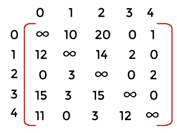

由于第一列和第三列的最小值是非零的，我们将只计算第一列和第三列。我们已经评估了第一列。现在我们将评估第三列。

考虑第三列。

当 i = 0 时，j =2

M[0][2] = 20-3= 17

当 i = 1，j = 2 时

M[1][2] = 13 - 1= 12

当 i = 2 时，j = 2

M[2][2] = 1 - 1 = 0

当 i = 3，j = 2 时

M[3][2] = 16 - 1 = 15

当 i = 4，j = 2 时

M[4][2] = 12 - 1 = 11

评估第三列后，矩阵如下所示:

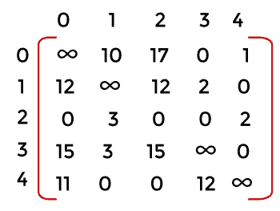

以上是简化矩阵。行的最小值是 21，列是 4。因此，总最小值是(21 + 4)等于 25。

**我们来了解一下，如何借助状态空间树，使用分支定界来解决这个问题。**

为了生成状态空间树，首先，我们考虑节点 1。从节点 1，我们可以转到节点 2、3、4 或 5，如下图所示。节点 1 的成本将是我们在上面简化的矩阵中实现的成本，即.., 25.在这里，我们也将保持上限。最初，上限可能是无穷大。

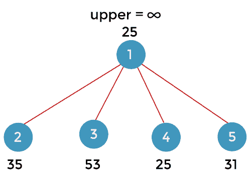

现在，考虑节点 2。这意味着我们正在从节点 1 移动到节点 2。如下表所示，将第一行和第二列设为无穷大:

一旦我们从节点 1 移动到节点 2，我们就不能再回到节点 1。因此，我们必须使 2 比 1 为无穷大，如下表所示:

因为每行和每列至少包含一个零值；因此，我们可以说上面的矩阵已经缩小了。节点 2 的约简成本为 c(1，2) + r + r` = 10 + 25 + 0 = 35。

现在我们将找到新的约简矩阵的每一列的最小值。第一列的最小值为 11，其他三列的最小值为 0。

现在，考虑节点 3。这意味着我们正在从节点 1 移动到节点 3。如下表所示，将第一行和第三列设为无穷大:

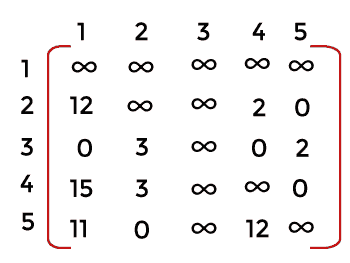

一旦我们从节点 1 移动到节点 3，我们就不能再回到节点 1。因此，我们必须使 3 比 1 为无穷大，如下表所示:

因为每行和每列至少包含一个零值；因此，我们可以说上面的矩阵已经缩小了。节点 3 的缩减成本为 c(1，3) + r + r` = 17 + 25 + 11= 53。

现在，考虑节点 4。这意味着我们正在从节点 1 移动到节点 4。如下表所示，将第一行和第四列设为无穷大:

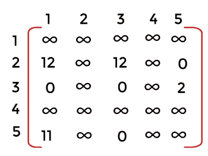

一旦我们从节点 1 移动到节点 4，我们就不能再回到节点 1。因此，我们必须使 4 比 1 为无穷大，如下表所示:

因为每行和每列至少包含一个零值；因此，我们可以说上面的矩阵已经缩小了。节点 4 的缩减成本为 c(1，4) + r + r` = 0 + 25 + 0 = 25。

现在，考虑节点 5。这意味着我们正在从节点 1 移动到节点 5。如下表所示，将第一行和第五列设为无穷大:

一旦我们从节点 1 移动到节点 5，我们就不能再回到节点 1。因此，我们必须使 5 比 1 为无穷大，如下表所示:

因为每行和每列至少包含一个零值；因此，我们可以说上面的矩阵已经缩小了。在这种情况下，第二行和第三行是非零的。因此，我们必须首先找到这两行的最小值。第二行的最小值为 2；因此，我们从第二行的所有元素中减去 2。第二行的元素是:

A[1][0] = 12-2 = 10

A[1][1] = ∞

A[1][2] = 11 - 2 = 9

A[1][3] = 2 - 2 = 0

A[1][4] = ∞ - 2 = ∞

正如我们现在可以观察到的，第二行包含一个零值。

减少节点 5 的成本是 c(1，5) + r + r` = 1 + 25 + 5 = 31

因为节点 4 具有最小成本，即 25。所以我们将首先探索节点 4。从顶点 4，我们可以转到顶点 2、3 或 5，如下图所示:

现在我们必须计算从顶点 4 到 2、顶点 4 到 3 以及顶点 4 到 5 的路径的成本。这里，我们将使用节点 4 的矩阵来找到所有节点的成本。

首先，我们考虑从顶点 4 到顶点 2 的路径。我们将第四行设为∞，第二列设为∞。因为我们不能从 2 回到 1，所以 1 到 2 也是无穷大，如下表所示:

因为所有的行和列都至少有一个零值。因此，我们可以说这个矩阵已经缩小了。所以，不会降低成本。节点 2 的缩减成本为 c(4，2) + r + r` = 3 + 25 + 0 = 28

现在我们必须计算从顶点 4 到顶点 3 的路径成本。我们将第四行和第三列设为无穷大，如下表所示。由于我们不能从顶点 3 移动到 1，因此我们将 3 到 1 设为无穷大，如下矩阵所示:

现在我们将检查每行和每列是否至少包含一个零值。首先，我们观察所有的行。由于第三行没有零值，所以我们先求第三行的最小值。第三行的最小值是 2，所以我们从第三行的所有元素中减去 2。第三行的元素是:

A[2][0] = ∞ - 2 = ∞

A[2][1] = 3 - 2 = 1

A[2][2] = ∞ - 2 = ∞

A[2][3] = ∞ - 2 = ∞

A[2][4] = 2 - 2 = 0

正如我们现在可以观察到的，第三行包含一个零值。

第一列不包含零值。第一列的最小值是 11。我们从第一列的所有元素中减去 11。第一栏的内容是:

A[0][0] = ∞ - 11 = ∞

A[1][0] = 12 - 11 = 1

A[2][0] = ∞ - 11= ∞

A[3][0] = ∞ - 11= ∞

A[4][0] = 11 - 11 = 0

正如我们现在可以观察到的，第一列包含一个零值。总的最低成本是 11 +2 等于 13。节点 3 的缩减成本为 c(4，3) + r + r` = 12 + 25 + 13 = 50。

现在我们将计算从顶点 4 到 5 的路径的成本。我们将第四行和第五列设为无穷大。由于我们无法从节点 5 移回 1，因此我们也将 1 到 5 设为无穷大，如下表所示:

现在我们将检查每行和每列是否至少包含一个零值。首先，我们观察所有的行。第二行不包含零值，所以我们找到第二行的最小值。最小值是 11，所以我们从第二行的所有元素中减去 11。第二行的元素是:

A[1][0] = 12 - 11 = 1

A[1][1] = ∞ - 11 = ∞

A[1][2] = 11 - 11 = 0

A[1][3] = ∞ - 11 = ∞

A[1][4] = ∞ - 11 = ∞

正如我们现在可以观察到的，第二行包含一个零值。节点 5 的缩减成本为 c(4，5) + r + r` = 0 + 25 + 11 = 36。

现在我们将比较所有叶节点的成本。成本为 28 的节点是最小的，所以我们将探索这个节点。成本为 28 的节点可以进一步扩展到节点 3 和 5，如下图所示:

现在我们必须计算两个节点的成本，即 3 和 5。首先，我们考虑从节点 2 到节点 3 的路径。考虑如下所示的节点 2 的矩阵:

我们将第二行和第三列设为无穷大。此外，我们不能从节点 3 移回节点 1，因此我们将 3 比 1 设为无穷大，如下表所示:

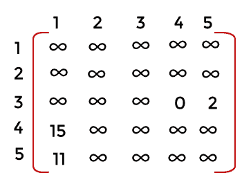

现在我们将检查任何一行是否包含零值。因为第三行不包含任何零值，所以我们将找到第三行的最小值。第三行的最小值是 2，所以我们从第三行的所有元素中减去 2。第三行的元素是:

A[2][0] = ∞ - 2 = ∞

A[2][1] = ∞ - 2 = ∞

A[2][2] = ∞ - 2 = ∞

A[2][3] = ∞ - 2 = ∞

A[2][4] = 2 - 2 = 0

因为第五行不包含任何零值，所以我们将找到第五行的最小值。第五行的最小值是 11，所以我们从第五行的所有元素中减去 11。

A[4][0] = 11 - 11 = 0

A[4][1] = ∞ - 11 = ∞

A[4][2] = ∞ - 11 = ∞

A[4][3] = ∞ - 11 = ∞

A[4][4] = ∞ - 11 = ∞

总的最低成本是(11 + 2)等于 13。节点 3 的缩减成本为 c(2，3) + r + r` = 11 + 28 + 13 = 52。

考虑从节点 2 到节点 5 的路径。将第四行和第三列设为无穷大。因为我们不能从节点 5 移回节点 1，所以将 1 到 5 也设为无穷大，如下表所示:

现在我们将检查任何一行是否包含零值。因为每一行和每一列都包含零值；因此，上述矩阵是简化矩阵。

减少节点 5 的成本是 c(2，5) + r + r` = 0 + 28 + 0 = 28

现在我们将以最小的代价找到叶节点。成本为 28 的节点 5 是最小的，因此我们选择节点 5 进行进一步的探索。节点 5 可以进一步扩展到节点 3，如下图所示:

这里，我们将使用节点 5 的矩阵，其成本为 28，如下所示:

考虑从节点 5 到节点 3 的路径。将第五行和第三列设为无穷大。因为我们不能从节点 3 移回节点 1，所以将 1 到 5 也设为无穷大，如下表所示:

现在我们将检查任何一行是否包含零值。因为每一行和每一列都包含零值；因此，上述矩阵是简化矩阵。

节点 3 的约简成本为 c(5，3) + r + r` = 0 + 28 + 0 = 28。

最后，我们遍历所有节点。上限值从无穷大更新为 28。我们将检查是否有任何叶节点的值小于 28。因为没有叶节点包含小于 28 的值，所以我们丢弃树中的所有叶节点，如下所示:

旅行的路线是 1->4->2->5->3。

* * *