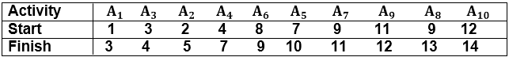
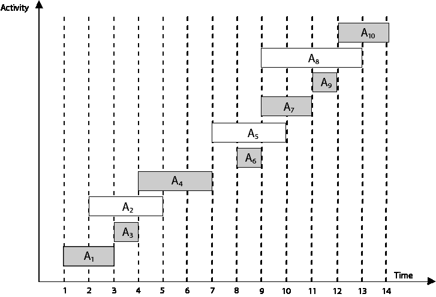
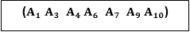

# 一个活动选择问题

> 原文：<https://www.javatpoint.com/activity-selection-problem>

活动选择问题是一个数学优化问题。我们的第一个例子是在几个挑战活动中安排资源的问题。我们发现贪婪算法为选择最大规模的手动兼容活动集提供了一种设计良好且简单的方法。

假设 S = {1，2....n}是 n 个建议活动的集合。这些活动共享一次只能由一个活动使用的资源，例如网球场、演讲厅等。每个活动“I”有**开始时间** s <sub>i</sub> 和一个**结束时间** f <sub>i</sub> ，其中 s <sub>i</sub> ≤f <sub>i</sub> 。如果所选活动“I”发生在半开放时间间隔[s<sub>I</sub>，f<sub>I</sub>期间。如果间隔(s <sub>i</sub> 、f <sub>i</sub> )和[s <sub>i</sub> 、f <sub>i</sub> )不重叠(即如果 s <sub>i</sub> ≥f <sub>i</sub> 或 s <sub>i</sub> ≥f <sub>i</sub> ，则活动 I 和 j 是**兼容的**。活动选择问题选择了相互一致的活动的最大规模集合。

## 贪婪活动选择器的算法:

```
GREEDY- ACTIVITY SELECTOR (s, f)
1\. n ← length [s]
2\. A ← {1}
3\. j ← 1.
4\. for i ← 2 to n
5\. do if si ≥ fi
6\. then A ← A ∪ {i}
7\. j ← i
8\. return A

```

**示例:**给定 10 个活动及其开始和结束时间，如下所示

```
S = (A1 A2 A3 A4 A5 A6 A7 A8 A<sub>9</sub> A<sub>10</sub>)
S<sub>i</sub> = (1,2,3,4,7,8,9,9,11,12)
f<sub>i</sub> = (3,5,4,7,10,9,11,13,12,14) 
```

计算活动最多的时间表。

**解决方案:**使用贪婪策略的上述活动调度问题的解决方案如下所示:

按照结束时间递增的顺序安排活动




现在，安排 A <sub>1</sub>

接下来的时间表 A <sub>3</sub> 作为 A <sub>1</sub> 和 A <sub>3</sub> 互不干扰。

下一步**跳过** A <sub>2</sub> ，因为它正在干扰。

接下来，将时间表 A <sub>4</sub> 作为 A <sub>1</sub> A <sub>3</sub> 和 A <sub>4</sub> 不干涉，然后接下来，将时间表 A <sub>6</sub> 作为 A<sub>1</sub>A<sub>3</sub>A<sub>4</sub>和 A <sub>6</sub> 不干涉。

跳过 A <sub>5</sub> ，因为它有干扰。

接下来，将 A <sub>7</sub> 安排为 A<sub>1</sub>A<sub>3</sub>A<sub>4</sub>A<sub>6</sub>和 A <sub>7</sub> 互不干扰。

接下来，安排 A <sub>9</sub> 为 A<sub>1</sub>A<sub>3</sub>A<sub>4</sub>A<sub>6</sub>A<sub>7</sub>和 A <sub>9</sub> 互不干扰。

跳过 A <sub>8</sub> ，因为它有干扰。

接下来，安排 A <sub>10</sub> 作为 A<sub>1</sub>A<sub>3</sub>A<sub>4</sub>A<sub>6</sub>A<sub>7</sub>A<sub>9</sub>和 A <sub>10</sub> 互不干涉。

因此，最终的活动时间表是:

