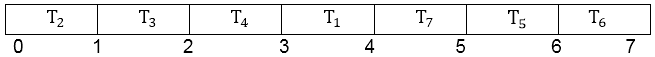
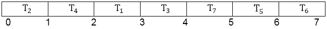

# 活动或任务调度问题

> 原文：<https://www.javatpoint.com/activity-or-task-scheduling-problem>

这是关于在单个处理器上优化调度单位时间任务的争议，其中每个任务都有一个截止日期，如果错过了截止日期，就必须支付罚款。

单位时间的任务是一项工作，例如在计算机上运行的程序，只需要一个单位的时间就可以完成。给定单位时间任务的有限集合 S，S 的调度是指定执行这些任务的顺序的 S 的排列。计划中的第一个任务在时间 0 开始，在时间 1 结束；第二个任务在时间 1 开始，在时间 2 结束，依此类推。

为每个处理器安排单位时间任务的争议有以下输入:

*   一组 S = {1，2，3.....n 个单位时间任务中的 n 个。
*   一组 n 个整数截止日期 d <sub>1</sub> d <sub>2</sub> d <sub>3</sub> ...d <sub>n</sub> 使得 d <sub>i</sub> 满足 1≤ d <sub>i</sub> ≤ n 并且任务 I 应该在时间 d <sub>i</sub> 之前完成
*   一组 n 个非负权重或处罚 w <sub>1</sub> w <sub>2</sub> ....w <sub>n</sub> 这样，如果任务 I 没有在时间 d <sub>i</sub> 之前完成，我们将受到 w <sub>i</sub> 的处罚，如果任务在截止日期之前完成，我们将不会受到处罚。

在这里，我们找到了一个 S 的时间表，最大限度地减少了因错过最后期限而导致的总损失。

如果任务在截止日期后完成，则在此时间表中会延迟**。否则，任务会提前完成。一个任意的时间表可以始终如一地放入**先早后晚的形式**，其中先有任务先于后有任务，即如果某个新任务 x 跟在某个后有任务 y 之后，那么我们就可以在不影响 x 早或 y 晚的情况下切换 x 和 y 的位置。**

 **一个任意的时间表总是可以被放入一个**规范形式**中，第一个任务在最晚的任务之前，并且第一个任务按照不减少截止日期的顺序被安排。

如果存在特定任务的时间表，使得没有任务迟到，则任务集合 A 是独立的。因此，一个计划的第一组任务形成了一个独立的任务集，l 表示所有独立任务集的集合。

对于任何一组任务 A，如果 t = 0，1，2，则 A 是独立的.....N 我们有 N <sub>t</sub> (A) ≤ t 其中 N <sub>t</sub> (A)表示 A 中截止日期为 t 或更早的任务数，即如果 A 中的任务按照单调递增的截止日期顺序被期望，那么没有任务迟到。

**示例:**在给定权重(惩罚)和截止日期的情况下，为以下任务找到最佳计划。

|  | one | Two | three | four | five | six | seven |
| d <sub>i</sub> | four | Two | four | three | one | four | six |
| w <sub>i</sub> | Seventy | Sixty | Fifty | Forty | Thirty | Twenty | Ten |

**解决方案:**根据贪婪算法，我们按照惩罚的降序对作业进行排序，以便收取最低的惩罚。

在这个问题中，我们可以看到单处理器机器运行的最大时间是 6 个单位，因为这是最大截止时间。

让 T <sub>i</sub> 代表 i = 1 到 7 的任务



T <sub>5</sub> 和 T <sub>6</sub> 在 T <sub>7</sub> 后不能接受，因此处罚为

```
w5 + w6 = 30 + 20 = 50 (2 3 4 1 7 5 6)

```

其他日程是



(2 4 1 3 7 5 6)

可以有许多其他时间表，但(2 4 1 3 7 5 6)是最佳的。**