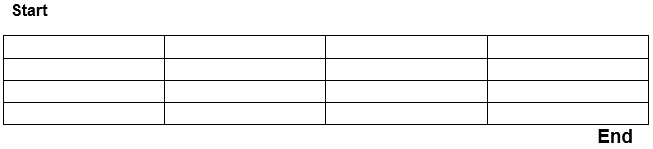

# 递归迷宫算法

> 原文：<https://www.javatpoint.com/recursive-maze-algorithm>

递归迷宫算法是回溯算法最好的例子之一。递归迷宫算法是解决迷宫问题的可能方案之一。

## 迷惑

迷宫是一个被墙壁包围的区域；在这两者之间，我们有一条从起点到终点的路径。我们必须从起点开始，从终点走向终点。

## 迷宫原理

如上所述，在迷宫中，我们必须从起点走到终点。问题是选择路径。如果我们在终点前发现任何死胡同，我们必须回溯并移动方向。穿越的方向是北、东、西、南。我们必须继续“前进和后退”，直到我们到达最后一点。

假设我们有一个二维迷宫单元[宽度][高度]。这里，单元格[x] [y] = 1 表示壁，单元格[x] [y] = 0 表示迷宫中特定位置 x，y 的自由细胞。我们可以在数组中更改的方向是北、东、西和南。第一步是把二维数组的边界做成一个，这样我们就不会走出迷宫，通常会随时驻留在迷宫里面。

| 迷宫示例 |
| one | one | one | one | one | one | one |
| one | Zero | Zero | Zero | one | one | one |
| one | one | one | Zero | one | one | one |
| one | one | one | Zero | Zero | Zero | one |
| one | one | one | one | one | Zero | one |
| one | one | one | one | one | one | one |

现在从起始位置开始改变(因为边界被 1 填充)，找到下一个自由单元，然后转向下一个自由单元，以此类推。如果我们抓住一个死胡同，我们必须回溯，使路径中的单元格为 1(墙)。继续同样的过程，直到达到最后一点。