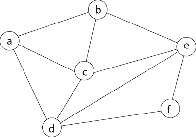
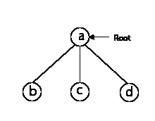
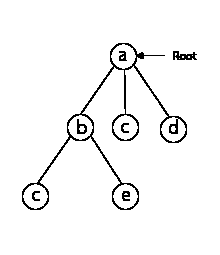
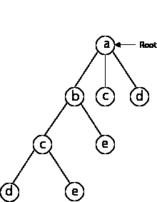
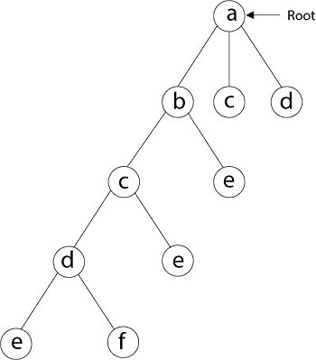
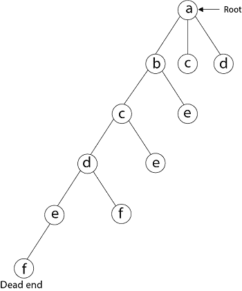
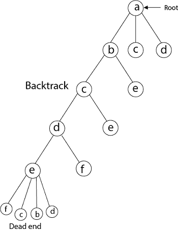
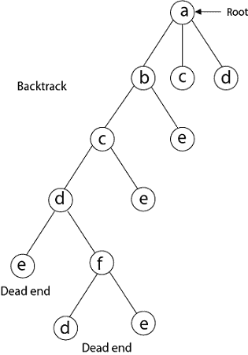
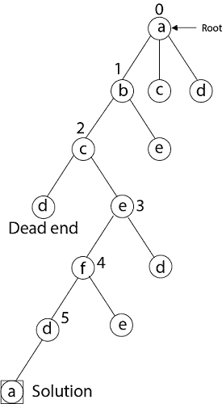

# 哈密顿电路问题

> 原文：<https://www.javatpoint.com/hamiltonian-circuit-problems>

给定一个图 G = (V，E)，我们必须用回溯法找到哈密顿回路。我们从任意一个顶点开始搜索，比如‘a’，这个顶点‘a’就成为我们隐式树的根。我们的部分解的第一个元素是要构造的哈密顿圈的第一个中间顶点。下一个相邻顶点按字母顺序选择。如果在任何阶段任何任意顶点与除顶点‘a’之外的任何顶点形成一个循环，那么我们说到达了**死胡同**。在这种情况下，我们回溯一步，搜索再次从选择另一个顶点开始，并从局部回溯元素；必须移除解决方案。如果得到哈密顿圈，使用回溯的搜索是成功的。

**例:**考虑图中所示的一个图 G = (V，E)我们得用回溯法找到一个哈密顿回路。

**求解:**首先，我们从顶点‘a’开始搜索，这个顶点‘a’成为我们隐式树的根。

接下来，我们选择与“a”相邻的顶点“b”，因为它在字典顺序中排在第一位(b，c，d)。

接下来，我们选择“b”旁边的“c”。

接下来，我们选择与 c 相邻的 d。

接下来，我们选择“d”旁边的“e”

接下来，我们选择与“e”相邻的顶点“f”。与“f”相邻的顶点是 d 和 e，但它们已经访问过了。因此，我们得到了死胡同，我们回溯一步，从部分解中移除顶点“f”。

从回溯来看，与“e”相邻的顶点是 b、c、d 和 f，从这些顶点已经检查过“f ”,并且 b、c、d 已经访问过。所以，我们再回溯一步。现在，与 d 相邻的顶点是 e，f，其中 e 已经被检查过了，“f”的相邻顶点是 d 和 e。如果“e”顶点，重新访问它们，我们会得到一个死状态。所以我们再回溯一步。

现在，与 c 相邻的是“e”，与“e”相邻的是“f”，与“f”相邻的是“d”，与“d”相邻的是“a”。这里，我们得到哈密顿圈，因为除了开始顶点“a”之外，所有的顶点都只被访问一次。(a - b - c - e - f -d - a)。

**再次回溯**

这里我们生成了一个哈密顿回路，但是考虑另一个顶点也可以得到另一个哈密顿回路。