# 子集和问题

> 原文：<https://www.javatpoint.com/subset-sum-problems>

这是复杂性理论中最重要的问题之一。给定一组整数 a1，a2，…的问题。，最多 n 个整数。问题出现了，是否存在一个非空子集，使得子集的和被给出为 M 个整数？。比如集合给出为[5，2，1，3，9]，子集的和为 9；答案是肯定的，因为子集[5，3，1]的和等于 9。这又是一个 NP 完全问题。这是背包的特例

### 让我们通过一个例子来理解这个问题。

问题。

下面给出了一组 5 个整数:

**N = 4，-2，2，3，1**

我们想找出和等于 5 的子集。这个问题有很多解决办法。

天真的方法，即强力搜索生成原始数组的所有可能子集，即有 2n 种可能状态。这里的运行时间复杂度是指数级的。然后，我们在 O(N)线性运行时间内考虑所有这些子集，并检查项目的总和是否为 M。

动态规划具有伪多项式运行时间。

**语句:**给定一组正整数和值，确定给定集合子集的和等于给定和。

**或**

给定一个整数数组和，任务是让给定数组的所有子集的和等于给定的和。

```

Example 1:
Input: set[] = {4, 16, 5, 23, 12}, sum = 9
Output = true
Subset {4, 5} has the sum equal to 9.

Example 2:
Input: set[] = {2, 3, 5, 6, 8, 10}, sum = 10
Output = true
There are three possible subsets that have the sum equal to 10.
Subset1: {5, 2, 3}
Subset2: {2, 8}
Subset3: {10}

```

**解决子集问题有两种方式:**

*   递归
*   动态规划

**方法 1:递归**

在了解递归方法之前，我们应该了解下面给出的一个子集中的两件事:

*   **Include:** 这里的 Include 表示我们正在从数组中选择元素。
*   **Exclude:** 这里，Exclude 表示我们正在从数组中拒绝该元素。

**为了实现递归方法，我们考虑以下两种情况:**

*   现在我们考虑第一个元素，现在所需的和等于目标和与第一个元素的值之间的差。元素的数量等于元素总数与 1 之差。
*   保留“第一个”元素，现在所需的总和=目标总和。元素的数量等于元素总数与 1 之差。

**我们来理解一下，如何用递归来解决问题。考虑下面给出的数组:**

**arr = [3，4，5，2]**

**总和= 9**

**结果= []**

在上面的例子中，我们取了一个数组，这个名为 result 的空数组存储了所有结果和等于 9 的值。

**数组中的第一个元素是 3。有两种情况:**

*   第一种情况是选择。该和等于第一个元素的**目标和值，即** 9 - 3 = 6，第一个元素，即 3 存储在结果数组中，即**结果[]** 。
*   第二种情况是拒绝。数组 arr 包含元素 4、5、2，即 arr = [4、5、2]，当我们拒绝元素 3 时，总和将与 9 相同。**结果[]** 数组将保持为空。
    
    **现在我们对元素 4 执行相同的选择和拒绝操作，因为它现在是数组的第一个元素。**
*   从数组中选择元素 4。因为我们从数组中选择 4，所以数组 arr 将包含元素 5，2，即 arr = [5，2]。总和等于 6-4 = 2，元素 4 存储在结果 arr 中。结果[] = {3，4}。
*   拒绝数组中的元素 4。因为我们拒绝数组中的 4，所以数组 arr 将包含元素 5，2，即 arr = [5，2]。总和将保持与 6 相同，结果数组将与之前的数组相同，即{3}。
    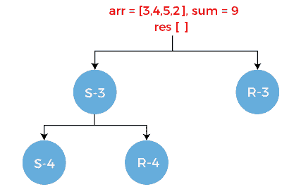
    **现在我们对元素 5 执行选择和拒绝操作。**
*   从数组中选择元素 5。因为我们从数组中选择 5，所以数组 arr 将包含元素 2，即 arr = [2]。总和等于 2 - 5 等于-3，元素 5 存储在结果 arr 中。结果[] = {3，4，5}。
*   拒绝数组中的元素 5。因为我们拒绝数组中的 5，所以数组 arr 将包含元素 2，即 arr = [2]。总和将保持与前一个相同，即 6，结果数组将与前一个相同，即{3，4}。
    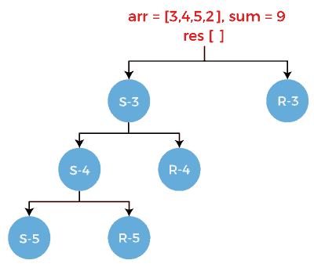

如果我们观察 S-5，可以看到和为负，返回 false。这意味着集合中没有其他可用的子集。

**考虑 R-5。它还有两个场景:**

*   从数组中选择元素 2。一旦选择了元素 2，数组就变成空的，即 arr[] = " "。总和是 2-2 等于 0，元素 2 存储在结果数组中。结果[] = [3，4，2]。
*   拒绝数组中的元素 2。一旦元素 2 被拒绝，数组就变成空的，即 arr[] = " "。总和将与前一个相同，即 2，结果数组也将与前一个相同，即[3，4]。

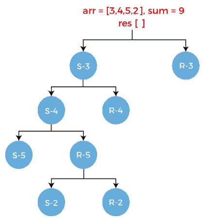

**考虑 R-4。它有两个场景:**

*   从数组中选择元素 5。因为我们从数组中选择 5，所以数组 arr 将包含元素 2，即 arr = [2]。总和是 6-5 等于 1，元素 5 存储在结果数组中。结果[] = [3，5]。
*   拒绝数组中的元素 5。因为我们拒绝数组中的 5，所以数组 arr 将包含元素 2，即 arr = [2]。总和将保持与前一个相同，即 6，结果数组将与前一个相同，即{3}。

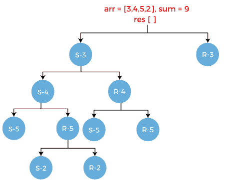

**考虑 S-5。它有两个场景:**

*   从数组中选择元素 2。因为我们从数组中选择了 2，所以数组 arr 将为空，即 arr = " "。总和将是 1-2 等于-1，元素 2 存储在结果数组中。结果[] = [3，5，2]。
*   拒绝数组中的元素 2。因为我们拒绝数组中的 2，所以数组 arr 将变成空的。总和将保持与前一个相同，即 1，结果数组将与前一个相同，即{3，5}。

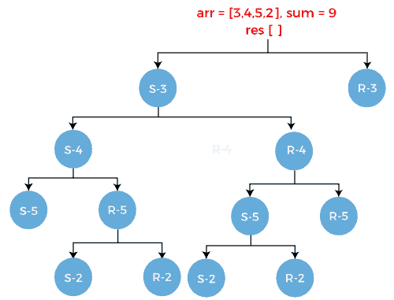

**考虑 R-5。它有两个场景:**

*   从数组中选择元素 2。因为我们从数组中选择了 2，所以数组 arr 将为空，即 arr = " "。总和是 6-2 等于 4，元素 2 存储在结果数组中。结果[] = [3，2]。
*   拒绝数组中的元素 2。因为我们拒绝数组中的 2，所以数组 arr 将变成空的。总和将保持与前一个相同，即 6，结果数组将与前一个相同，即{3}。

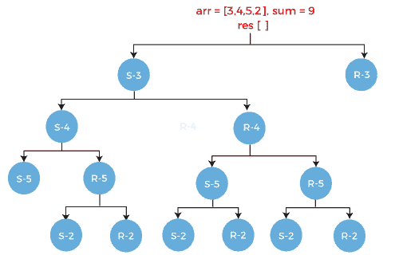

同样，我们得到拒绝案例，即如下所示的 R-3:

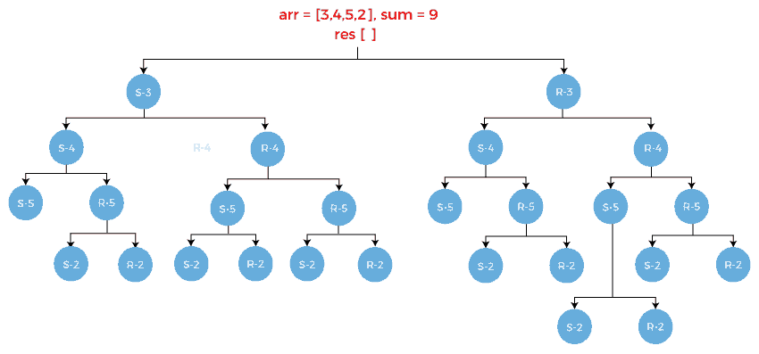

**以下是基本条件:**

```

if sum == 0 
return true
if sum < 0
return false
if (arr[] && sum!= 0)
return false

```

当我们在上面的树上应用基本条件时，我们会发现下面给出的两个子集:

S1 = {3，4，2}

S2 = {4，5}

**实施**

```

def subset_sum(arr, res, sum)
  if sum ==0
  return true
 if sum < 0
return false
if len(arr) == 0 and sum!= 0
return false
arr.pop(0);
if len(arr) > 0
 res.append(arr[0])
 select = subset_sum(arr, sum-arr[0], res)
reject = subset_sum(arr, res, sum)
return reject or sum

```

**方法二:动态编程**

假设 A 是包含“n”个非负整数的数组或集合。找到集合“A”的子集“x”，使得 x 的所有元素的和等于 w，其中 x 是另一个输入(和)。

例如:

A = {1，2，5，9，4}

总和(w) = 18

现在我们必须从给定的集合中找出和等于 18 的子集。这里我们将使用动态规划方法来解决子集和问题。

**示例:**

**A = [2，3，5，7，10]**

**总和(w) = 14**

首先，我们创建一个表。该列包含从 0 到 14 的值，而行包含给定集合的元素，如下所示:

**下表中:**

**i:** 代表行。Rows 表示元素。

**j:** 代表列。列表示总和。

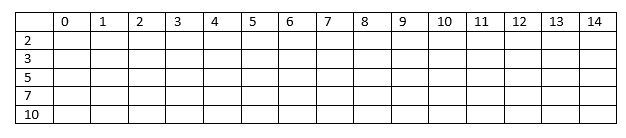

**考虑元素 2。我们将使用 1 作为真值，0 作为假值。值 1 位于 0 和 2 列下，如下所示:**

**这里 i=1，a[i] =2**

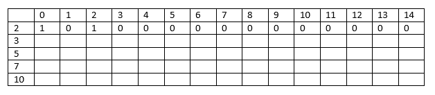

#### 注:各栏填写规则如下:
必选和= j -元素
A[I][j]= A[I-1][必选和]

**当 j= 1 时**

**要求的总和**= 1-2 =-1；由于总和为负，因此如上表所示，将 0 放在 1 列下。

**当 j= 2 时**

**要求的总和**= 2-2 = 0；由于 sum 的值为零，因此我们将 1 放在列 2 下，如上表所示。

我们把 0 放在和大于 2 的列下面，因为我们不能从元素 2 得到和大于 2 的值。

**考虑元素 3。**

**这里 i = 2，a[i] = 3**

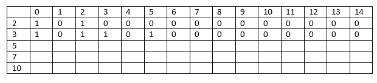

总和小于 3 的列将具有与前面的列相同的值。

**当 j = 3 时，和[j] = 3**

**要求的总和**= 3-3 = 0；因为总和为零，所以我们将 1 放在第 3 列下，如上表所示。

**当 j = 4 时；总和[j] = 4**

要求总和= 4-3 = 1；因为和是 1，所以我们移到上一行，即 i=1，j=1。a[1][1]处的值是 0，因此我们将 0 放在 a[2][4]处。

**当 j = 5 时，和[j] = 5**

要求总和= 5-3 = 2；sum 的值是 2，因此 a[1][2]处的值等于 1。因此，a[2][5]的值将是 1。

**当 j = 6 时，和[j] = 6**

要求总和= 6-3 = 3；sum 的值是 3，因此 a[1][3]处的值等于 0。因此，a[2][6]处的值将为 0。

**当 j = 7 时，和[7] = 7**

要求总和= 7-3 = 4；sum 的值是 4，因此 a[1][4]处的值等于 0。因此，a[2][7]处的值将为 0。

这样，我们从第 8 列到第 14 列得到值 0。

**考虑元素 5。**

**这里 i=3，a[i] = 5**

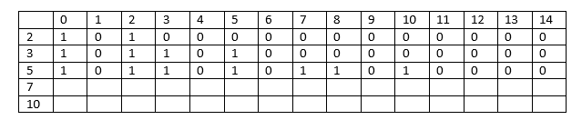

总和小于 5 的列将具有与前面的列相同的值。

**当 j =5 时，和[j] = 5**

要求总和= 5-5 = 0；由于 sum 的值为 0；因此，a[2][5]处的值等于 1。

**当 j = 6 时，和[j] = 6**

要求总和= 6-5 = 1；sum 的值为 1，因此 a[2][1]处的值等于 0；因此，a[3][6]处的值等于 0。

**当 j=7 时，和[j] = 7**

要求总和= 7-5 = 2；sum 的值是 2，因此 a[2][2]处的值等于 1；因此，a[3][7]处的值等于 1。

**当 j=8 时，和[j] = 8**

要求总和= 8-5 = 3；sum 的值是 3，因此 a[2][3]处的值等于 1；因此，a[3][8]处的值等于 1。

**当 j=9 时，和[j] =9**

要求总和= 9-5 = 4；sum 的值为 4，因此 a[2][4]处的值等于 0；因此[3][9]处的值等于 0。

这样，我们得到了第 10 列到第 14 列的值。

**考虑元素 7。**

**这里 i=4，a[i] =7**

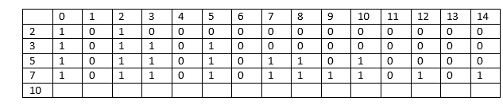

总和小于 7 的列将具有与前几列相同的值。

**当 j=9 时，和[j] = 9**

要求总和= 9-7 = 2；sum 的值是 2，因此 a[3][2]处的值等于 1；因此 a[4][9]处的值等于 1。

**当 j=10 时，和[j] = 10**

要求总和= 10-7 = 3；sum 的值是 3，因此 a[3][3]处的值等于 1；因此，a[4][10]处的值等于 1。

**当 j=11 时，和[j] =11**

要求总和= 11-7 = 4；sum 的值为 4，因此 a[3][4]处的值等于 0；因此，a[4][11]处的值等于 0。

**当 j=12 时，和[j] = 12**

要求总和= 12-7 = 5；sum 的值是 5，因此 a[3][5]处的值等于 1；因此，a[4][12]处的值等于 1。

**当 j=13 时，和[j] =13**

要求总和= 13-7 = 6；sum 的值是 6，因此 a[3][6]处的值等于 0；因此，a[4][13]处的值等于 0。

**当 j=14 时，和[j] = 14**

要求总和= 14-7 = 7；sum 的值是 7，因此 a[3][7]处的值等于 1；因此，a[4][14]处的值等于 1。

**考虑元素 10**

**这里 i=5，a[i] = 10**

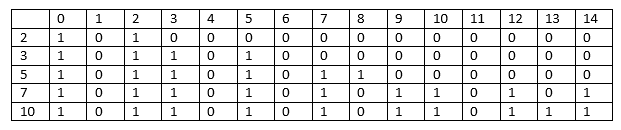

总和小于 10 的列将具有与前几列相同的值。

当 j = 10 时，总和[j] = 10

要求总和= 10-10 = 0；sum 的值为 0，因此 a[4][0]处的值等于 1；因此，a[5][10]处的值等于 1。

当 j = 11 时，总和[j] = 11

要求总和= 11-10 = 1；sum 的值为 1，因此 a[4][1]处的值等于 0；因此，a[5][11]处的值等于 0。

当 j=12 时，总和[j] = 12

要求总和= 12-10 = 2；sum 的值是 2，因此 a[4][2]处的值等于 1；因此，a[5][12]处的值等于 1。

当 j=13 时，总和[j] = 13

要求总和= 13-10 = 3；sum 的值是 3，因此 a[4][3]处的值等于 1；因此，a[5][13]处的值等于 1。

为了确定上面给定的问题是否包含子集，我们需要检查最后一行和最后一列。如果值为 1，这意味着至少存在一个子集。

```

We have basically followed three conditions where we write 1 in the cell of the table:
  •  A[i] = j
  •  A[i-1][j] = 1
  •  A[i-1][j-A[i]] = 1

```

* * *